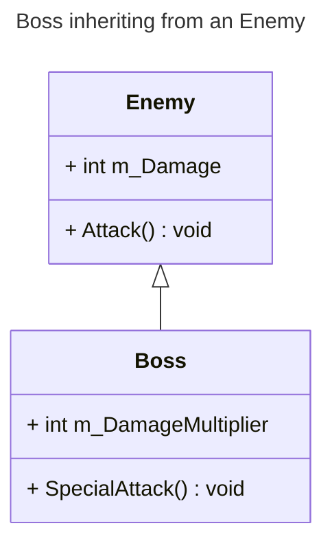
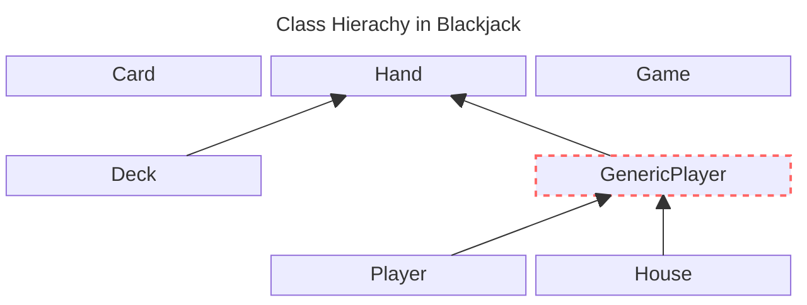
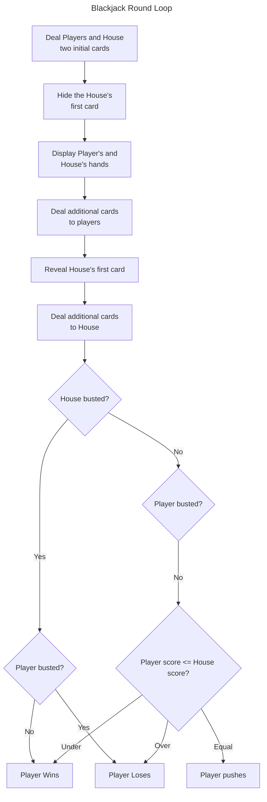
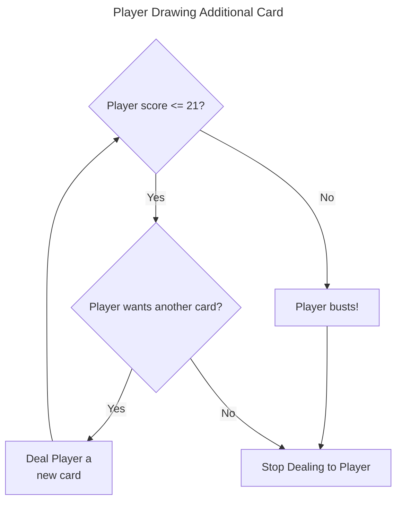
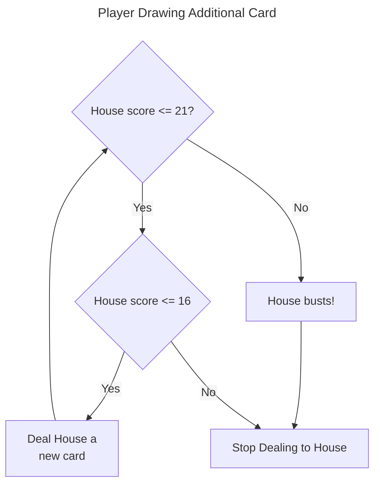

# Chapter 10: Inheritance and Polymorphism: Blackjack

## Examples

### [Simple Boss](./Examples/01_SimpleBoss/simpleBoss.cpp)

Demonstrates the concept of classes inheriting from each other

### [Simple Boss 2.0](./Examples/02_SimpleBoss2/simpleBoss2.cpp)

Demonstrates access control under inheritance

### [Overriding Boss](./Examples/03_OverridingBoss/overridingBoss.cpp)

Demonstrates calling and overriding base member functions

### [Polymorphic Bad Guy](./Examples/04_PolymorphicBadGuy/polymorphicBadGuy.cpp)

Demonstrates calling member functions dynamically

### [Abstract Creature](./Examples/05_AbstractCreature/abstractCreature.cpp)

Demonstrates Abstract classes

### [Major Project: Blackjack](./Examples/06_Blackjack/blackjack.cpp)

A complicated program showing how to combine features of object-oriented design to make a fully fledged program. In this case the game blackjack

## Exercises

## Notes

- *Inheritance* and *Polymorphism* are techniques for manipulating the relationship between different classes

### Introducing Inheritance

- *Inheritance* allows you to *derive* a new class from an existing one
- New class automatically *inherits* data members and member functions of an existing class
- Useful for creating more specialised variant of an existing class
- e.g. A `enemy` class with an `Attack()` function might have a `Boss` class dervied from it, that has an *additional* `specialAttack()`



- Inheritance lets us reuse already written classes, benefits include
  - **Less work**: There's no need to redefine functionality
  - **Fewer errors**: Once bugs are fixed in a class it can be reused
  - **Cleaner code**: Functionality exists in one location, so easier to comprehend

#### Example [Simple Boss](#simple-boss)

#### Deriving frfom a Base Class

- To derive from a base class write the class definition like,

```cpp
class new_class : access-modifier inherited-class 
```

- e.g. For the aforementioned `Boss` and `Enemy` classes we would write

```cpp
class Boss : public Enemy
```

- The *inherited-class* is called the *base class* (or *superclass*)
- The *new-class* is called the *derived class* (or *subclass*) `Boss` inherits `m_Damage` and `Attack()` from the `Enemy` class

>[!IMPORTANT]
>You might have noticed that I made all of the members of the classes public, including their data members. I did this because it makes for the simplest first example of a base and derived class. You also might have noticed that I used the keyword `public` when deriving `Boss` from `Enemy`. For now, don't worry about this. I'll cover it all in the next example program, Simple Boss 2.0

- You can derive further classes from a derived class
- There a few functions that are not inherited they are
  - Constructors
  - Copy constructors
  - Destructors
  - Overloaded assignment operators

#### Instantiating Objects of a Derived Class

- Inherited classes are instantiated like any other class e.g. `Boss boss1;` creates a new `Boss` object called `boss1`
  - The inherited object will call the base class constructor
  - Then call it's own constructor
  - Reverse happens for destructors
    - Own called first
    - Then base called

>[!TIP]
>The fact that base class destructors are called for objects of derived classes ensures that each class gets its chance to clean up any part of the object that needs to be taken care of, such as memory on the heap

#### Using Inherited Members

- Call the base class data members and member functions on the inherited class as if it were the base class
- e.g. `boss1.Attack()` calls the `Attack()` member function defined in the `Enemy` class
- This also applies in member functions, e.g. if `specialAttack` has the definition,

```cpp
void Boss::Boss specialAttack() {
    cout << "Special Attack inflicts " << (m_DamageMultiplier * m_Damage);
    cout << " damage points!\n";
}
```

- Observe the base class data member `m_Damage` is accessed as if it were defined in the derived class

### Controlling Access Under Inheritance

- You can control how much access a derived class has to the internals of the base class

#### Example [Simple Boss 2.0](#simple-boss-20)

#### Using Access Modifiers with Class Members

- `public` anyone can see the data member or member function
- `private` nobody outside the class can see the data member or member function
  - This includes *derived classes!*
- `protected` accessible in their own class and *derived classes* (depending on the access level used in inheritance)

#### Using Access Modifiers When Deriving Classes

- Recall we stated in syntax for deriving a class there is an access modifier.
  - e.g.

```cpp
class Boss : public Enemy
```

- Using `public` derivation means:
  - `public` members in the base class remain public in the derived class
  - `protected` members in the base class remain protected in the derived
  - `private` members are inaccessible

>[!TIP]
>Even if base data members are private, you can still use the indirectly through base class member functions. You can even get and set their values if the base class has accessor member functions

- `pubic` derivation basically acts like a copy and paste (minus the `private` members)

>[!IMPORTANT]
>You can derive a new class with the `protected` and `private` keywords, but they're rarely used and are beyond the scope of this book

### Calling and Overriding Base Class Member Functions

- You can customise how inherited member functions work in your derived class
- You can override them by giving them new definitions in the derived class
- You may also explicitly call a base class member function

#### Example [Overriding Boss](./Examples/03_OverridingBoss/overridingBoss.cpp)

#### Calling Base Class Constructors

- You can explicitly invoke the base class constructor from a derived class constructor
  - Syntax similar to member initialisation list as demonstrated below

```cpp
Boss::Boss(int damage): Enemy(damage) {}
```

- The above code forwards the `damage` argument to the constructor for the base `Enemy` class

>[!TIP]
>Being able to call a base class constructor is useful when you want to pass specific values to it

#### Declaring Virtual Base Class Member Functions

- Any inherited base class expecting to be overridden in a derived class should be declared `virtual`
  - Provides a mechanism for overidden versions to behave correctly with pointers and references
- e.g. The below declares a virtual function `Taunt`

```cpp
void virtual Taunt() const;
```

>[!CAUTION]
>Although you can override non-virtual member functions, this can lead to behaviour you might not expect. A good rule of thumb is to decalre any base class member function be overridden as virtual

- You don't need to include `virtual` in the definition, only the declaration, e.g.

```cpp
void Enemy::Taunt() const {
    cout << "The enemy says he will fight you.\n;"
}
```

- Once declared `virtual` a function is `virtual` in any derived class
  - Still good practice to redeclare it as one, to be explicit

#### Overriding Virtual Base Class Member Functions

- To override then redefine the function in the base class, e.g. the below redefines the `Taunt` function in the `Boss` function

```cpp
void Boss::Taunt() const {
    cout << "The boss says he will end your pitiful existence.\n";
}
```

>[!CAUTION]
>Don't confuse override with overload. When you override a member function, you provide a new definition of it in a derived clas. When you overload a function, you create multiple versions of it with different signatures.

- Overriding member functions is useful when you want to change or extend the behaviour of base class member functions in derived classes

>[!CAUTION]
>When you override a base class member function, you hide all of the other overloaded bersions of the base class member function, meaning that the only way to access the other versions of the member function is to explicitly call the base class member function. So if you override an overloaded member function, it's a good idea to override every version of the overloaded function

#### Calling Base Class Member Functions

- You can call a base class member function from any function in a derived class
  - Prefix the class name to the desired member function and use the scope resolution operator, e.g. the below uses the `Enemy` `Attack` function inside the derived `Boss` `Attack` function

```cpp
void Boss::Attack() const {
    Enemy::Attack();
    cout << " And laughs heartily at you.\n";
}
```

>[!TIP]
>You can extend the way a member function of a base class works in a derived class by overriding the base class method and then explicitly calling the base  class member function from this new definition in the derived class and adding some functionality

### Using Overloaded Assignment Operators and Copy Constructors in Derived Classes

- As mentioned copy constructors and overloaded assignment operators don't inherit to derived classes
- Typically we *want* to call the base class operator overload, when we derive ourselves
- e.g. the below example shows this for the assignment operator

```cpp
Boss& operator=(const Boss& b) {
    Enemy::operator=(b); //handles the data members inherited from the Enemy
    //now take care of data members defined in Boss
}
```

- Explicit call to `Enemy` assignment handles assignment of the inherited members
- Then need to add code to handle the `Boss` property

- Need to do similar for the copy constructor

```cpp
Boss(const Boss& b): Enemy(b) {// handles the data members inherited from Enemy
    //now take care of data members defined in Boss
}
```

### Introducing Polymorphism

- *polymorphism* is a key tenant of OOP
- Means that a member function produces different behaviour depending on the type of the object that calls it
- e.g. If we have a group of different bad guys each belonging to different subclasses we might want to call the `Attack` function on all of them
  - *But* have the `Attack` function behave differently for different bad guys
- Polymorphism differs from overloading in that it is *dynamic* and determined by the *runtime* type of the object

#### Example [Polymorphic Bad Guy](#polymorphic-bad-guy)

#### Using Base Class Pointers to Derived Class Objects

- An object of a derived class is also an object of the base class
- e.g. In the example a `Boss` is also an `Enemy`
- You can use a pointer to the base class to refer to a derived class
- e.g. `Enemy* pBadGuy = new Boss()` uses an `Enemy` pointer to refer to a `Boss`
- `virtual` functions called through this pointer will resolve to the correct member function
  - e.g. in the above `pBadGuy->Attack()` calls the `Boss` class `Attack` function even though the pointer is to an `Enemy`

>[!TIP]
>`virtual` functions produce polymorphic behaviour through references as well as through pointers

- The advantage of polymorphism is that it lets us handle collections of objects without knowing the exact type of every single object in the collection

>[!CAUTION]
>If you override a non-virtual member function in a derived class, and call that member function on a derived class object through a pointer to a base class you'll get the results of the base class member function and not the derived class member function definition. This is easier to understand with an example. If in the Polymorphic Bad Guy program I hadn't declared `Attack` as `virtual`, then when I invoke the member function through a pointer to `Enemy` on a `Boss` object with `pBadGuy->Attack();`, I would have gotten the message to `"An enemy attacks and inflicts 10 damage points"`. This would have happened as a result of *early binding*, in which the exact member function is bound based on the pointer type (in this case, `Enemy`). But because `Attack` is declared as `virtual` this member function call is based on the type of object being pointed to at run time, `Boss` in this case, not fixed by the pointer type. I achieve this polymorphic behaviour as a result of the *late binding* because `Attack` is `virtual`. The moral of the story is that you should only override `virtual` member functions.
>
> **Beware**: The benefits of virtual functions aren't free; there is a performance cost associated with the overhead. Therefore you should use virtual functions only when you need them

#### Defining Virtual Destructors

- What happens when we delete a derived class object through a base class pointer?
  - If the destructor is not `virtual` it will call the base class destructor (see the discussion above)
  - This might incorrectly cleanup the derived class
- Should make the base class destructor `virtual`
  - Means the correct destructor will be called
  - Ensures clean up is carried out correctly

```cpp
virtual ~Enemy();
```

- The above demonstrates a `virtual` destructor

>[!TIP]
>A good rule of thumb is that if you have a virtual member functions in a class, you should make the destructor `virtual`, too

### Using Abstract Classes

- Sometimes you may want to define a class to act as a base for other classes
  - Might not want to instantiate the specific base class though
- e.g. a game might have many different `creature` types, using a generic `creature` class to capture common code
  - Doesn't make much sense to instantiate a generic `creature` though, it doesn't represent anything

#### Example [Abstract Creature](#abstract-creature)

#### Declaring Pure Virtual Functions

- A *pure virtual function* is one without a definition
  - i.e. Might not make sense to assign a generic implementation even if all derived classes must implement it
  - To do so, write a `virtual` function prototype and then write `= 0;`
- A class with at least *one pure virtual function* is an abstract class
  - Cannot be instantiated itself
- An abstract class can have data members and `virtual` functions that are not pure.

#### Deriving a Class from an Abstract Class

- A derived class can override the base classes pure virtual functions
- If you override *all* the pure virtual functions, then the new class is not abstract and you can instantiate objects from it
- Note you can still create pointers to the base class
  - Means we can still use polymorphism

### Example: [Blackjack](#major-project-blackjack)

- Final project is a simplified implementation of Blackjack
- Each player attempts to reach $21$ without going over
  - Numbered cards have their numeric value
  - Face cards have value $10$
  - Ace is either $1$ or $11$
- Computer acts as the house and competes against $1$-$7$ players
- At the start of the round all players are dealt $2$ cards
  - One of the house's cards are hidden
  - All other cards are visible
  - Each player draws one additional card at a time until they decide to stay or go over $21$ (*bust*)
- House then draws while it's total is $16$ or less
  - If the House busts all non-busted players win
  - Else all players who beat the House's total win
  - If they tie, this is referred to as *pushing*

#### Designing the Classes

- First thing to do before coding is to consider our classes

| **Class**       | **Base Class**  | **Description**                                                                                                   |
|-----------------|-----------------|-------------------------------------------------------------------------------------------------------------------|
| `Card`          | None            | A Blackjack playing card                                                                                          |
| `Hand`          | None            | A Blackjack hand. A collection of `Card` objects                                                                  |
| `Deck`          | `Hand`          | A Blackjack deck. Has extra functionality that `Hand`  doesn't, such as shuffling and dealing                     |
| `GenericPlayer` | `Hand`          | A generic Blackjack player. Not a full player, but  the common elements of a human player and the computer player |
| `Player`        | `GenericPlayer` | A human Blackjack                                                                                                 |
| `House`         | `GenericPlayer` | The computer player, the house                                                                                    |
| `Game`          | None            | A Blackjack game                                                                                                  |

- It helps to both write out and describe the classes and picture how they fit together



- The above shows the inheritance hierachy, `GenericPlayer` is shaded red to denote that it's an Abstract class

- `Card` is viewed as a real-life card. Card's aren't copied when they are dealt, they are simply moved
  - i.e. `Hand` contains a container (`vector`) of pointers to `Card` objects living on the Heap
  - A card is moved between hands via copying and destroying pointers
- Players are viewed as extensions of a Blackjack hand
  - They are *hands with names*
  - `Player` and `House` thus both derived indirectly from `Hand`
  - Could also view a `Player` has having a `Hand` in which case a `Player` would have a `Hand` data member
- `GenericPlayer` exists to hold the common functionality of a `Player` and the `House`
- `Deck` is viewed as seperate from the house.
  - `Deck` responsible for dealing the cards
  - Uses polymorphism to work on `GenericPlayer` rather than overloading for `Player` and `House`

The below breaks the classes down in more detail

- `Card` class
  - `Rank m_Rank`
    - Rank of the card (ace, 2, 3, etc.)
    - Rank is an enumeration
  - `Suit m_Suit`
    - Suit of the card (clubs, diamonds, hearts, spades)
    - Also an enumeration
  - `bool m_isFaceUp`
    - Denotes if a card is face up (impacts display and value)
  - `int GetValue()`
    - Returns the value of a card
  - `void Flip()`
    - Flips a card. Face up becomes face down, face down becomes face up
- `Hand` class
  - `vector<Card*> m_Cards`
    - Collection of cards. Stores pointers to `Card` objects
  - `void Add(Card* pCard)`
    - Adds a card to the hand. Adds a pointer to `Card` to the vector `m_Cards`
  - `void Clear()`
    - Clears all cards from the hand. Removes all pointers in the vector `m_Cards`
  - `int GetTotal() const`
    - Returns the total value of the hand
- `GenericPlayer Class (Abstract)`
  - `string m_Name`
    - Generic player's name
  - `virtual bool IsHitting() const = 0`
    - Indicates whether the generic player wants another hit. Pure virtual function
  - `bool IsBusted() const`
    - Indicates whether the generic player has busted
  - `void Bust() const`
    - Announces that the generic player busts
- `Player class`
  - `virtual bool IsHitting() const`
    - Indicates whether the player wants another hit
  - `void Win() const`
    - Announces that the player wins
  - `void Lose() const`
    - Announces that the player loses
  - `void Push() const`
    - Announces that the player pushes
- `House class`
  - `virtual bool IsHitting() const`
    - Indicates whether the house is taking another hit
  - `void FlipFirstCard()`
    - Flips over the first card
- `Deck class`
  - `void Populate()`
    - Creates a standard 52 card deck
  - `void Shuffle()`
    - Shuffles cards
  - `void Deal(Hand& aHand)`
    - Deals one card to a hand
  - `void AdditionalCards(GenericPlayer& aGenericPlayer)`
    - Gives additional cards to a generic player for as long as the generic player can and wants to hit

#### Planning the Game Logic

- Let us write out the pseudocode again to map out the flow of a round

```text
Deal players and the house two initial cards
Hide the house's first card
Display players' and house's hands
Deal additional cards to players
Reveal house's first card
Deal additional cards to house
If house is busted
    Everyone who is not busted wins
Otherwise
    For each player
    If player isn't busted
        If player's total is greater than the house's total
        Player wins
    Otherwise if player's total is less than house's total
        Player loses
    Otherwise
        Player pushes
Remove everyone's cards
```

- Or represented as a game loop



- We can also draw out the additional card loops for the player



- And, we can do so similarly for the `House`



>[!IMPORTANT]
>The `blackjack.cpp` file contains seven classes. In C++ programming, it's common to break up files like this into multiple files, based on individual classes. However, the topic of writing a single program using multiple files is beyond the scope of the book

#### The `Card` Class

```cpp
//Blackjack
// Plays a simple version of the casino game of blackjack; for 1 -7 players

#include <iostream>
#include <string>
#include <vector>
#include <algorithm>
#include <random> // to replace srand and rand

using namespace std;
class Card {
    public:
        enum Rank {ACE = 1, TWO, THREE, FOUR, FIVE, SIX, SEVEN, EIGHT, NINE, TEN, JACK, QUEEN, KING};
        enum Suit {CLUBS, DIAMONDS, HEARTS, SPADES};

        //overloading << operator so can send Card object to standard output
        friend ostream& operator<<(ostream& os, const Card& aCard);

        Card(Rank r = ACE, Suit s = SPADES, bool ifu = true);

        //returns the value of a card, 1 - 11
        int GetValue() const;

        //flips a card; if face up, becomes face down and vice versa
        void Flip();
    private:
        Rank m_Rank;
        Suit m_Suit;
        bool m_IsFaceUp;
};

Card::Card(Rank r, Suit s, bool ifu): m_Rank(r), m_Suit(s), m_IsFaceUp(ifu) {}

int Card::GetValue() const {
    //if a cards is face down, its value is 0
    value = m_Rank;
    //value is 10 for face cards
    if (value > 10) {
        value = 10;
    }
    return value;
}

void Card::Flip() {
    m_IsFaceUp = !(m_IsFaceUp);
}
```

- Define two enumerations `Rank` and `Suit` internal to the `Card` class so they live in it's namespace
- Enumerations limit the value and improve readability
- Observe we set `ACE = 1` so that all sequential values have their traditional card values
- Overloaded `friend` operator is for easy printing
  - We'll see it later
- `GetValue()` returns a value for a `Card`, either it's raw enum value or $10$ if it's a face card
  - `ACE` is valued at $1$, we check later if we want to count it as $11$ instead

#### The `Hand` Class

```cpp
class Hand {
    public:
        Hand();

        virtual ~Hand();

        //adds a card to the hand
        void Add(Card* pCard);
        //clears hand of all cards
        void Clear();
        //gets hand total value, intelligently treats ace as 1 or 11
        int GetTotal() const;
    protected:
        vector<Card*> m_Cards;
};

Hand::Hand() {
    m_Cards.reserve(7);
}

Hand::~Hand() {
    Clear();
}

void Hand::Add(Card* pCard) {
    m_Cards.push_back(pCard);
}

void Hand::Clear() {
    //iterate through a vector, freeing all memory on the heap
    vector<Card*>::iterator iter = m_Cards.begin();
    for (iter = m_Cards.begin(); iter != m_Cards.end(); ++iter) {
        delete *iter;
        *iter = 0;
    }
    //clear vector of pointers
    m_Cards.clear();
}

int Hand::GetTotal() const {
    //if no cards in hand, return 0
    if (m_Cards.empty()) {
        return 0;
    }
    //if a first card has value of 0, then card is face down; return 0
    if (m_Cards[0]->GetValue() == 0) {
        return 0;
    }
    //add up card values, treat each ace as 1
    int total = 0;
    vector<Card*>::const_iterator iter;
    for (iter = m_Cards.begin(); iter != m_Cards.end(); ++iter) {
        total += (*iter)->GetValue();
    }
    //determine if hand contains an ace
    bool containsAce = false;
    for (iter = m_Cards.begin(); iter != m_Cards.end(); ++iter) {
        if ((*iter)->GetValue() == Card::ACE) {
            containsAce = true;
        }
    }
    //if hand contains ace and total is low enough, treat ace as 11
    if (containsAce && total <= 11) {
        //add only 10 since we've already added 1 for the ace
        total += 10;
    }
    return total;
}
```

>[!CAUTION]
>The destructor of the class is virtual, but notice that I don't use the keyword virtual outside of the class when I actually define the destructor. You only use the keyword inside the class definition. Don't worry; the destructor is still virtual

- Again, all `Card` objects exist in one allocation on the heap. A `Hand` simply contains a reference via pointer to the cards it contains.
- `Clear()` removes all pointers to `Card` objects in the hand and also frees the associated `Card` object
  - Virtual destructor delegates to `Clear`
- `GetTotal` calculates the total and uses some logic to determine how to count an Ace. If we can count it as an $11$ without going bust we will, else we count it as $1$

#### The `GenericPlayer` Class

```cpp
class GenericPlayer : public Hand {
    friend ostream& operator<<(ostream& os, const GenericPlayer& aGenericPlayer);

    public:
        GenericPlayer(const string& name = "");
        virtual ~GenericPlayer();
        //indicates whether or not the generic player is hitting
        virtual bool IsHitting() const = 0;
        //returns whether generic player has busted - has a total greater than 21
        bool IsBusted() const;
        //announces that the generic player has busted
        void Bust() const;
    protected:
      string m_Name;
};

GenericPlayer::GenericPlayer(const string& name): m_Name(name) {}

GenericPlayer::~GenericPlayer() {}

bool GenericPlayer::IsBusted() const {
    return (GetTotal() > 21);
}

void GenericPlayer::Bust() const {
    cout << m_Name << " busts.\n";
}
```

- Again we want an overloaded ostream `<<` operator to allow printing a `GenericPlayer`
  - Since it uses a `GenericPlayer` it will work for a `House` or `Player` object
- Contructor accepts a `string` for the name
- Destructor inherits `virtual` from `Hand`
- `IsHitting()` indicates if a player wants another card
  - Designed to be overridden by subclasses to implement their own decision logic
  - Since its pure virtual must be reimplemented by `Player` and `House`
- `IsBusted()` indicates if a `GenericPlayer` has busted, this logic is common to either subclass to we can put it in the base class
- `Bust()` announces that the `GenericPlayer` has busted

#### The `Player` Class

```cpp
class Player: public GenericPLayer {
    public:
        Player(const string& name = "");
        virtual ~Player();
        //returns whether or not the player wants another hit
        virtual bool IsHitting() const
        //announces that the player wins
        void Win() const;
        //announces that the player loses
        void Lose() const;
        //announces that the player pushes
        void Push() const;
};

Player::Player(const string& name): GenericPlayer(name) {}

Player::~Player() {}

bool Player::IsHitting() const {
    cout << "m_Name" << ", do you want a hit (Y/N): ";
    char response;
    cin >> response;
    return (response == 'y' || response == 'Y');
}

void Player::Win() const {
    cout << m_Name << " wins.\n";
}

void Player::Lose() const {
    cout << m_Name << " loses.\n";
}

void Player::Push() const {
    cout << m_Name << " pushes.\n";
}
```

- Implements the `IsHitting()` method as prompt to the user
  - No longer abstract
- `Win`, `Lose`, `Push` simply abstract announcing the player's result

#### The `House` Class

```cpp
class House : public GenericPlayer {
    public:
        House(constr string& name ="House");
        virtual ~House();

        //indicates whether house is hitting - will always hit on 16 or less
        virtual bool IsHitting() const;
        //flips over first card
        void FlipFirstCard();
};

House::House(const string& name): GenericPlayer(name) {}

House::~House() {}

bool House::IsHitting() const {
    return (GetTotal() <= 16);
}

void House::FlipFirstCard() {
    if (!(m_Cards.empty())) {
        m_Cards[0]->Flip();
    }
    else {
        cout << "No card to flip!\n";
    }
}
```

- Implements the `House` rules for `IsHitting` i.e. hits iff the `House` hand value is less than or equal to $16$
- Recall that `House` has it's first card hidden
  - `void House::FlipFirstCard()` handles this since deck by default deals cards face up

#### The `Deck` Class

```cpp
class Deck : public : Hand {
    public:
        Deck();
        virtual ~Deck();
        //create a standard 52 card deck
        void Populate();
        //shuffle cards
        void Shuffle();
        //deal one card to a hand
        void Deal(Hand& aHand);
        //give additional cards to a generic player
        void AdditionalCards(GenericPlayer& aGenericPlayer);
};

Deck::Deck() {
    m_Cards.reserve(52);
    Populate();
}

Deck::~Deck() {}

void Deck::Populate() {
    Clear();
    //create standard deck
    for (int s = Card::CLUBS; s <= Card::SPADES; ++s) {
        for (int r = Card::ACE; r <= Card::KING; ++r) {
            Add(new Card(static_cast<Card::Rank>(r), static_cast<Card::Suit>(s)));
        }
    }
}

void Deck::Shuffle() {
    random_device rd;
    mt19937 rng(sd());
    shuffle(m_Cards.begin(), m_Cards.end(), rng);
}

void Deck::Deal(Hand& aHand) {
    if ( !m_Cards.empty()) {
        aHand.Add(m_Cards.back());
        m_Cards.pop_back();
    }
    else {
        cout << "Out of cards. Unable to deal.";
    }
}

void Deck::AdditionalCards(GenericPlayer& aGenericPlayer) {
    cout << endl;
    //continue to deal a card as long as gneeric player isn't busted
    // and wants another hit
    while (!(aGenericPlayer.IsBusted()) && aGenericPlayer.IsHitting()) {
        Deal(aGenericPlayer);
        cout << aGenericPlayer << endl;
        
        if (aGenericPlayer.IsBusted()) {
            aGenericPlayer.Bust();
        }
    }
}
```

>[!TIP]
>*Type casting* is a way of converting a value of one type to a value of another type. One way to do type casting is to use `static_cast`. You use `static_cast` to return a value of a new type from a value of another type by specifying the new type you want between `<` and `>`, followed by the value from which you want to get a new value between parentheses. Here's an example that returns the double value $5.0$.
>
>```cpp
>static_cast<double>(5);
>```

- `Populate()` creates a standard deck of $52$ cards by looping over the values and suits to instance each card
  - `static_cast` is used to convert integer loop variables to the correct `enum` type
- `Shuffle()` shuffle the random cards in the deck. Note we use `shuffle` in union with a random number generator from `random` rather than `random_shuffle` from as in the original book due to the former being deprecated
- `Deal()` deals one card from the deck to a hand. It copies the pointer to back of the `Hand`'s `m_Cards` attribute
  - Then removes it's own pointer, effectively causing a transfer
  - Uses a generic `Hand` object so works with any `Hand` object (in theory could use this to combine multiple decks!)
  - Uses the polymorphic `Add` function on a `Hand` object
- `AdditionalCards()` gives additional cards to a generic player until the generic player either stops hitting or busts.
  - Uses a reference to a `GenericPlayer`
  - Internally wraps a loop around `Deal`
  - Polymorphically calls `IsHitting` and `IsBusted` on the `Player` or `House` object without knowing which it is

#### The `Game` Class

```cpp
class Game {
    public:
        Game(const vector<string>& names);
        ~Game();
        //plays the game of blackjack
        void Play();
    private:
        Deck m_Deck;
        House m_House;
        Vector<Player> m_Players;
};

Game::Game(const vector<string>& names) {
    //create a vector of players from a vector of names
    vector<string>::const_iterator pName;
    for (pName = names.begin(); pName != names.end(); +=pName) {
        m_Players.push_back(Player(*pName));
    }
    m_Deck.Populate();
    m_Deck.Shuffle();
}

Game::~Game() {}

void Game::Play() {
    //deal initial 2 cards to everyone
    vector<Player>::iterator pPlayer;
    for (int i = 0; i < 2; ++i) {
        for (pPlayer = m_Players.begin(); pPlayer != m_Players.end(); ++pPlayer) {
            m_Deck.Deal(*pPlayer);
        }
        m_Deck.Deal(m_House);
    }
    //hide house's first card
    m_House.FlipFirstCard();
    //display everyone's hand
    for (pPlayer = m_Players.begin(); pPlayer != m_Players.end(); ++pPlayer) {
        cout << *pPlayer << endl;
    }
    cout << m_House << endl;
    //deal additional cards to players
    for (pPlayer = m_Players.begin(); pPlayer != m_Players.end(); ++pPlayer) {
        m_Deck.AdditionalCards(*pPlayer);
    }
    //reveal house's first card
    m_House.FlipFirstCard();
    cout << endl << m_House;

    //deal additional cards to house
    m_Deck.AdditionalCards(m_House);

    if (m_House.IsBusted()) {
        //everyone still playing wins
        for (pPlayer = m_Players.begin(); pPlayer != m_Players.end(); ++pPlayer) {
            if (!(pPlayer->IsBusted())) {
                pPlayer->Win();
            }
        }
    }
    else {
      //compare each player still playing to house
        for (pPlayer = m_Players.begin(); pPlayer != m_Players.end(); ++pPlayer) {
            if (!(pPlayer->IsBusted())) {
                if (pPlayer->GetTotal() > m_House.GetTotal()) {
                    pPlayer->Win();
                }
                else if (pPlayer->GetTotal() < m_House.GetTotal()) {
                    pPlayer->Lose();
                }
                else {
                    pPlayer->Push();
                }
            }
        }
    }
    //remove everyone's cards
    for (pPlyaer = m_Players.begin(); pPlayer != m_Players.end(); ++pPlayer) {
        pPlayer->Clear();
    }
    m_House.Clear();
}
```

- Class constructor takes in a `vector` containing references to a `string` objects taken to be the `Player` names
  - Instantiates a `Player` for each name
- Then uses `Populate` and `Shuffle` to populate and shuffle the deck
- `Play` carries out the main game loop diagrammed out and in pseudocode

#### The `main` function

```cpp
//function prototypes
ostream& operator<<(ostream& os, const Card& aCard);
ostream& operator<<(ostream& os, const GenericPlayer& aGenericPlayer);

int main() {
    cout << "\t\tWlecome to Blackjack!\n\n";

    int numPlayers = 0;
    while (numPlayers < 1 || numPlayers > 7) {
        cout << "How many players? (1 - 7): ";
        cin >> numPlayers;
    }

    vector<string> names;
    string name;
    for (int i = 0; i < numPlayers; ++i) {
        cout << "Enter player name: ";
        cin >> name;
        names.push_back(name);
    }
    cout << endl;

    //the game loop
    Game aGame(names);
    char again = 'y';
    while (again != 'n' && again != 'N') {
        aGame.Play();
        cout << "\nDo you want to play again? (Y/N): ";
        cin >> again;
    }
    return 0;
}
```

- `main` gets the players names and stores them in a `vector` containing `string` objects.
- Then creates the `Game` object using this vector
- `main` then keeps calling `Play` until the players indicate that they don't want to play anymore

#### Overloading the `operator<<` Function

- We lastly overload the `operator<<` to easily let us print the cards and player's hand

```cpp
ostream& operator<<(ostream& os, const Card& aCard) {
    const string RANKS[] = {"0", "A", "2", "3", "4", "5", "6", "7",
                            "8", "9", "10", "J", "Q", "K"};
    const string SUITS[] = {"♧", "♢", "♡", "♤"};

    if (aCard.m_isFaceUp) {
        os << RANKS[aCard.m_Rank] << SUITS[aCard.m_Suit];
    }
    else {
        os << "XX";
    }
    return os;
}
```

- Observe we store the symbols to print for the cards in two arrays. Printing is just then an array lookup on the suit and value
- this technique of embedded lookup tables is very useful
- Observe we add a special case to print `"XX"` to represent a card that is still facedown

```cpp
ostream& operator<<(ostream& os, const GenericPlayer& aGenericPlayer) {
    os << aGenericPlayer.m_Name << ":\t";
    vector<Card*>::const_iterator pCard;
    if (!aGenericPlayer.m_Cards.empty()) {
        for (pCard = aGenericPlayer.m_Cards.begin(); pCard != aGenericPlayer.m_Cards.end(); ++pCard) {
            os << *(*pCard) << "\t";
        }
        if (aGenericPlayer.GetTotal() != 0) {
            cout << "(" << aGenericPlayer.GetTotal() << ")";
        }
    }
    else {
        os << "<empty>";
    }
    return os;
}
```

- To print a `GenericPlayer`'s hand we print out the player's name, then
  - Loop through their cards, using the overload on a `Card` to print it
  - Finally we display the players total
- We include a special case for the situation where a player has no cards

## Summary

## Questions and Answers
