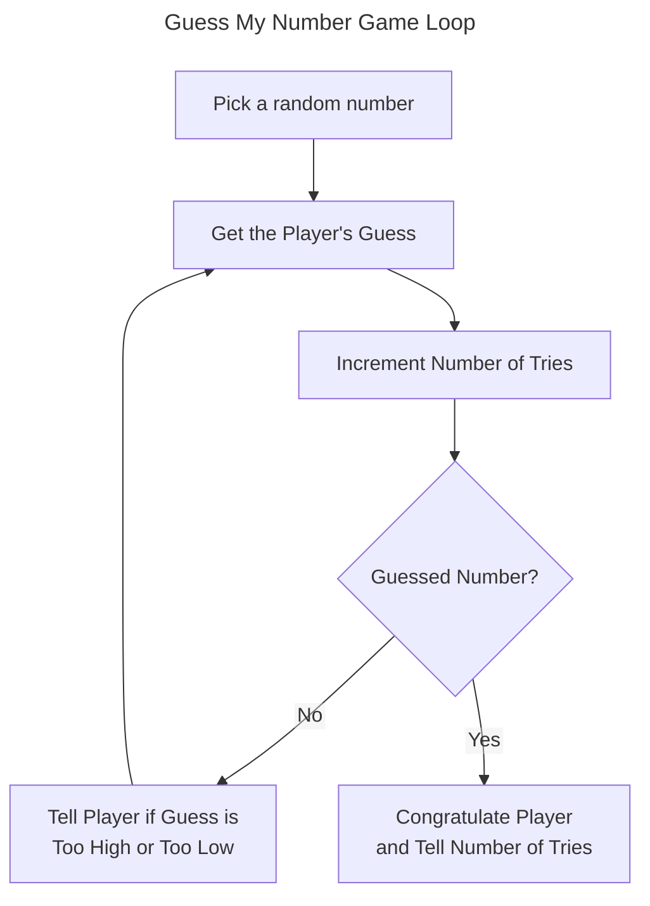

# Chapter 2: Truth, Branching, and the Game Loop: Guess My Number

## Examples

### [Score Rater](./Examples/01_ScoreRater/)

Introduces the `if, else, else-if` construct

#### [Score Rater v1](./Examples/01_ScoreRater/v1/score_rater.cpp)

Demonstrate the `if` statement

#### [Score Rater v2](./Examples/01_ScoreRater/v2/score_rater.cpp)

Improves on the previous program with the `else` clause

#### [Score Rater v3](./Examples/01_ScoreRater/v3/score_rater.cpp)

Improves the previous programs through an `else-if` statement

### [Menu Chooser](./Examples/02_MenuChooser/menu_chooser.cpp)

Demonstrates the `switch` statement to perform a multi-way branch

### [Play Again](./Examples/03_PlayAgain/)

Introduces the `while` and `do-while` loop constructs

#### [Play Again v1](./Examples/03_PlayAgain/v1/play_again.cpp)

Demonstrates the `while` loop

#### [Play Again v2](./Examples/03_PlayAgain/v2/play_again.cpp)

Reimplements the previous program but with a `do-while` construct

### [Finicky Counter](./Examples/04_FinickyCounter/finicky_counter.cpp)

Demonstrates the use of `break` and `continue` to modify the behaviour of a loop

### [Designers Network](./Examples/05_DesignersNetwork/designers_network.cpp)

Uses a basic username and password chat room framework to demonstrate the use of logical `AND` (`&&`) and logical `OR` (`||`)

### [Major Project: Guess My Number](./Examples/07_GuessMyNumber/guess_my_number.cpp)

Ties together the concept of branching, looping and logical operators to write a simple program in which a human player has to guess
a computer generated number in as few guesses as possible

## Exercises

### Discussion Questions

1. *What kind of things would be difficult to program without loops?*
    - Any kind of functionality which has to repeat an arbitrary number of times is difficult without some form of loop construct.
2. *What are the advantages and disadvantages of the `switch` statement versus a series of `if` statements*
    - The switch statement has the advantage of performing the multiway with one comparison
    - The `if-else-if-else` construct requires us to write a sequentual series of `if-else-if` statements that must be tested in turn
    - Additionally the `switch` statement can use cascading behaviour
      - Code falls through from one case to the next in the absence of a `break`
      - Can write short code in cases where there is a standard behaviour with some preprocessing performed in a couple of special cases.
    - However the `if-else-if-else` construct is more flexible since the conditional for the branch may be any expression, not just an `int`
3. *When might you `omit` a break statement from the end of `switch` statement?*
    - As mentioned before, it may be that for a given operation we always want to perform some operation, however in a specific subset we want to perform some preprocessing
    - We can write a `default` case to capture the normal flow and then a special case using `switch` to preprocess but then have it fall through to the `default` behaviour
4. *When should you use a `while` loop over a `do` loop?*
    - When the loop may run $0$ or more times

### Code Exercises

#### [Exercise 2.1](./Exercises/Ex2_1/menu_chooser.cpp)

*Rewrite the Menu Chooser program from this chapter using an enumeration to represent difficulty levels. The variable `choice` will still be of type `int`*

We create the `enum difficulty` as

```cpp
    enum difficulty {EASY = 1, NORMAL, HARD}
```

We explicitly assign `EASY` the value of $1$ so all the constants are the same as in the original code. This implement is much better because now the numbers are assigned semantic meaning in the code through the enumeration. This also makes it easy to extend or modify the difficulty settings in the future

#### [Exercise 2.2](./Exercises/Ex2_2/ex2_2.cpp)

*What's wrong with the following loop?*

```cpp
int x = 0
while(x) {
    ++x;
    cout << x << endl;
}
```

At the first evaluation of the `while` condition `x` will have the vlaue $0$ which is equivalent to `false`. Hence the loop will never run (and if it did it would run endlessly since `x` will continously increase and the overflow behaviour of signed integers is undefined)

#### [Exercise 2.3](./Exercises/Ex2_3/guess_my_number.cpp)

*Write a new version of the [Guess My Number](#major-project-guess-my-number) program in which the player and the computer switch roles. That is, the player picks a number and the computer must guess what it is.*

This is pretty fun as a little exercise. For utility we convert the minimum and maximum allowed numbers to constants to give them semantic meaning and make them easy to change in the future.

For the player we now prompt the player to enter a number within the valid range, reprompting them if they give an invalid number.

For the computer, the simplest approach is to make the computer randomly guess a number until it's correct. However, like the human we want the computer to make use of the response **Too High!** or **Too Low!**. We could use an algorithm like [Binary Search](https://en.wikipedia.org/wiki/Binary_search) but that would be a bit boring. So lets keep the Computer a little bit random, we instead have the computer keep track of the *greatest* and *least* possible values as so:

- Let the range where the number lies be `[a, b]` and the computer guesses `c`
- If `c` is **Too High!** the valid range is now `[a, c - 1]` else if `c` is too low then the range is `[c + 1, b]`. Refer to this new range in either case as `[a', b']`.
- If `a' == b'`, then there is only one valid guess and we generate that number. Otherwise randomly generate a number in the range `[a', b']` and repeat.

## Notes

- To create interesting programs you need to ability to execute (or skip) sections of code based on some condition

### Understanding Truth

- Truth can be represented with `true` and `false`
- Truthfulness can be stored in a `bool`
  - e.g. `bool fact = true, fiction = false`
- Any expression can be evaluated for truthfulness
  - Any non-zero value is `true`
  - Zero is interpreted as `false`
- A common truthfulness expression is a *relation*

| Operator | Meaning                  | Sample Expression | Evaluates to |
|----------|--------------------------|-------------------|--------------|
| ==       | equal to                 | 5 == 5, 5 == 8     | true, false   |
| !=       | not equal to             | 5 != 8, 5 != 5     | true, false   |
| >        | greater than             | 8 > 5, 5 > 8       | true, false   |
| <        | less than                | 5 < 8, 8 < 5       | true, false   |
| >=       | greater than or equal to | 8 >= 5, 5 >= 8     | true, false   |
| <=       | less than or equal to    | 5 <= 8, 8 <= 5     | true, false   |

### Using the `if` Statement

- `if` statements allow you to test an expression for truthfulness and conditionally execute some code

```cpp
if (expression) {
    statement;
}
```

- If `expression` is `true`, then `statement` is executed.
- Otherwise statement is skipped

### Example [Score Rater](#score-rater-v1)

### Testing `true` and `false`

>[!CAUTION]
>Notice that you don't use a semicolon after the closing parenthesis of the expression you test in an `if` statement. If you were to do this, you'd create an empty statement that would be paired with the `if` statement, essentially rendering the `if` statement useless. Here's an example
>
>```cpp
>if (false);
>{
>   cout << "Thhis is never displayed.\n\n";    
>}
>```
>
>By adding the semicolon after (`false`), I create an empty statement thats associated with the `if` statement. The preceding code is equivalent to:
>
>```cpp
>if (false) {
>   ; // an empty statement which does nothing    
>}
>{
>   cout << "This is never displayed.\n\n";    
>}
>```
>
> The `if` statement sees the `false` value and skips the next statement (the empty statement). Then the program goes on its merry way to the statement after the `if` statement, which displays the message, `"This is never displayed"`.
>
>Be on guard for this error. It's an easy one to make and because it's not illegal, it won't produce a compile error

### Interpreting a Value as `true` or `false`

- As mentioned any expression can be evaluated as `true` (non-zero) or `false`

### Using Relational Operators

>[!CAUTION]
>The equal to relational operator is `==`. Don't confuse it with the assignment operator `=`.
>
>It's not illegal to use the assignment operator instead of the equal to relational operator, the results might not be what is expected though. Look at this code
>
>```cpp
>int score = 500;
>if (score = 1000) {
>   cout << " You scored 1000 or more. Impressive!\n";    
>}
>```
>
> As a result of this code, `score` is set to `1000` and the message, `"You scored 1000 or more. Impressive!"` is displayed. Here's what happens: `score` is $500$ before the `if` statement. When the expression is evaluated, `score` is assigned the value $1000$, the assignment expression is evaluated as $1000$ which is non-zero and interpreted as `true`. As a result the string is displayed.
>
>Be on guard for this type of mistake. It's easy to make and in some cases can be hard to find (though most modern compilers should warn about it.)

### Nesting `if` statements

- An `if` statement may execute a single statement or a block of statements
- This includes potentially other `if` statements (called *nesting*)

>[!WARNING]
> You can nest as many levels as you want. However, if you nest code too deeply, it gets hard to read. In general, you should try to limit your nesting to a few levels at most

### Using the `else` clause

- An `else` clause is attached to an `if` statement
- The `else` clause executes when the `if` statement test expression evaluates to `false`

```cpp
if (expression) {
    statement1; //executed if expression is true
} else {
    statement2; //executed if expression is false
}
```

### Example [Score Rater 2.0](#score-rater-v2)

### Using a sequence of `if` statements with `else` clauses

- You can chain `if` statements with `else` clauses to create a sequence of ordered test expressions.
- The statements will be executed from top to bottom until one evaluates as `true` or the `else` clause is reached

```cpp
if (expresssion1) {
    statement1;
} 
else if (expression2) {
    statement2;
} ...
else if (expressionN) {
    statementN;
}
else {
    statementN+1;
}
```

>[!TIP]
> While the final `else` clause in an `if-else-if` suite isn't required, you can use it as a way to execute code if none of the expressions in the sequence are `true`

### Example [Score Rater 3.0](#score-rater-v3)

### Using the `switch` statement

- `switch` statements allow multi-way branching

```cpp
switch(choice) {
    case value1:
        statement1;
        [break;]
    case value2:
        statement2
        [break;]
        .
        .
        .
    case valueN:
        statementN;
        [break;]
    default:
        statementN+1;
}
```

- statement tests `choice` against the `case` *labels* in order
- If equal to a *label* program execution, *jumps* to that label
- Execution exits the `switch` on encountering a `break`
- If no match is found then `default` is executed
- `break` and `default` optional

>[!WARNING]
>Although a default case isn't required, it's usually a good idea to have one as a catchall

- If there is no `break` after a *statement*, execution *falls though* to the next case

>[!CAUTION]
>You can use the `switch` statement, only to to test an `int` (or a value that can be treated as one such as a `char` or an `enumerator`). A switch statement won't work with any other type

- `switch` cases must be specific values, they cannot be conditions or ranges

### Example [Menu Chooser](#menu-chooser)

>[!CAUTION]
>You'll almost always want to end each case with a `break` statement. Don't forget them otherwise your code might do things you never intended

### Using `while` loops

- `while` loops enable repeated sections of code while an expression is `true`

```cpp
while(expression) {
    statement;
}
```

- If `expression` is `false` execution moves past the statement
- If `expression` is `true` the statement is exectued, then control returns to top of the loop where it is tested again

### Example [Play Again](#play-again-v1)

### Using `do` Loops

- `do` loops like `while` loops allow repeated code

```cpp
do {
    statement;
} while(expression);
```

>[!NOTE]
>Even though you can use `while` and `do` loops interchangeably, most programmers use the `while` loop. Although a `do` loop may seem more natural in some cases, the advantage of the `while` loop is that its expression appears right at the top of the loop; you don't have to go to the bottom of the loop to find it.

- Unlike a `while` loop, the statement is executed *first* and then the control expression is evaluated

>[!CAUTION]
> If you've ever had a game get stuck in the same endless cycle, you might have experienced an *infinite loop* (a loop without end). Here's a simple example,
>
>```cpp
>int test = 10;
>while(test == 10) {
>   cout << test;   
>}
>```
>
>In this case, the loop is entered because `test` is `10`. But because `test` never changes, the loop will never stop. As a result, the user will have to kill the running program to end it. The moral of the story? Make sure that the expression of a loop can eventually become `false` or that there's another way for the loop to end. See [Using Break and Continue Statements](#using-break-and-continue-statements)

### Example [Play Again 2.0](#play-again-v2)

### Using Break and Continue Statements

- You can immediately exit a loop with the `break` statement
- You can jump directly to the top of a loop with the `continue` statement

### Example [Finicky Counter](#finicky-counter)

- Here we have a main loop structured as

```cpp
int count = 0;
while(true) {
    count += 1;
    //end loop if count is greater than 10
    if (count  > 10) {
        break; //immediately exits the loop
    }
    //skip the number 5
    if (count == 5) {
        continue; // skips to next loop iteration
    }
    cout << count << endl; //normal loop behaviour
}
```

### Creating a `while(true)` loop

- The line `while(true)` creates an infinite loop
  - Fine as long as the loop body contains an exit condition
  - `while(true)` better than a hidden infinite loop since the intentionality is clear

>[!WARNING]
>Although a `while(true)` loop sometimes can be clearer than a traditional, you should try to minimise your use of these loops

### When to use `break` and `continue`

- Can be used in any loop construct
- Use sparingly, since they make it harder to reason about the flow of a loop
  - Typically best in nested or complex conditional cases where carrying the information through to the next loop variable is tedious
  - e.g. Error handling

### Using Logical Operators

- Logical operators allow simple expressions to be combined into more complex truthfulness expressions

| Operator | Description | Sample Expression            |
|----------|-------------|------------------------------|
| `!`        | Logical NOT | `!expression`                  |
| `&&`       | Logical AND | `expression1 && expression2`   |
| `\|\|`     | Logical OR  | `expression1 \|\| expression2` |

### Example [Designers Network](#designers-network)

### Using Logical AND

- Logical AND (`&&`) joins two expressions to form a larger one
- `true` only if *both* expressions are `true`

| `expression1` | `expression2` | `expression1 && expression2` |
|-------------|-------------|----------------------------|
| true        | true        | true                       |
| true        | false       | false                      |
| false       | true        | false                      |
| false       | false       | false                      |

### Using Logical OR

- Logical OR (`||`) joins two expressions to form a larger one
- `true` if *either* expression is `true`

| `expression1` | `expression2` | `expression1 && expression2` |
|-------------|-------------|----------------------------|
| true        | true        | true                       |
| true        | false       | true                       |
| false       | true        | true                       |
| false       | false       | false                      |

### Using Logical NOT

- Logical NOT (`!`) flips the truthfulness of an expression

| `expression` | `!(expression)` |
|--------------|-----------------|
| true         | false           |
| false        | true            |

### Understanding Order of Operations

- Logical operators also have a precendence
- `! > && > ||`
- Can use parentheses to override order of operations

>[!TIP]
>Although you can use parentheses in a larger expression to change the way in which it's evaluated you can also use *redundant* parentheses (parentheses that don't change the value of the expression) to make the expression clearer. Consider the simple example
>
>`(username == "S.Meier && password == "civilisation")`
>
>Now here's the expression with redundant parentheses,
>
>`((username == "S.Meier) && (password == "civilisation))`
>
>The extra parentheses don't change the meaning of the expression but help demarcate the two smaller expressions joined by the `&&` operator.
>
>**Note:** When and where to use redundant parentheses is something you can only learn with experience

### Generating Random Numbers

- Computers have techniques for generating *pseudo*random numbers
  - Pseudorandom numbers are not truely based random but based on a formula designed to mimic randomness

### The `rand()` function

- `rand()` is a function from the `C` standard library that is grandfathered into `C++`
- To use `rand()` include `cstdlib` via `#include <cstdlib>`.
- `rand()` requires no arguments and returns a random number
  - e.g. `int randomNumber = rand()`

>[!WARNING]
>The `rand()` function generates a random number between $0$ and at least $32767$. The exact upper limit depends on your implementation of C++. The upper limit is stored in the constant `RAND_MAX`, which is defined in `cstdlib`. So if you want to know the maximum random number `rand()` can generat, just send `RAND_MAX` to `cout`.

### Seeding a Random Number Generator

- As mentioned before a computer generates `pseudorandom` numbers
  - random*like* numbers generated according to a sequence or formula
- *Seeding* is the process of telling the random number generator where in the sequence to start generating numbers from.
  - If the program is not seeded (or not seeded unique) each time it is executed, then the sequence of random numbers generated will be identical
- A common seeding technique is to use the current clock time, as demonstrated below

```cpp
srand(static_cast<unsigned int>(time(0))); //seed random number generator
```

- The function `srand` takes in an `unsigned int` to set as the seed for `rand`
- `time` returns a number based on the current system date and time
  - `static_cast<unsigned int>(*number*)` converts this number to an `unsigned int` as required by `srand`
- **Note:** seeding the random number generator has to be done *before* calling `rand`

>[!IMPORTANT]
>A comprehensive explanation of the various forms of casting a value from one type to another is beyond the scope of this book.

### Calculating a Number within a range

- By default `rand()` returns a value between $0$ and `RAND_MAX` (see the above *warning* discussion)
- A technique to convert this number to lie within a range is to use the `%` operator.
  - e.g. to convert the result to a die roll between $1$ and $6$ use

```cpp
int die = (randomNumber % 6) + 1;
```

- The first part of the expression folds `randomNumber` into the range $0$ to $5$ and the second then shifts this to $1$ to $6$

>[!CAUTION]
>Using the modulus operator to create a number within a range from a random number might not always produce uniform results. Some numbers in the range might be more likely to appear than others. However, this isn't a problem for simple games

### Understanding the Game Loop

- The *game loop* is a generalised representation of the flow of events in a game
- The core of the events repeats, hence the name *game loop*
- Specific implementations may vary game to game
- The generic game loop structure can be considered as
  1. **Setup:** Accepting initial settings or loading game assets. Providing context to the player
  2. **Getting player input:** Either from *mouse*, *keyboard* or some other *device*
  3. **Update game internals:** The game logic and rules are applied to the game world in response to player input. e.g. Physics system updating collisions, A.I making moves
  4. **Updating the display:** Drawing graphics or returning display text
  5. **Checking if the game is over:** If the game isn't over the loop branches back to receiving player input. If the game is over control falls through to the shutting down stage
  6. **Shutting down** The game is over, the player may be given some final information, such as his score. The program frees and resources and if necessary exits

### Introducing [Guess My Number](#major-project-guess-my-number)

- Classic guessing game
- The Computer randomly generates a number between $0$ and $100$
- While the player has not correctly guessed the number, they are then
  1. Player prompted for a number
  2. Player enters a number
  3. `If` the number matches the randomly generated number the player *wins*, `else` the player is informed if the number is *too high* or *too low* and control flow returns to the prompt stage
  4. Once the player guesses the number they are informed how many guesses it took them



## Summary

- You can use the truthfulness of an expression to branch (or skip) code
- You can represent truthfulness with the keywords `true` and `false`
- You can evaluate any value or expression for truthfulness
- Any non-zero value evaluates to `true`, while zero evaluates to `false`
- A common way to create an expression to be evaluated as `true` or `false` is to compare values with the *relational operators*
- The `if` statement tests an expression and executes a section of code only if the expression is `true`
- The `else` caluse of an `if` statement specifies code that should be executed only if the expression tested in the `if` statement is `false`
- The `switch` statement tests a value that can be treated as an `int` and executes a section of code labeled with the corresponding value
- The `default` keyword, when used in a `switch` statement, specifies code to be executed if the value tested in the `switch` statemetn matches no listed values
- The `while` loop executes a section of code if an expression is `true` and repeats the code as long as the expression is `true`
- A `do` loop executes a section of code and then repeats the code as long as the expression is `true`
- Used in a loop, the `break` statement immediately ends the loop
- Used in a loop, the `continue` statement immediately causes the control of the program to branch to the top of the loop
- The `&&` (AND) operator combines two smaller expressions to create a new expression that is `true` only if both simpler expressions are `true`
- The `||` (OR) operator combines two simpler expressions to create a new expression that is `true` if either simpler expression is `true`
- The `!` (NOT) operator creates a new expression that is the opposite truth value of the original
- The game loop is a generalised representation of the flow of events in a game, the core of which repeats
- The file `cstdlib` contains functions that deal with generating random numbers
- The function `srand()`, defined in `cstdlib`, seeds the random number generator
- The function `rand()`, defined in `cstdlib`, returns a random number.

## Questions and Answers

1. Do you have to use the keywords `true` and `false`?
    - No, but its a good idea since they have clear semanatic meaning
2. Can you assign a `bool` variabe something other than `true` or `false`?
    - Yes, you can assign an expression to a bool variable, which will store the truthfulness of the result
3. Can you use a `switch` statement to test some non-integer value?
    - No, `switch` statements only work with values that can be interpreted as integers
4. How can you test a single non-integer value against multiple values if you can't use a `switch` statement?
    - Use an `if-else-if-else` construct
5. What's a infinite loop?
    - A loop that never ends regardless of input or state
6. Why are infinite loops considered bad?
    - A program stuck in an infinite loop will typically never end on its own. It may have to be shut down by the operating system, or the computer itself may need to be rebooted
7. Won't a compiler catch an infinite loop and flag it as an error?
    - No, an infinite loop is a logical error - the kind of error a programmer makes.
    - *Some modern compilers may have a limited ability to detect an infinite loop*
8. If infinite loops are a bad thing,then isn't a `while(true)` loop a bad thing?
    - No, when a programmer creates a `while(true)` loop, they should provide a way for the loop to end (usually through a `break` statement)
9. Why would a programmer create a `while(true)` loop?
    - They are typically used for the main loop of a program such as the game loop
10. Why do some people feel that using a `break` statement to exit a loop is poor programming?
    - Because indiscriminate use of `break` statements can make it hard to understand and reason about the conditions under which a loop ends. However, sometimes the use of a `while(true)` loop along with a `break` statement can be clearer than creating the same loop in a more traditional way
11. What's a pseudorandom number?
    - A random number that's usually generated by a formula. As a result, a series of pseudorandom numbers is not truely random, but good enough for most purposes
12. What's seeding a random number generator?
    - It's giving the random number generator a seed, such as an integer, which affects the way the generator produces random numbers. If you don't seed a random number generator, it will produce the same series of numbers each time its run from the beginning of a program
13. Don't you always want to seed the random number generator before using it?
    - No nessecarily. You might want a program to produce the exact same sequence of "random" numbers each time it runs for testing purposes, for example
14. How can I generate more truely random numbers?
    - There are third-party libraries that produce better psuedorandom numbres than the ones that typically come with C++ compilers
15. Do all games use the game loop?
    - The game loop is just a way of looking at a typical game's flow of events. Just because this paradigm fits a particular game does not mean that game is implemented with a loop around the bulk of its code