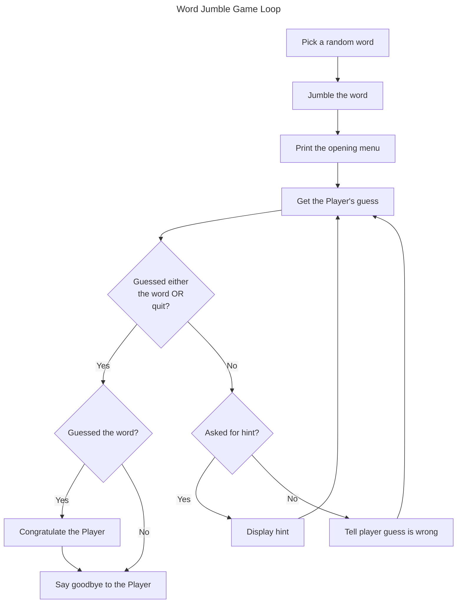

# Chapter3: For Loops, String and Arrays: Word Jumble

## Examples

### [Counter](./Examples/01_Counter/counter.cpp)

A simple counter demonstrating `for` loops

### [String Tester](./Examples/02_StringTester/string_tester.cpp)

Demonstrates the behaviour of `string` objects and common operations

### [Hero's Inventory](./Examples/03_HerosInventory/)

Introduces the concept of arrays

#### [Hero's Inventory 1.0](./Examples/03_HerosInventory/v1/heros_inventory.cpp)

Demonstrates the use of an array to store multiple values under the same "variable".

#### [Hero's Inventory 2.0](./Examples/03_HerosInventory/v2/heros_inventory.cpp)

Demonstrates the use of an initiliser list to create an array

### [Tic-Tac-Toe](./Examples/04_TicTacToe/tictactoe.cpp)

Demonstrates the use of multidimensional arrays by printing a sample tic-tac-toe board state

### [Major Project: Word Jumble](./Examples/05_WordJumble/word_jumble.cpp)

Ties together `for` loops, `strings` and `arrays` in the game *Word Jumble* were the player is given a randomly jumbled word from an internally stored dictionary and asked to guess the jumbled word

## Exercises

### Discussion Questions

1. *What are some of the things from your favourite game that you could represent as objects? What might their data members and member functions be?*
    - Consider the game chess, we could consider two objects
        1. A game board, which stores the game state and where pieces are as data members, and has functions to update the board
        2. Pieces which may store their location, points value and have functions that can be used to calculate their valid moves
2. *What are the advantage of using an array over a group of individual variables?*
    - Common variables are grouped together in the program under one semantic label and in the memory as one block
    - It is easier to adjust the number of elements by changing the size of the array as opposed to creating or deleted variable names
    - We can easily write code to perform algorithms on arbitrarily-sized arrays, we can't easily do this for an arbitrary collection of independently named variables
3. *What are some limitations imposed by a fixed array size?*
    - Fixes the amount of memory used regardless of if this is *too large* or *too small*
    - Can't add more elements to the array that the fixed size allows

### Code Exercises

#### [Exercise 3.1](./Exercises/Ex3_1/word_jumble.cpp)

*Improve the Word Jumble game by adding a scoring system. Make the point value for a word based on its length. Deduct points if the player asks for a hint*

We implement a simple score situation were the score for a word is set as equal to the length of that word. Then after an incorrect guess the score is reduced by $1$ (to a minimum of $0$.) If the player asks for a hint, their remaining score is halved.

#### [Exercise 3.2](./Exercises/Ex3_2/phrase.cpp)

*What is wrong with the following code?*

```cpp
for (int i = 0; i <= phrase.size(); ++i) {
    cout << "Character at position " << i << " is: " << phrase[i] << endl;
}
```

strings store their characters in an underlying array of characters. For a string containing $`n`$ characters these are in the indices $0 \ldots n - 1$. Typically the $n$-th index then stores a character called a *null terminator*, which is not part of the actual string itself but is designed to demarcate the end of the string. By running over all the indices up to and including *size* above, we accidently print out this null terminator

#### [Exercise 3.3](./Exercises/Ex3_3/grid.cpp)

*What's wrong with the following code?*

```cpp
{
    const int ROWS = 2;
    const int COLUMNS = 3;
    char board[COLUMNS][ROWS] = {{'O', 'X', 'O'}, {' ', 'X', 'X'}};
}
```

The problem above is that the way the code semantically reads is that board should be a $2 \times 3$ array, but instead the columns and rows have been flipped as so what is actually happening is board is declared as a $3 \times 2$, which we then try to initialise as a $2 \times 3$ array. This code should cause a *compile error*

## Notes

- Lots of time in code rather than dealing with single units of data, we work with *sequences* of data.
  - e.g. *strings*, which are sequences of characters

### Using `for` loops

- Well suited for iterating over a sequence

```cpp
for (initialisation ; test ; action) {
    statement;
}
```

- *initialisation* is a statement that sets up some initial condition prior to loop body execution
  - This may include defining variables
- *test* is the loop condition, equivalent to the *while* loops test statement
  - *statement* is what is done when the loop condition is `true`
- *action* is executed after each iteration of the loop body
  - Commonly this is iterating or counting over an index

#### Example: [Counter Program](#counter)

>[!CAUTION]
> If you're using an older compiler that doesn't support modern C++ standards, when you try to compile the [counter](#counter) example you might get an error that says something like `error: 'i': redefinition: multiple initialisation`.
>
>The best solution is to use a modern,  compliant compiler such as `g++` or `clang`, or `MSVC` on Windows. If you must use an old compiler then declare any `for` loop counter variables just once for all `for` loops in scope. Scopes are covered in [Chapter 5](../Chapter5/Chapter5.md/)

#### Counting with `for` loops

- Typical use for `for` loops is iterating over a sequence like `for (int i = 0; i < 10; i++)` which iterates from $0$ through to $9$ inclusive
- `for` loops can also work backwords e.g. `for (int i = 9; i >= 0; --i)` works as before but counts backwards from $9$
- The *action* in a `for` loop is not restricted to simple sequential counting, e.g. `for(int i = 0; i <= 50; i += 5)` counts up in increments of $5$
- `for` loops can be just as susceptible to infinite loops as `while` loops

#### Using empty statements in `for` loops

- You can use empty statements in creating your `for` loop, as I did in the following loop, `for (; count < 10; )`
- Empty statements are effectively ignored, an empty *test condition* is equivalent to a `while(true)` statement

>[!NOTE]
> Different game programmers have different traditions. In the last chapter, you saw that you can create a loop that continues until it reaches an exit statement (such as a `break`) using `while(true)`. Some programmers, prefer to use `for(;;)`.
Because the test expression in this loop is the empty statement, the loop will continue until it encounters some exit statement

#### Nestng `for` Loops

- You can nest `for` loops

#### Understanding `for` Loops

- Fundamental types store individual pieces of information
- We've seen how these can be manipulated through operators and functions
- Many things are *objects* (encapsulated, cohesive things that combine qualities and abilities)
  - e.g. An *Alien Spaceship* might have a *quality*: **energy level** and an *ability*: **firing it's weapons**
- C++, like many modern languages lets you define *software objects*  which combine data and functions
  - *data object* called a *data member* or *attributes*
  - *object function* called a *member function* or *method*
  - Same *type* objects have the same structure, but can have different values
- For objects you don't need to know the underlying implementation, purely what we can do with the object
- Objects can be stored in variables as for fundamental types

### Using `string` objects

- `string` objects are used for sequences of characters
  - Is actually an object
    - Provides member functions e.g. length and character substitution
    - `strings` also defined to work intuitively with specific *operators*

#### Example [String Tester](#string-tester)

#### Creating `string` objects

- There are several methods to create a `string` in C++

```cpp
string word1 = "Game";
string word2("Over");
string word3(3, '!');
```

- The first creates a string `word1` using the assignment operator and a *string literal* as with fundamental types
- The second creates a string `word2` by wrapping the desired *string literal* in parentheses using a function call syntax
- The final creates a string `word3` by using a function call syntax with a *number* denoting the string length, followed by the character `'!'` which is repeated to the desired length to give the string `"!!!"`

#### Concatenating `string` Objects

- `strings` can be *concatenated* using the *addition* operator

```cpp
string phrase = word1 + " " + word2 + word3;
```

- The above code creates the string, `"Game Over!!!"`
- `+` which is normally mathematical addition has been *overloaded* to mean concatenation

#### Using the `size()` Member Function

- `string` has the member function `size` which returns the size (number of characters) in the string.
- member functions are called with the `object.member_function()` syntax

>[!TIP]
>`string` objects also have a member function `length()`, which, just like `size()`, returns the number of characters in the `string` object.

#### Indexing a `string` object

- Individual sequence elements of a `string` can be accessed using *index notation* e.g. `phrase[0]` returns the first character in the string `phrase`
  - **Note**: C++ sequences are $0$-indexed, i.e. the first index is $0$

>[!CAUTION]
>It's a common mistake to forget that indexing begins at position $0$. Remember a `string` object with $n$ characters in it can be indexed from position $0$ to position $n - 1$

- You can also reassign individual characters in a `string` e.g. `phrase[0] = 'L'` sets the first character of the string `phrase` to `'L'`.

>[!CAUTION]
> C++ compilers do not perform bounds checking when working with `string` objects and the subscropting oeprator. This means that the compiler doesn't check to see whether you're attempting to access and element that doesn't exist. Accessing an invalid sequence elment can lead to disastrous results because it's possible to write over critical data in your computer's memory. By doing this, you can crash your program, so take care when using the subscripting operator

- One can loop over `string` objects as for any sequence, e.g. the below example which prints out every character in the string individually
  - Observe the use of `phrase.size()` to iterate over the full bounds

```cpp
for (unsigned int i = 0; i <= phrase.size(); ++i) {
    cout << "Character at position" << i << "is: " << phrase[i] << endl;
}
```

>[!NOTE]
>Iterating through a sequence is a powerful and often used technique in games. You might for example, iterate through hundreds of individual units in a strategy game, updating their status and order. Or you might iterate through the list of vertices of a 3D model to apply some geometric transformation

#### Using the `find()` Member Function

- The `string` member function `find` checks if a *string* contains a *substring*
  - `find` returns the index of the first occurrence of the *substring* in the *string*
  - If the *substring* **does not exist** in *string* the special constant `string::npos` is returned
    - `string::npos` represents the largest possible size of a `string` object, so it is not a valid index.
    - Semantically means a position that cannot exist

>[!TIP]
> When using `find()`, you can supply an optional argument that specifies a character number for the program to start looking for the substring. The following line will start looking for the string literal `"eggplant"` beginning at position $5$ in the `string` object `phrase`.

#### Using the `erase()` Member Function

- `erase()` removes a specified *substring* from a `string` object
- One call is to specify the beginning position and the length of the *substring* e.g. `phrase.erase(4 5);` which erases the *substring* of length $5$ starting at position $4$
- Another call is to supply the beginning position
  - The beginning position and all susequent characters are erased e.g. `phrase.erase(4)`
- If `erase` is called with no arguments the entire string is erased and becomes the empty `string`, `""`.

#### Using the `empty()` Member Function

- `empty()` returns a *boolean* value indicating if the string is *empty* (`true`) or *non-empty* (`false`)

### Using Arrays

- Arrays provide a mechanism to work with a sequence of any elements of *any* type
- Arrays can store *fundamental* types e.g. `int`, or *programmer defined* types e.g. *items in a characters inventory*

#### Example: [Hero's Inventory](#heros-inventory-10)

#### Creating Arrays

- Often good to define a constant for the size of an array
- Declaration follows the same as any other variable
  i.e. `type name[size];`

>[!Important]
>You can initialise an array with values when you declare it by providing an *initiliser list* (a sequence of elements seperated by commas and surrounded by curly braces). Here's an example:
>
>```cpp
>   string inventory[MAX_ITEMS] = {"sword", "armour", "shield"};
>```
>
>The preceding code declares an array of `string` objects, `inventory`, that has a size of `MAX_ITEMS`. The first three elements of the array are initialised to `"sword"`, `"armour"`, and `"shield"`.
>
>If you omit the number of elements when using initialiser list, the array will be created with a size equal to the number of elements in the list. Here's an example:
>
>```cpp
>   string inventory[] = {"sword", "armour", "shield"};
>```
>
>Because there are three elements in the initialiser list, the preceding line creates an array, `inventory`, that is three elements in size. Its elements are `"sword"`, `"armour"`, and `"shield"`.

#### Example: [Hero's Inventory - Initialiser List](#heros-inventory-20)

#### Indexing Arrays

- Arrays can be indexed like strings using the subscripting operator (`[]`)
- You can add, elements to an array using the subscripting operator

```cpp
int numItems = 0;
inventory[numItems++] = "sword";
inventory[numItems++] = "armour";
inventory[numItems++] = "shield";
```

- `numItems` counts the number of items in the `inventory` array.
  - It can also be viewed as the *next free index* in `inventory`
  - Using the *postfix* **increment** operator lets us add items while keeping the `numItems` as the number of items in one operation
    - If we were removing items the *prefix* **decrement** operator lets us perform the operation in reverse (i.e. decrements `numItems` to the last occupied index then performs the edit to the array)
- It is easy to increment over arrays

```cpp
cout << "Your items:\n";
for (int i = 0; i < numItems; ++i) {
    cout << inventory[i] << endl;
}
```

- Arrays elements can also be reassigned like strings e.g. `inventory[0] = "battle axe"`

>[!CAUTION]
>Array indexing begins at $0$, just as you saw with `string` objects. This means that the following code defines a five-element array:
>
>```cpp
>int highScores[5]
>```
>
>Valid position numbers are $0$ through to $4$, inclusive. There is no element `highScores[5]`! An attempt to access `highScores[5]` could lead to a crash or other *undefined behaviour*.

#### Accessing Member Functions of an Array Element

- Recall you can access an array element with the selection operator, e.g. `inventory[0]` selects the first element
- If the member is an object and has attached functions, we can use them as if `inventory[idx]` was the variable name
  - e.g. `inventory[0].size()` calls the `size` function on `inventory[0]`, i.e. the number of characters in `inventory[0]`.

#### Being Aware of Array Bounds

- Arrays have fixed size
  - This size is not explicitly stored in the program
  - Typically an integer constant or integer is created to track the array size
- Accessing an array outside of its bounds in *undefined behaviour* which means the program can do anything, (often crashing but worse it can access memory it shouldn't which is a common cause of security errors)
- One should always establish *bounds checking*
  - Either use surrounding code to enforce that any accessed bound is valid, or
  - Check the array is valid before we index

#### Understanding C-Style Strings

- Before `string` objects, strings were represented as character arrays terminated by a *null character* or *null terminator*
  - These are called *C-style strings* since it derives from the C language
- You can declare and initialise *C-style strings*

```cpp
char phrase[] = "Game Over!!!";
```

- **Note:** The null character is implicit by the enclosing `""`, the character array `phrase` has $13$ elements, but $12$ that represent the actual character sequence
- You can also specify the array size, e.g.

```cpp
char phrase[81] = "Game Over!!!";
```

- The above creates a *char* array with $81$ characters, i.e. it can hold $80$ printable characters and $1$ null character
- C-strings don't have member functions, but the file `cstring` in the standard library contains functions for working with C-style strings
- `string` objects should work seamlessly with C-style strings e.g. the following are all valid

```cpp
string word1 = "Game"
char word2[] = " Over"

string phrase = word1 + word2;

if (word1 != word2) {
    cout << "word1 and word2 are not equal.\n";
}

if (phrase.find(word2) != string::npos) {
    cout << "word2 is contained in phrase.\n";
}
```

- Can contenate `string` objects and C-style strings, result is a `string` object
- can compare `string` objects and C-style strings using relational operators
- Can use C-style strings as arguments to `string` object member functions

- C style strings are functionally arrays with the same shortcomings, e.g. fixed size etc.
- **Use `string` whenever possible!**

### Using Multidimensional Arrays

- Sometimes it is much more intuitive to represent an object as multi-dimensional, e.g. a $8 \times 8$ chessboard may be more naturally represented as a $2$-D structure than a $64$ element linear array

#### Example: [Tic-Tac-Toe Board](#tic-tac-toe)

#### Creating Multidimensional Arrays

- Multidimensional arrays declarations can be considered as writing an `array of arrays`, i.e. we write a series of `[]` to specify the size, and use nested initiliser lists to initialise, e.g.

```cpp
char board[ROWS][COLUMNS] = {{'O', 'X', 'O'},
                             {' ', 'X', 'X'},
                             {'X', 'O', 'O'}};
```

>[!TIP]
>It's possible to simply declare a multidimensional array without initialising it. Here's an example:
>
>```cpp
>char chessboard[8][8];
>```
>
>The preceding code declares an $8 \times 8$, two-dimensional character array, `chessBoard`. By the way, multidimensional arrays aren't required to have the same size for each dimension. The following is a perfectly valid declaration for a game map represented by individual characters:
>
>```cpp
>char map[12][20];
>```

#### Indexing Multidimensional Arrays

- To index an individual element you must index each dimension using the indexing operator `[]`, e.g. `board[1][0]` accesses the first element of the second row
- You can assign to individual elements the same as you would for a linear array
- There is a simple convention for iterating over a $2$-D array,

```cpp
for (int i = 0; i <  ROWS; ++i) {
    for (int j = 0; j < COLUMNS; ++j) {
        cout << board[i][j];
    }
}
```

### Introducing [Word Jumble](#major-project-word-jumble)

- Game where a player has to guess a word with the letters arranged randomly
- In our game the computer will generate the word and perform the jumble
  - We also let the player ask for a hint

>[!NOTE]
>Even though puzzle games don't usually break into the top-te list of games, major companies still publish them year after year. Why? For one simple reason: They're profitable. Puzzle games, while not usually blockbusters, can still sell well. There are many gamers out there (casual and hardcore) who are drawn to the zen of a well-designed puzzle game. And puzzle games cost much less to produce than the high-profile games that require large production teams and years of development time

#### Picking a Word to Jumble

- Each word is effectively a *word*, *hint* pair, which can naturally be stored in a two-dimensional array associating each word and hint.
- We then store the words and hints in a `const string` array, `WORDS`, since we don't ever want to modify them. This array is effectively our dictionary
- We use an `enum` to allow labeled names to assign semantic meaning to each array index
  - e.g. `words[1][HINT]` accesses the hint for the second word
  - `NUM_FIELDS` defaults to the number after `HINT` in this case $2$, which means (assuming we use default `enum` values), `NUM_FIELDS` is the number of elements in the `enum` excluding itself

```cpp
enum fields {WORD, HINT, NUM_FIELDS}
const string WORDS[NUM_WORDS][NUM_FIELDS] = {
  {"wall", "do you feel you're banging your head against something"},
  {"glasses", "These might help you see the answer"},
  {"laboured", "Going slowly, is it?"},
  {"persistent", "Keep at it"},
  {"jumble", "It's what the game is all about"}
}
```

>[!TIP]
>You can list a final enumerator in an enumeration as a convenient way to store the number of elements, e.g.
>
>```cpp
>enum difficulty {EASY, MEDIUM, HARD, NUM_DIFF_LEVELS}
>cout << "There are" << NUM_DIFF_LEVELS << " difficulty levels";
>```
>
>In the previous code `NUM_DIFF_LEVELS` is $3$, the exact number of difficulty levels in the enumeration. As a result, the second line of code displays the message `"There are 3 difficulty levels"`

- A word is picked using the standard random selection idiom to select a *row* / word index in the array
  - We then perform the assignments `string theWord = WORDS[choice][WORD]; string theHint = WORDS[choice][HINT]`
  - This is purely to avoid having to do the lengthly multidimensional array references everywhere

#### Jumbling the Word

- To jumble the word we need to make a *mutable* copy, since the word dictionary is `const` qualified.
  - `string jumble = theWord;` creates a mutable copy
- To jumble we iterate over the length of the string, and each time swap two random elements of `jumble`

```cpp
string jumble = theWord;
int length = jumble.size();
for (int i = 0; i < jumble.size(); i++) {
    int index1 = (rand() % length);
    int index2 = (rand() % length);
    char temp = jumble[index1] //swap
    jumble[index1] = jumble[index2];
    jumble[index2] = temp;
}
```

#### Welcoming the Player

- Prints out a simple menu for the player, including a quit option

>[!WARNING]
>As enthralling as you think your game is, you should always provide a way for the player to exit it.

#### Entering the Game Loop

- Word jumble has a simple game loop
- *prompt* the player to guess
- While the player has not guessed the word (or quit), we
  - Read in the player guess
  - *if* its *hint* we offer the hint,
  - *else* inform the player the guess is wrong
  - *reprompt* the player for a new guess
- Once the player has guessed we congratulate them,
- Then (or if the player quits) thank them for playing
- Exit

The game loop flowchart is



## Summary

- The `for` loop lets you repeat a section of code. In a `for` loop, you can provide an initialisation statement, an expression to test, and an action to take after each loop iteration
- `for` loops are often used for counting or looping through a sequence
- Objects are encapsulated, cohesive entitites that combine data (called *data members*) and functions (called *members functions*)
- `string` objects (often called just *strings*) are defined in the file `string`, which is part of the standard library. `string` objects allow you to store a sequence of characters and also have member functions
- `string` objects are defined so they work intuitively with familiar operators, such as the concatenation operator and the relational operators
- All `string` objects have member functions, including those for determining a `string` object's length, determining whether or not a `string` object is empty, finding substrings and removing substrings
- Arrays provide a way to store and access sequences of any type
- A limitation of arrays is they have a fixed length
- You can access individual elements of `string` objects and arrays through the subscripting operator
- Bounds checking is not enforced when attempts are made to access individual elements of `string` objects or arrays. Therefore, bounds checking is up to the programmer
- C-style strings are character arrays terminated with the null character. They are the standard way to represent strings in the C language. Even though C-style strings are perfectly legal in C++, `string` objects are the preferred way to work with sequence of characters

## Questions and Answers

1. Which is better, a `while` loop or a `for` loop?
    - Neither is inherently better than the other. Use the loop that best fits the usecase
2. When might it be better to use a `for` loop than a `while` loop?
    - You can create a `while` loop to do the job of any `for` loop; however, there are some cases were a `for` loop is more compact. Those include counting and iterating through a sequence
3. Can I use `break` and `continue` statements with `for` loops?
    - Sure. They behave just they do in `while` loops: `break` ends the loop and `continue` jumps control back to the top
4. Why do programmers tend to use variablee names such as `i`, `j` and `k` as counters in `for` loops?
    - Largely out of tradition, and some legacy convention around variable naming in the language `FORTRAN` which itself was inspired by mathematical notation where `i`, `j`, `k` are common index variables
5. I dont have to include a file to use `int` or `char` types, so why do I have to include the `string` file to use strings?
    - `int` and `char` are built-in types. They can be accessed in any C++ program. The `string` type, on the other hand, is not a built-in type. It;s defined as part of the standard library in the `string` file.
6. How did C-style strings get their name?
    - In the C programming language, programmers represent strings using character arrays terminated by a null character. The practice was carried forward into C++. After the `string` type was introduced, C-style strings became terminology to refer to the old style of strings
7. Why should I use `string` objects over C-style strings?
    - `string` objects are significantly more programmer friendly. They are dynamically sizeable meaning they can be created without specifying the a fixed size. Additionally not having to manage the null character makes manipulating them much easier to reason about
8. Should I ever use C-style strings?
    - You should opt to use `string` objects whenever possible. If you're working on an existing program that uses C-style strings, the you might have to work with them
9. What is operator overloading?
    - A process that allows you to define the use of familiar operators (like $+$ and $-$) in different contexts with different but predictable results. For example $+$ is overloaded by the `string` type to perform concatenation since numerical addition doesn't exist for strings.
10. Can't operator overloading be confusing?
    - It can be. Overloading assigns a new meaning to an operator, but the new meaning is fixed to a specfic context. E.g. it should be clear that `4 + 6` and `string1 + string2` are doing two different types of *addition* operations.
11. Can I use the `+=` operator to concatenate `strings`?
    - Yes, the `+=` operator is concatenated to work as you would expect
12. To get the number of characters in a `string` object should I use the `length()` member function or the `size()` member function?
    - Both return the same value, so you can use either
13. What's a predicate function?
    - A function that returns either `true` or `false`. The string object member function `empty()` is an example of a predicate function
14. What happens if I try to assign a value to an element beyond the bounds of an array?
    - C++ will allow you to make the assignment. However the results are unpredictable and might cause your program to crash. That's because you altering some unknown part of the computer's memory
15. Why should I use multidimensional arrays?
    - To make working with a group of elements more intuitive. For example a chess board can be represented in one dimension as an array `chessBoard[64]` or you could represent it with a more intuitive, two-dimensional array, as in `chessBoard[8][8]`
