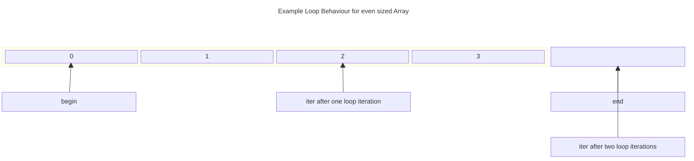
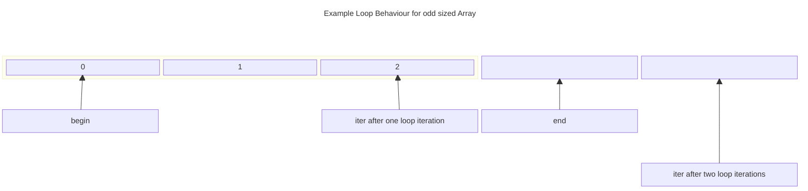
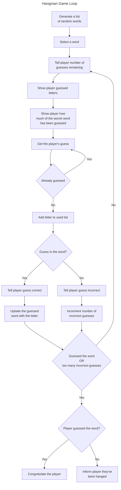

# Chapter 4: The Standard Template Library

## Examples

### Hero's Inventory

Introduces the concept of dynamic arrays called *vectors* and *iterators* over them

#### [Hero's Inventory 2.0](./Examples/01_HerosInventory/v2/heros_inventory.cpp)

Introduces *vectors* as dynamic arrays

#### [Hero's Inventory 3.0](./Examples/01_HerosInventory/v3/heros_inventory.cpp)

Demonstrates the use of *iterators* to access eleemnts of a container like a *vector*

### [High Scores](.//Examples/02_HighScores/high_scores.cpp)

Demonstrates use of the standard algorithms offered in the STL including operations like *sort* and *random shuffle*

### [Major Project: Hangman](./Examples/03_Hangman/hangman.cpp)

Introduces the concept of *pseudocode* and ties together *vectors* and STL *algorithms* in the game *Hangman* where a player has a limited number of guesses to guess a hidden word from an internal dictionary character by character.

## Exercises

### Discussion Questions

1. *Why should a game programmer use the STL?*
    - The STL provides common containers, algorithms and iterators, that are typically type-generic and high performance. It saves the programmer time in creating their own bespoke implementations and helps new hires learn the codebase by a common reference point
2. *What are the advantages of a vector over an array?*
    - Vectors are dynamically sizeable and as objects provide helpful functions and attributes such as their length bundled with the instance. This is distinct from an array where one must write most functions themselves and keep track of the fixed array size themselves.
3. *What types of game objects might you store with a vector?*
    - Anything that has to be iterated over and that potentially has a dynamic range such as vertices in a 3D animation, units in a RTS, items in an inventory
4. *How do performance characteristics of a container type affect the decision to use it?*
    - Often containers have *advantages*; scenarios or situations in which they provide good performance (such as appending and removing from the end of a vector) and *disadvantages*; scenarios in which they provide bad performance (such as inserting into the middle of a vector). By considering what operations are most likely to be performed most often on data, an appropriate container can be chosen to ensure that high performance is achieved and maintained
5. *Why is program planning important?*
    - Programs can be large and complicated. Without a good idea of **what** you're planning to acheive and **how** to acheive it. You can easily get into situations where you have to spend lots of time and effort rewriting a program that doesn't do what it should or whose performance is inadequate due to a poor choice of data structure

### Code Exercises

#### [Exercise 4.1](./Exercises/Ex4_1/game_list.cpp)

*Write a program using vectors and iterators that allows a user to maintain a list of his or her favourite games. The program should allow the user to list all game titles, add a game title, and remove a game title*

We store the game titles in an initially empty `vector` of `string` objects. When the user adds a game we simply read in the title of the game and append it to the `vector`.

When the user wants to remove a game, we again read in the title, then get an iterator pointing to the game using the `std::find` algorithm and erase it. If the game does not exist we print an error diagnostic.

To display the list we simply iterate over the vector contents and output each game title on its own line.

We wrap these three required operations in a simple menu controlled using numeric inputs and a `switch` statement, add functionality to quit or see the menu again and call it there.

We've played around a little with the `switch` statement, notably the `default` case comes *before* the `HELP` case, and falls through to the help after printing the message `"invalid option!"`. This is a quality of life choice, we assume a user who has entered an invalid option has forgotten the menu and with it the correct input for help!

You will notice an odd syntax `[[fallthrough]]` at the end of the `default` case instead of a `break`. This is a piece of syntax called an *attribute*. It exists to tell the compiler that the fallthrough behaviour is desired here, so a warning is not generated.

#### [Exercise 4.2](./Exercises/Ex4_2/vector_iterator_error.cpp)

*Assuming that `scores` is a vector that holds elements of type `int`, what's wrong with the following code snippet? (meant to increment each element)?*

```cpp
vector<int>::iterator iter;
//increment each score
for (iter = scores.begin(); iter != scores.end(); ++iter) {
    iter++
}
```

Recall that the access the value an iterator refers to you have to use the *derefence operator* (`*`). Instead `iter++` moves the iterator to the next element. This the outcome that effectively the iterator is moved forward *twice* each time around the loop. If the number of elements in score is even then the loop terminates, but `scores` is left unchanged. **Worse** behaviour is observed if the number of elements is odd. Then the indices at each loop iteration are $0, 2, 4, \ldots, 2k$ etc, this means (since the final index would be odd-valued) that the program will skip past `scores.end()` without testing and so never fail the loop condition hence causing an *infinite loop*.

The below block diagrams illustrated with mermaid demonstrate the difference



- In the even length case above `iter` and `end` eventually reference the same point and the loop terminates



- In the odd length case above `iter` skips past `end` and the loop never terminates

[Exercise 4.3](./Exercises/Ex4_3/word_jumble_pseudo.md)

*Write psuedocode for the Word Jumble game from Chapter 3*.

You can read the pseudocode in the linked markdown file. For a simple game like word jumble we don't feel the need to do any significant refinement of any steps of the *pseudocode*. Notice that the pseudocode itself also doesn't directly translate one to one to our implementation in C++, the loop is written like we ask the player what action they want to take, then receive the appropriate input. In the implementation we get player input, then from it decide it's a guess, a hint request or a quit request. *This is fine!*, Pseudocode is supposed to give a guiding overview of the structure of the program, not the exact implementation. (Otherwise we would just write a pseudocode compiler)

## Notes

- The *Standard Template Library* provides sophisticated techniques for working with collections. These include
  - *Containers* like `vector` for storing data
  - *Iterators* for moving through sequences
  - *algorithms* for manipulating them

### Introducing the Standard Template Library

- The STL provides a set of *containers* for storing data, and compatible *algorithms* for manipulating them
- algorithms include
  - sorting
  - searching
  - copying
  - merging
  - inserting
  - removing
- Algorithms in the STL are written in a general way as to work across the container types
- *Iterators* are objects for identifying elements in a container
  - Can be moved among elements
  - Named because they traditionally were used to *iterate* over containers
    - Iterators support the STL algorithm implementations

### Using `vector`

- `vector` is a generalised *dynamic array* container provided by the STL
  - dynamic means that its size is not fixed, but can grow and shrink at runtime
  - `vector` also provides member functions to perform common array operations and manipulate its members
  - Effectively a **souped up array!**
- `vector` tends to be preferable to arrays, since
  - A `vector` can grow as needed where as an array is fixed size
  - `vector` supports use of the STL algorithms
    - Searching, sorting etc. are thus built in
- `vector` has some disadvantages,
  - object representation of `vector` requires a memory overhead
  - Resizing a `vector` has a performance cost
  - May not be available on systems that do not support modern C++ standards
- Overall a `vector` is preferable to an array

#### Example [Hero's Inventory 2.0](#heros-inventory-20)

#### Declaring a Vector

- `vector` is contained in the `vector` header so we need to use `#include <vector>` to access them.
  - As per usual carries the `std` namespace
- A simple `vector` instantiation is

```cpp
vector<type> name;
```

- e.g. `vector<string> inventory`, which declares a `vector` containing `string` objects called `inventory`

>[!TIP]
>There are additional ways to declare a vector. You can declare one with a starting size by specifying a number in paretheses after the vector name
>
>```cpp
>vector<string> inventory(10);
>```
>
>The preceding code declares a `vector` to hold `string` object elements with a starting size of $10$. You can also initialise all of a vector's elements to the same value when you declare it. You simply supply the number of elements followed by the starting value, as in:
>
>```cpp
>vector<string> inventory(10, "nothing");
>```
>
>The preceding code declared a `vector` with a size of $10$ and initialised all $10$ elements to `"nothing"`. Finally you can declare a vector and initialise it with the contents of another `vector`:
>
>```cpp
>vector<string> inventory(myStuff);
>```
>
>The preceding code created a new vector with the same contents as the vector `myStuff`

#### Using the `push_back()` Member Function

- The `push_back()` member function appends a new element to the end of the vector e.g.

```cpp
inventory.push_back("sword");
```

#### Using the `size()` Member Function

- The `size()` member function returns the number of elements in the `vector` e.g.

```cpp
cout << "You have " << inventory.size() << "items.\n"
```

#### Indexing Vectors

- You can index a `vector` like an array with the subscripting operator (`[]`), e.g.

```cpp
for (unsigned int i = 0; i < inventory.size(); i++) {
    cout << inventory[i] << endl;
}
```

- You can use indexing to modify and/or replace the contents of a `vector`

>[!CAUTION]
>Although vectors are dynamic,  you can't increase a vectors size by applying the subscripting operator. For example the following highly dangerous code snippet does not increase the size of the vector `inventory`:
>
>```cpp
>vector<string> inventory; //creating an empty vector
>inventory[0] = "sword"; // may cause a program crash
>```
>
>Just as with arrays, you can attempt to acess a nonexistent element position (but with potentially disastrous results). The preceding code changed some unknown section of your computer's memory and could cause your program to crash. To add a new element at the end of a vector, use the `push_back()` member function

#### Calling Member Functions of an Element

- As we saw with `string` objects, the member functions of an element can be accessed using the `.` operator, e.g. `inventory[0].size()` calls the `size` member function on the $0$-th indexed element of `inventory`

#### Using the `pop_back()` Member Function

- The delete equivalent to `push_back`, e.g. `inventory.pop_back()`
- Removes the *last* element of a vector and reduces the size by one

#### Using the `clear()` Member Function

- `name.clear()` removes all elements of a `vector` named `name` and sets the size to zero.

#### Using the `empty()` Member Function

- Like the `empty()` function on `string` objects discussed in [Chapter 3](../Chapter3/Chapter3.md#using-the-empty-member-function)
- `inventory.empty()` returns `true` if the `vector` named `inventory` is *empty*, else `false`
  - A `vector` is defined to be empty if its size is zero, i.e. it contains no elements

### Using Iterators

- As mentioned before *iterators* let you move through and identifying elements in containers
- Also let you interact with the algorithms in the STL

#### Example [Hero's Inventory 3.0](#example-heros-inventory-30)

#### Declaring Iterators

- Iterator declaration can look complicated and is best shown through an example, e.g.

```cpp
vector<string>::iterator myIterator
```

- The above declares an *iterator* for a `vector` containing `string` objects called `myIterator`, the general initialisation then looks something like

```cpp
container-type<element-type>::iterator name
```

- Iterators are values that identify a particular element in a container
- Iterators can access the underlying value of the element they refer to
- Certain iterators can change the referenced value
- Iterators can be moved via arithmetic operations
- A special type of *iterator* is a `const_iterator`  declared like

```cpp
container-type<element-type>::const_iterator name
```

- `const_iterator` creates a *constant iterator*, these iterators can still iterate over container elements like a normal iterator **but** they **cannot change** the value of the element they refer to
  - Consider them as *read-only access*
- Using a constant iterator is good for making your itentions clear
  - Signifies that no value should be changed
- Attempting to change a value with a constant iterator causes a compile error
  - Allows for catching errors early

>[!CAUTION]
>Using `push_back()` might invalidate all iterators referencing the vector

#### Looping through a Vector

- Like indexed `for` loops, there is a natural idiom for looping over a container with an `iterator`,

```cpp
cout << "Your items:\n";
for (iter = inventory.begin(); iter != inventory.end(); ++iter) {
    cout << *iter << endl;
}
```

- The `begin()` `vector` member function returns an iterator referring to the first element of the container
- The `end()` `vector` member function returns an iterator referring to one past the final element of the container

>[!CAUTION]
> The `end()` `vector` member function returns an iterator that's one *past* the last element of the vector (not the last element). Therefore you can't get a value from the iterator returned by `end()`. This might seem counter-intuitive, but it works well for loops that move through a container

- iterators can be altered using standard arithmetic operations, for example `++iter` shifts `iter` to refer to the next element in the container
  - Exact mathematical operations available depend on the iterator
  - Allow you to move around a container
- The access the value referenced by an iterator you need to *dereference* the iterator using the dereference operator (`*`). e.g. `cout << *iter` sends the value referenced by `iter` to `cout`.
  - **Note:** The Dereference operator comes *before* the variable

#### Changing the value of a Vector Element

- Though the syntax is different the method is basically the same as for arrays e.g.

```cpp
myIterator = inventory.begin();
*myIterator = "battle axe";
```

- The above replaces the first element of `inventory` with the string `"battle axe"`. Note the use of the dereference operator to assign the value the underlying element not the *iterator* itself

#### Acessing Member Functions of a Vector Element

- Like indexed array elements, elements referenced by an iterator can have their member functions invoked, e.g.

```cpp
cout << "\nThe item name '" << *myIterator << "' has ";
cout << (*myIterator).size() << " letters in it.\n";
```

- In the above we first dereference the iterator `myIterator` to access the underlying member `(*myIterator)`, then call the `size()` function `(*myIterator).size()`
  - We have to use parentheses since `.` has higher precendence than `*`
  - Without parentheses the term reads `*(myIterator.size())`, i.e. we try to dereference the result of calling `size()` on the iterator `myIterator`.

>[!WARNING]
>Whenever you dereference an iterator to access a data member or member function, surround the derferenced iterator by a pair of parentheses. This ensures that the dot operator will be applied to the object the iterator references

- An improved piece of syntax is given by `->` the statement `myIterator->size()` is equivalent to the `(*myIterator).size()` construct given before
  - This syntax is generally preferred

>[!IMPORTANT]
>*Syntactic Sugar* is a nicer, alternative syntax. It replaces harsh syntax with something that's a bit easier to swallow. As an example, instead of writing the code `(*myIterator).size()`. I can use the syntactic sugar provided by the `->` operator and write `myIterator->size()`

#### Using the `insert()` Vector Member Function

- Items can be added to arbitary locations in a `vector` using `insert()`
  - A version of `insert` takes an iterator and a new value; the new value is then *inserted* into the `vector` just before the element referred to by the iterator. e.g.

```cpp
 inventory.insert(inventory.begin(), "crossbow")
```

- The above version of insert returns an iterator referencing the newly inserted element
- All existing elements after the insertion point are shifted down one

>[!CAUTION]
>Calling the `insert()` member function on a vector invalidates all of the iterators that reference elements after the insertion point because of the elements after the insertion point are shifted down by one

#### Using the `erase()` Vector Member Function

- Items can be removed from arbitary locations in a `vector` using `erase`
  - One form removes an element from a `vector` by taking an `iterator` to the that element e.g.

```cpp
inventory.erase((inventory.begin() + 2))
```

- The preceding code deletes the third element in `inventory`
  - All following elements move up one
- This version returns an iterator referencing the element after the element that was just removed

>[!CAUTION]
>Calling the `erase()` member function on a vector invalidates all of the iterators that reference elements ater the removal point because all of the elements after the removal point are shifted up by one

### Using Algorithms

- STL algorithms let you manipulate containers and their elements through iterators
- Algorithm implementations are
  - flexible
  - efficient
  - generic to the container representation

#### Example [High Scores](#high-scores)

>The original book had the following code for randomising the scores
>
>```cpp
>#include <ctime>
>#include <cstdlib>
>--snip--
>vector<int>::const_iterator iter;
>--snip--
>
>srand(static_cast<unsigned int>(time(0)));
>random_shuffle(scores.begin(), scores.end());
>cout << "High Scores:\n"
>for (iter = scores.begin(); iter != scores.end(); ++iter) {
>   cout << *iter << endl;
>}
>```
>
> `random_shuffle` relies on the `cstdlib` function `rand` under the hood, (hence why need to seed the time and include `ctime` and `cstdlib`). There are quality concerns about the implementations of `rand` that have since made `random_shuffle` deprecated. The replacement is
>
>```cpp
>   shuffle(start, end, random number generator)
>```
>
>We can get a random number generator though the `random` header, the drop in replacement for `random_shuffle` then becomes,
>
>```cpp
>    random_device rd;
>    mt19937 rng(rd());
>    shuffle(scores.begin(), scores.end(), rng);
>```
>
>Where `random_device` can be thought of as the seed, replacing our `srand` call, while `mt19937 rng(rd())` creates a random number generator. For a discussion see [this reddit post](https://www.reddit.com/r/cpp_questions/comments/kbothg/with_random_shuffle_deprecated_what_function/)

#### Preparing the use Algorithms

- Live the `algorithm` header
- Belong to the `std` namespace

#### Using the `find()` Algorithm

- `find(start, stop, value)` searches from the iterator `begin` to the iterator `stop` for an element with the given `value`.
  - *If* found an iterator to that element is returned
    - If there are multiple elements with the given `value` the first is returned
  - *Else*  if not found the returned iterator is equal to `stop`
    - i.e. `stop` is not included in the search range, or we search the half open interval $[\text{start}, \text{stop})$
- If we want to iterate over all the *matches* we can use the loop construct

```cpp
for (iter = find(start, stop, value), iter != stop, find(++iter, stop, value)) {
    // do thing
}
```

- How does this work?
  - On initialising the loop we look for the desired value
    - *If* its not in the container, the loop test immediately fails and we don't proceed
    - *Else* `iter` is the first reference to that value, and we do some work
    - Now at the loop end, we move `iter` to the first element of the unsearched part of the container and perform `find` again.
      - Observe the use of the prefix `++` operator to ensure the updated location of `iter` is sent to `find`
  - The loop terminates once we've processed all the matches

#### Using the `random_shuffle()` Algorithm

- `random_shuffle` can randomise the order of the contents of a container between the iterators `start` and `stop`, with the call `random_shuffle(start, stop)`
  - Needs `srand` to be called to seed the underlying call to `rand`
  - `random_shuffle` is deprecated and replaced with `shuffle`, see the discussion [above](#example-high-scores)

>[!TIP]
>Although you might not want to randomise a list of high scores, `random_shuffle` (and it's replacement `shuffle`) is a valuable algorithm for games. You can use it for everything from shuffling a deck of cards to mixing up the order of the enmies a player will encounter in a game level

#### Using the `sort()` Algorithm

- Containers can be sorted with the `sort` algorithm
- `sort` follows the common algorithm interface, i.e. `sort(start, stop)` sorts the container between `start` and `stop`
  - The sort is performed in ascending order

>[!TIP]
>A very cool property of STL algorithms is that they can work with containers defined outside of the STL. These containers only have to meet certain requirements. For example, even though `string` objects are not part of the STL, you can use appropriate STL algorithms on them. The following code snippet demonstrates this:
>
>```cpp
>string word = "High Scores";
>random_shuffle(word.begin(), word.end());
>```
>
>The preceding code randomly shuffle the characters in `word`. As you can see `string` objects have both `begin` and `end` member functions, which return iterators to the first character, respectively. That's part of the reason why STL algorithms work with `strings`; they're designed to

### Understanding Vector Performance

- Vectors and other other STL containers are typically highly efficient
- They do have strengths and weaknesses though

#### Examining Vector Growth

- Vectors grow dynamically as needed
  - Every vector has a fixed size at a given point in time
  - When a vector exceeds its current size, the computer has to reallocate memory to increase this size
    - This might require the vector and its elements to be copied to a new memory location
    - This can have performance impacts
    - You can judge if this will be an issue by considering how many items and where this reallocation might occur
      - If it's a small number of items reallocation is unlikely
      - If the reallocation occurs in a relatively unimportant code point the impact will also be small

##### Using the `capacity` Member Function

- `vector.capacity()` returns the *capacity* of the vector `vector`.
- *capacity* is the number of elements the vector can hold before reallocation
- Typical behaviour is for a vector to double its capacity when it reallocates

##### Using the `reserve` Member Function

- `vector.reserve(cap)` increases the capacity of the vector `vector` to `cap`
  - This allows you to control when and where a reallocation occurs

>[!WARNING]
>As a beginning game programmer, it's good to be aware of how vector memory allocation works; however, don't obsess over it. The first game programs you'll write probably won't benefit from a more manual process of vector memory allocation.

#### Examining Element Insertion and Deletion

- Adding or deleting via `push_back(val)` and `pop_back()` are extremely efficient
  - Effectively just overwriting the last element in an underlying array
- Adding or removing from anywhere else is less efficient
  - May have to move multiple elements
- The STL offers the `list` container
  - Designed for fast arbitrary insert and delete

>[!CAUTION]
>Just becuase you want to insert or delete elements from the middle of a sequence, that doesn't mean you should abandon the vector. It might still be a good choice for your game program. It really depends on how you use the sequence. If your sequence is small or there are onlyy a few insertion and deletions, then a vector might still be your best bet

### Examining Other STL Containers

- There are two broad types of STL containers
  - *sequential containers*, where values are retrieved in a sequence
  - *associate containers*, values are retrived via a key
    - vectors are sequential
- Sequential containers are good for when we might want to cycle through a set, e.g. players in a turn-based game.
- Associatiative good when we may perform arbitrary lookup on individual items
  - e.g. relating player information to a unique indentifier such as an IP address in an online game
- *Container adaptors* convert one of the sequence containers
  - Represent standard computer science data structures

| Container      | Type        | Description                                                                        |
|----------------|-------------|------------------------------------------------------------------------------------|
| deque          | Sequential  | Double-ended Queue                                                                 |
| list           | Sequential  | Linear List                                                                        |
| map            | Associative | Collection of key/value pairs in which each  key is associated with a unique value |
| multimap       | Associative | Collection of key/value pairs in which each key is associated with multiple values |
| multiset       | Associative | Collection in which each element is not necessarily unique                         |
| priority_queue | Adaptor     | Priority Queue                                                                     |
| queue          | Adaptor     | Queue                                                                              |
| set            | Associative | Collection in which each element is unique                                         |
| stack          | Adaptor     | Stack                                                                              |
| vector         | Sequential  | Dynamic Array                                                                      |

### Planning your Programs

- *Psuedocode* is a technique of sketching out a program before writing it
- Uses englishlike syntax to outline the *functional* steps your code should do
- There's no formal structure, the aim is to translate the problem statement into code, see the blow example of a plan to make a money

```text
If you can think of a new and useful product
    Then that's your product
Otherwise
    Repackage an existing product as your product
Make an informercial about your product
Show the infomercial on TV
Charge $100 per unit of your product
Sell 10,000 units of your product
```

#### Using Stepwise Refinement

- If the pseudocode is not clear enough for you to get started, then often you might expand on parts of the pseudocode to make it more detailed
- For example, take the line `Create an infomercial about your product`, we can expand this as

```text
Write a script for an infomercial about your product
Rent a TV Studio for a day
Hire a production crew
Hire an enthusiastic audience
Film the infomercial
```

### Introducing Hangman

- Computer picks a secret word and the player tries to guess it one letter at a time
- Player gets eight incorrect guesses to avoid being hanged

#### Planning the Game

- Lets write the pseudocode for hangman

```text
Create a group of words
Pick a random word from the group as the secret word
While player hasn't made too many incorrect guesses and hasn't guessed the secret word
    Tell player how many incorrect guesses he or she has left
    Show player the letters he or she has guessed
    Show player how much of the secret word he or she has guessed
    Get player's next guess
    While player has entered a letter that he or she has already guessed
        Get player's guess
    Add the new guess to the group of used letters
    If the guess is in the secret word
        Tell the player the guess is correct
        Update the word guessed so far with the new letter
    Otherwise
        Tell the player the guess is incorrect
        Increment the number of incorrect guesses the player has made
If the player has made too many incorrect guesses
    Tell the player that he or she has been hanged
Otherwise
    Congratulate the player on guessing the secret word
```

We can convert this into the game loop flowchart



#### Setting up the Program

- The `include` is

```cpp
#include <iostream>
#include <string>
#include <vector>
#include <algorithm>
#include <cctype>
#include <random> // for shuffle inplace of <ctime> for random_shuffle
```

- `cctype` includes function for converting characters to uppercase
  - Makes `a` equal to `A` when we handle the player guess

#### Initialising Variables and Constants

- The setup is then

```cpp
int main() {
    const int MAX_WRONG = 8; // constant for max wrong guesses

    vector<string> words //collection of possible words
    words.push_back("GUESS");
    words.push_back("HANGMAN");
    words.push_back("DIFFICULT");

    random_device rd; //replacement for random_shuffle
    mt19937 rng(rd());
    shuffle(scores.begin(), scores.end(), rng);
    const string THE_WORD = words[0]; // word to guess, unchanging
    int wrong = 0; //number of incorrect guesses
    string soFar(THE_WORD.size(), '-'); //word guessed so far
    string used = ""; // letters already guessed

    cout << "Welcome to Hangman. Good luck!\n";
}
```

- Notice we try to make things `const` where possible

#### Entering the Main Loop

- We loop until the player guesses the word or the player gets too many guesses wrong
- Print out the game state for the player each time

```cpp
cout << "\n\nYou have " << (MAX_WRONG - wrong);
cout << " incorrect guesses left.\n";
cout << "\nYou've used the following letters:\n" << used << endl;
cout << "\nSo far, the word is:\n" << soFar << endl;
```

#### Getting the Player's Guess

- We use the standard `cin` method to get the input
- Convert to uppercase to keep things standardised
  - Check if its already been guessed (repeat getting the guess until we get a new guess)
  - Append the new guessed letter to the string with string concatenation
  - Update the game state

```cpp
char guess;
cout << "\n\nEnter your guess: ";
cin >> guess;
guess = toupper(guess); //make uppercase since secret word in uppercase
while(used.find(guess) != string::npos) { // reprompt the user until no matches
    cout << "\nYou've already guessed " << guess << endl;
    cout << "Enter your guess: ";
    cin >> guess;
    guess = toupper(guess);
}

used += guess;

if (THE_WORD.find(guess) != string::npos) {
    cout << "That's right!" << guess << " is in the word.\n";
    //update soFar to include all matches to the newly guessed character
    for (unsigned int i = 0; i < WORD.length(); ++i) {
        if (THE_WORD[i] == guess) {
            soFar[i] = guess;
        }
    }
}
else {
    cout << "Sorry, " << guess << " isn't in the word.\n";
    ++wrong; //update the wrong
}
```

#### Ending the Game

- Work out which condition ended the game and print out the appropriate message

## Summary

- The Standard Template Library (STL) is a powerful collection of programming code that provides containers, algorithms and iterators
- Containers are objects that let you store and access collections of values of the same type
- Algorithms defined in the STL can be used with its containers and provide common functions for working with groups of objects
- Iterators are objects that identify elements in containers and can be manipulated to move among elements
- Iterators are they key to using containers to their fullest. Many of the container member functions require iterators, and the STL algorithms require them too
- To get the value reference byy an iterator, you must *dereference* the iterator using the *dereference operator (\*)*
- A vector is one kind of sequential container provided by the STL. It acts like a dynamic array
- It's very efficient to iterate through a vector. It's also very efficient to insert or remove an element from the end of a vector
- It can be inefficient to insert or delete elements from the middle of a vector, especially if the vector is large
- Psuedocode, which falls somewhere between English and a programming language is used to plan programs
- Stepwise refinement is a process used to rewrite pseudocode to make it ready for implementation

## Questions and Answers

1. Why is the STL important?
    - Because it saves game programmers time and effort. The STL provides commonly used container types and algorithms
2. Is the STL fast?
    - Definitely. The STL has been honed by hundreds of programmers to eke out as much performance as possible on each supported platform
3. When should I use a vector instead of an array?
    - Almost always. Vectors are efficient and flexible. They do require a little more memory than arrays, but this tradeoff is almost always worth the benefits
4. Is a vector as fast as an array?
    - Accessing a vector element can be just as fast as accessing an array element. Also, iterating through a vector can be just as fast as iterating through an array
5. If I can use the subscripting operator with vectors, why should I ever need iterators?
    - There are several reasons. First, many of the `vector` member functions require iterators. (`insert()` and `erase()` are two examples.) Second, STL algorithms require iterators. And third, you can't use the subscripting operator with most of the STL containers, so you're going to have to learn to user iterators sooner or later
6. Which is the best way to access elements of a vector? Through iterators, or through the subscripting operator?
    - It depends. If you need random-element access, then the subscripting operator is a natural fit. If you need to use the STL algorithms, then you must use iterators
7. What about iterating through the elements of a vector? Should I use subscripting or an iterator?
    - You can use either method. However, an advantage of using an iterator is that it gives you the flexibility to substitute a different STL container in place of a vector (such as a list) without much code changing
8. Why does the STL define more than one sequentional container type?
    - Different sequential container types have different performance properties. They're like tools in a toolbox; each tool is best suited for a different job
9. What are container adaptors?
    - Container adaptors are based on one of the STL sequence containers; they represent standard computer data structures. Although they are not official containers, they look and feel just like them
10. What's a stack?
    - A data structure in which elements are removed in the reverse order from how they were added. This means that the last element added is the first one removed. This is just like a real-life stack, from which you remove the last item you placed on top of the stack
11. What's a queue?
    - A data structure in which elements are removed in th esame order they were added. This is just like a real-life queue, such as a line of people in which the first person in line gets served first
12. What's a double ended queue?
    - A queue in which elements can be added or removed from either end.
13. What's a priority queue?
    - A data structure that supports finding and removing the element with the highest priority
14. When would I use psuedocode?
    - Any time you want to plan to write a program or section of code
15. When would I use stepwise refinement?
    - When you want to get even more detailed with your pseudocode
