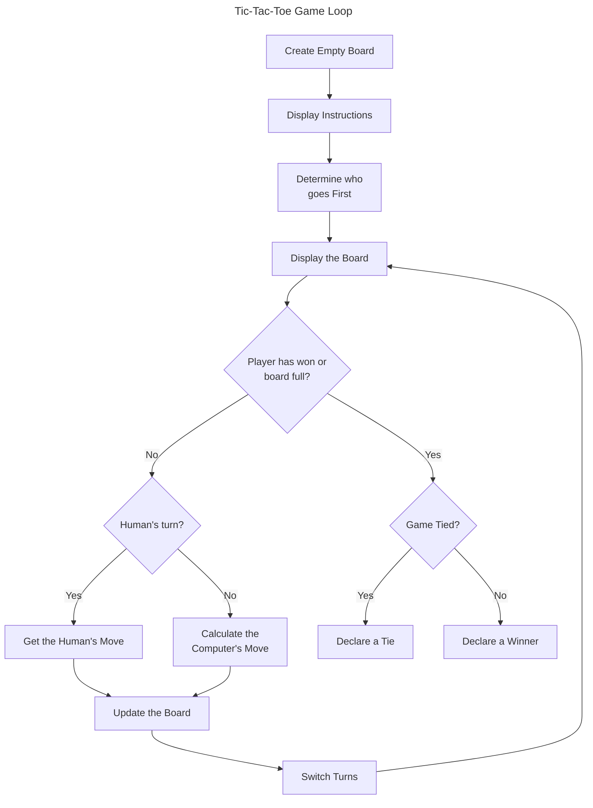
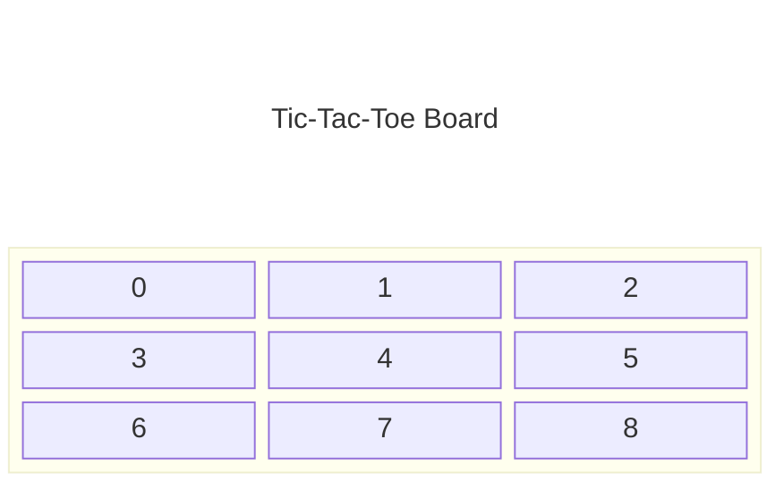

# Chapter 6: References: Tic-Tac-Toe

## Examples

### [Referencing](./Examples/01_Referencing/referencing.cpp)

Introduces the concept of a `reference` in C++

### [Swap](./Examples/02_Swap/swap.cpp)

Demonstrate the use of references to alter argument variables

### [Inventory Displayer](./Examples/03_InventoryDisplayer/inventory_displayer.cpp)

Highlights the concept a `const reference` for constant read-only access

### [Inventory Referencer](./Examples/04_InventoryReferencer/inventory_referencer.cpp)

Demonstrates the ability to return a reference from a function

### [Major Project: Tic-Tac-Toe](./Examples/05_TicTacToe/tictactoe.cpp)

Shows the advantage of references in having multiple functions operate on a common state, through the well known game Hangman. Includes a non-trivial Computer opponent heuristic

## Exercises

### Discussion Questions

1. *What are the advantages and disadvantages of passing an argument by value?*
    - **Pro and Con:** Allows the value to be changed without modifying the original value
    - **Con**: Can result in excessive expensive copy operations for read-only values
    - **Pro**: Pass by value and return by value makes it clear when a value changes purely through the function signatures
2. *What are the advantages and disadvantages of passing a reference?*
    - **Pro**: Passing an alias in typically much cheaper than a copy
    - **Pro and Con**: Allows variables to have their value changed by a function
    - **Con**: Can make it unclear if and what variable values are changed
    - **Con**: Can't pass in a literal
3. *What are the advantages and disadvantages of passing a constant reference?*
    - **Pro**: Passing an alias is typically much cheaper than a copy
    - **Pro**: Makes it clear what values are changed through the return parameter, since the reference is read-only
    - **Pro**: Can pass a literal through a constant reference
    - **Con**: Can't change referenced values
4. *What are the advantages and disadvantages of returning a reference?*
    - **Pro**: Avoids expensive copy on return by value
    - **Con**: Reference can't be assigned to a variable, or this copy occurs regardless
    - **Con**: Can't return a local variable, since lifetime is only so long as the function exists
5. *Should game A.I cheat in order to create a more worthy opponent?*
    - This is an open question, typically players will verbally say that they don't like it when the A.I cheats or doesn't play by the same rules, however it can be very difficult to make a competitive A.I in an advanced technical game without some level of "cheating"

### Code Exercises

#### [Exercise 6.1](./Exercises/Ex6_1/mad_lib_references.cpp)

*Improve the Mad Lib game from Chapter 5 by using references to make the program more efficient*

Let us examine the program. In the case of the `askNumber` and `askText` program, the provided prompt is *read-only*, we simply print it out. We thus replace it with a `const` reference. However, we will *assign* their return values to a standard variable, so we leave the `return` as *return-by-value*

The remaining function is the `tellStory` function, here all the input parameters are *read-only* output passed to `cin` so we change all of the over to `const` references

#### [Exercise 6.2](./Exercises/Ex6_2/invalid_reference.cpp)

*What's wrong with the following program?*

```cpp
int main() {
    int score;
    score = 1000;
    float& rScore = score;
    return 0;
}
```

The reference `rScore` refers to a `float` but the type of `score` is `int`. References must preserve the type. This program should *fail to compile*, (see the linked code)

#### [Exercise 6.3](./Exercises/Ex6_3/local_reference.cpp)

*What's wrong with the following function?*

```cpp
int& plusThree(int number) {
    int threeMore = number + 3;
    return threeMore;
}
```

This function returns a reference to the local variable `threeMore`, the lifetime of this variable will expire when the function returns leaving the reference invalid. The linked implementation should generate a *compiler warning*

## Notes

- References are a simple, but powerful tool. This chapter covers how to
  - Create references
  - Access and change referenced values
  - Pass references to functions to alter argument values or for efficiency
  - Return references from a function for efficiency or to alter values

### Using References

- A *reference* is an alias for another variable
- Reference reflect operations on them to the underlying variable

#### Example: [Referencing](#referencing)

#### Creating References

- References are created using the referencing operator `&`, e.g.

```cpp
int myScore = 1000;
int& mikesScore = myScore;
```

- References are declared as `ref-type& ref-name = aliased-variable`

>[!TIP]
>Sometimes programmers prefix a reference name with the letter "r" to remind them that they're working with a reference. A programmer might include the following lines,
>
>```cpp
>int playerScore = 1000;
>int& rScore = playerScore;
>```
>
>Though modern tooling should let you inspect a variable type

- References can be considered as nicknames

>[!CAUTION]
>Because a reference must always refer to another value, you must initialise the reference when you declare it. If you don't you'll get a compile error. The following line is quite illegal:
>
>```cpp
>int& mikesScore; //not assignment
>```

#### Accessing Referenced Values

- The referenced value is accessed exactly as if the reference was the original name, e.g.

```cpp
cout << "myScore is: " << myScore << "\n";
cout << "mikesScore is: " << mikesScore << "\n\n"; 
//mikesScore references myScore
```

- These both will print the value in `myScore`

#### Altering Referenced Values

- Any modification of the variable through one name will be echoed in the other
  - Recall a *reference* is effectively another alias for *one* place in memory
- e.g. if `score` is referenced by `rScore` then we can modify the value through `score` *or* `rScore`

>[!CAUTION]
>A reference always refers to the variable with which it was initialised. You can't reassign a reference to refer to another variable, so for example, the results of the following code might not be obvious
>
>```cpp
>int myScore = 1000;
>int& mikesScore = myScore;
>int larrysScore = 2500;
>mikesScore = larrysScore; // may not do what you think
>```
>
>The line `mikesScore = larrysScore;` does not reassign the reference `mikesScore` so it referes to `larrysScore` because a reference can't be reassigned. However, because `mikesScore` is just another name for `myScore`, the code `mikesScore = larrysScore;` is equivalent to `myScore = larrysScore;`, which assigns $2500$ to `myScore`. And after all is said and done, `myScore` becomes $2500$ and `mikesScore` still refers to `myScore`

### Passing References To Alter Arguments

- Passing an argument to a function occurs as a copy
- The original variable cannot be changed
- Typically desired to preserve the original variable
- But if we want to change the original variable directly, we can use a reference

#### Example [Swap](#swap)

#### Passing by Value

- A normal parameter is *passed by value*
  - The function gets a *copy* of the argument variable
  - e.g. The below function attempts to swap variables, but receives by value

```cpp
void badSwap(int x, int y) {
    int temp = x;
    x = y;
    y = temp;
}
```

- The `x` and `y` in the above are *local* copies, so the original `x` and `y` in the calling scope are unchanged
  - The local `x` and `y` do swap

#### Passing by Reference

- If we pass by reference, we are aliasing the original variable
  - Anything done to the parameter will be done to the original variable
- To *pass by reference* you must declare the parameter as a reference
- e.g. the `swap` implementation below uses references and does work

```cpp
void goodSwap(int& x, int& y) {
    int temp = x;
    x = y;
    y = temp;
}
```

- Observe that the actual internals of the code is the same, the references just work

### Passing References for Efficiency

- Passing a variable by value incurs the overhead of creating the copy
  - overhead negligable for `int`, `float` etc.
- Typically passing by reference is cheaper when dealing with non-fundamental types
  - e.g. `string`

#### Example [Inventory Displayer](#inventory-displayer)

#### Understanding the Pitfalls of Reference Passing

- Passing a large object by reference avoids the copy cost
- However, introduces risk, the original object can now be changed
  - How do we ensure we don't want to change it, or *document* this for other developers?
  - Answer is to use a *constant reference*

>[!WARNING]
>In general, you should avoid changing an argument variable. Try to write functions that send back new information to the calling code through a return value

#### Declaring Parameters as Constant References

- *Constant references* are declared using the `const` keyword, e.g. `void display(const vector<string>& vec)`

- A *constant reference* is a restricted reference
  - The data it references is *read-only*
  - The underlying data can't be changed without generating a compile error
- constant references thus render the passed arguments *safe*
  - efficiently passed and non-modifiable
- Note constant references can be used anywhere, they are not restricted to function parameters

>[!TIP]
>A constant reference comes in handy in another way. If you need to assign a constant value to a reference, you have to assign it to a constant reference. (A non-constant reference won't do)

#### Passing a Constant Reference

- Non-constant variables can be passed as constant references
  - The creaton of the appropriate type at the function call is handled by the compiler

>[!CAUTION]
>You can't modify a parameter marked as a constant reference. If you try, you'll generate a compile error.

### Deciding How to Pass Arguments

- Guidelines for choosing how to pass arguments
  - **By Value**: Pass by value when an argument variable is one of the fundamental built-in types, such as `bool`, `int` or `float`. Objects of these types are so small that passing by reference doesn't result in any performance gain.
    - Also pass by value when you want to make a copy of the variable, such as if you plan to modify a function parameter without reflecting in the calling scope
  - **As a constant reference**: Pass a constant reference when you want to efficiently pass a value that you don't need to change
  - **As a reference**: Pass a reference only when you want to alter the value of the argument variable. However, you should try changing the argument variable whenever possible

### Returning References

- As when passing a value, *returning a value* is really returning a copy
- Again can be expensive and replaced by *returning a reference*

#### Example [Inventory Referencer](#inventory-referencer)

#### Returning a Reference

- Must specify that the return type is a reference, e.g. the below example declares a function returning a reference to a `string`

```cpp
string& refToElement(vector<string>& inventory, int i);
```

- No special need to identify the `return` is a reference, e.g. the above prototype has the implementation,

```cpp
string& refToElement(vector<string>& inventory, int i) {
    return vec[i];
}
```

- The function declaration handles specifying that a reference should be returned

>[!CAUTION]
>Although returning a reference can be an efficient way to send information back to a calling function, you have to be careful not to return a reference to an out-of-scope object (an object that ceases to exist). For example, the following function returns a reference to a `string` object that no longer exists after the function ends (and that's illegal)
>
>```cpp
>string& badReference() {
>   string local = "This string will cease to exist once the function ends.";
>   return local;
>}
>```
>
> One way to avoid this type of problem is to never return a reference to a local variable

#### Displaying the value of a Returned Reference

- Value can be accessed like any reference

#### Assigning a Returned Reference to a Reference

- A returned reference can be assigned to another reference, e.g.

```cpp
string& rStr = refToElement(inventory, 1);
```

- This is an efficient assignment because no complete copy of the object occurs

#### Assigning a returned Reference to a Variable

- Returned reference can be assigned to a traditional variable, e.g.

```cpp
string str = refToElement(inventory, 2);
```

- Reference can't be assigned to a normal variable, so what happens?
  - A copy of the underlying referenced object to the assigned variable occurs
  - This copy can be *expensive*! (Typically more than reference passing)

#### Altering an Object through a Returned Reference

- As long as the returned reference is not constant, you can use it to modify the original variable like any other reference, e.g.

```cpp
string& rStr = refToElement(inventory, 1);
rStr = "Healing Potion";
```

- The above code will alter the contents of `inventory[1]` to `"Healing Potion"`
  - Use a constant reference to avoid this behaviour

### Introducing Tic-Tac-Toe

- In this project we will implement a human-vs-machine Tic-Tac-Toe game, with a simple A.I (*artificial intelligence*)

#### Planning the Game

- Recall, the most important part of programming is planning to program!

>[!NOTE]
>Game designers work countless hours on concept papers, design documents, and prototypes before programmers write any game code. Once the design work is done, the programmers start their work (more planning). It's only after programmers write their own technical designs that they then begin coding in earnest. The moral of this story? Plan. It's easier to scrap a blueprint than a $50$-story building.

##### Writing the Pseudocode

- Lets first express the code in high-level pseudocode to try and capture the functions we might need

```text
Create an empty Tic-Tac-Toe board
Display the game instructions
Determine who goes first
Display the board
While nobody's won and it's not a tie
    If it's the human's turn
        Get the human's move
        Update the board with the human's move
    Otherwise
        Calculate the computer's move
        Update the board with the Computer's move
    Display the board
    switch turns
Congratulate the winner or declare a tie
```

We can also represent this as a game loop



##### Representing the Data

- How do we represent a piece?
  - We will display this on a terminal, so let us use either `'X'` or `'O'`
- How do we represent the board?
  - Can use a `vector` of nine `char` elements
  - Board positions then indexed from $0$-$8$
  - Need a symbol for empty tile, i.e. `' '`
- Move can therefore be represented as an `int` indicatig the tile to play
  - We also need to keep track of whose turn it is (using `'X'` or `'O'`)



##### Creating a List of Functions

- We use the psuedocode to guide the functions we implement

| Function                                                      | Description                                                                                                                          |
|---------------------------------------------------------------|--------------------------------------------------------------------------------------------------------------------------------------|
| `void instructions()`                                         | Displays the game instructions                                                                                                       |
| `char askYesNo(string question)`                              | Asks a yes or no question. Receives a question. Returns either a 'y' or 'n'                                                          |
| `int askNumber(string question, int high, int low = 0)`       | Asks for a number in a given range. Receives a question, a low number and a high number. Returns a number in the range (low, high)   |
| `char humanPiece()`                                           | Determines the human's piece.  Returns either an `'X'` or an `'O'`                                                                   |
| `char opponent(char piece)`                                   | Calculates the opposing piece given a piece. Receives either an `'X'` or an `'O'`. Returns either an `'X'` or an `'O'`               |
| `void displayBoard(const vector<char>& board)`                | Displays the board on the screen. Receives a board                                                                                   |
| `char winner(const vector<char>& board)`                      | Determines the game winner. Receives a board. Returns an `'X'`, `'O'`, `'T'` (to indicate a tie), or `N` (to indicate no winner yet) |
| `bool isLegal(const vector<char>& board, int move)`           | Determines if a move is legal. Receives a board and a move. Returns either `true` or `false`                                         |
| `int humanMove(const vector<char>& board, char human)`        | Gets the human's move. Receives a board and the human's piece Returns the human's move                                               |
| `int computerMove(vector<char> board, char computer)`         | Calculates the computer's move. Receives a board and the computer's piece Returns the computer's move                                |
| `void announceWinner(char winner, char computer, char human)` | Congratulates the winner or declares a tie. Receives the winning side, the computer's piece, and the human's piece                   |

#### Setting up the Program

- We start by setting up the function prototypes and declaring any global constants

```cpp
//global constants
const char X = 'X';
const char O = 'O';
const char EMPTY = ' ';
const char TIE = 'T';
const char NO_ONE = 'N';

//function prototypes
void instructions();
char askYesNo(string question);
int askNumber(string question, int high, int low = 0);
char humanPiece();
char opponent(char piece);
void displayBoard(const vector<char>& board);
char winner(const vector<char>& board);
bool isLegal(const vector<char>& board, int move);
int humanMove(const vector<char>& board, char human);
int computerMove(vector<char> board, char computer);
void announceWinner(char winner, char computer, char human);
```

- We create shorthands for `'X'` and `'O'` as global constants as well as other game states, such as
  - `EMPTY` for an empty tile
  - `'T'` for a tied game
  - `'N'` for a game that hasn't finished yet

#### The `main` Function

- Basically implements the pseudocode structure

```cpp
int main() {
    int move;
    const int NUM_SQUARES = 9;
    vector<char> board(NUM_SQUARES, EMPTY);

    instructions();
    char human = humanPiece();
    char computer = opponent(human);
    char turn = 'X';
    displayBoard(board);

    while(winner(board) == NO_ONE) {
        if (turn == human) {
            move = humanMove(board, human);
            board[move] = human;
        }
        else {
            move = ComputerMove(board, computer);
            board[move];
        }
        displayBoard(board);
        turn = opponent(turn);
    }
    announceWinner(winner(board), computer, human);
    return 0;
}
```

#### The `instructions` Function

- This simply prints out the instructions
- Prevents the logic of `main` being drowned out by a lot of formatted string literals

#### The `askYesNo` Function

```cpp
char askYesNo(string question) {
    char response;
    do {
        cout << question << "(y/n): ";
        cin >> response; 
    } while (response != 'y' && response != 'n');
    
    return response;
}
```

- Observe the function uses a `do` loop to ensure the supplied result is valid

#### The `askNumber` Function

```cpp
int askNumber(string question, int high, int low) {
    int number;
    do {
        cout << question << " (" << low << " - " << high << "): ";
        cin >> number;
    } while(number > high || number < low);
}
```

- Basically the numerical analogue to `askYesNo`
- Recall from the prototype this has a default value of `0` for the low

#### The `humanPiece` Function

```cpp
char humanPiece() {
    char go_first = askYesNo("Do you require the first move?");
    if (go_first == 'y') {
        cout << "\nThen take the first move. You will need it.\n";
        return X;
    }
    else {
        cout << "\nYour bravery will be your undoing... I will go first.\n";
        return O;
    }
}
```

- Prompts the human player to select their piece
- Observe the delegation to `askYesNo`

#### The `opponent` Function

```cpp
char opponent(char piece) {
    if (piece == X) {
        return O;
    }
    else {
        return X;
    }
}
```

- Returns the opposite of the passed piece

#### The `displayBoard` Function

- Encapsulates the code for drawing the board
- Again hides a lot of I/O from the `main`

#### The `winner` Function

- Receives a board and returns the Winner
- Stores an internal list of all the possible winning combinations
- Checks if any winning combination is matched by a single piece type (`X` or `O`)
- If no winners checks if the board is full and if so declares a tie
- else declares that the game is ongoing
- Uses a `const` reference for efficiency

#### The `isLegal` Function

- Simply checks that a move is legal, i.e. the square is not already occupied
- Uses a `const` reference for efficiency

#### The `humanMove` Function

```cpp
int humanMove(const vector<char>& board, char human) {
    int move  = askNumber("Where will you move?", (board.size() - 1));
    while (!isLegal(move, board)) {
        cout << "\nThat square is already occupied, foolish human.\n";
        move = askNumber("Where will you move?", (board.size() - 1));
    }
    cout << "Fine...\n";

    return move;
}
```

- Reprompts a move until its legal
- Uses a constant reference for the board, the actual update is handled elsewhere

>[!IMPORTANT]
>**Note**: The book has a typo here, the function `humanMove`  takes in the human piece parameter `char human` but this is never actually used in the function. In our actual implementation we remove this parameter

#### The `computerMove` Function

```cpp
int computerMove(vector<char> board, char computer) {
    unsigned int move = 0;
    bool found = false;

    //if computer can win on next move, that's the move to make
    while(!found && move < board.size()) {
        if (isLegal(move, board)) {
            board[move] = computer;
            found = winner(board) == computer;
            board[move] = EMPTY;
        }
        if (!found) {
            ++move;
        }
    }

    //otherwise if human can win on the next move, then block
    if (!found) {
        move = 0;
        char human = opponent(computer);
        while(!found && move < board.size()) {
            if (isLegal(move, board)) {
                board[move] = human;
                found = winner(board) == human;
                board[move] = EMPTY;
            }
            if (!found) {
                ++move;
            }
        }
    }
    //otherwise, moving to the best open square
    if (!found) {
        move = 0;
        unsigned int i = 0;

        const int BEST_MOVES[] = {4,0,2,6,8,1,3,5,7};
        //pick best open square
        while(!found && i < board.size()) {
            if (isLegal(move, board)) {
                found = true;
            }
            ++i;
        }
    }
    cout << "I shall take square number " << move << endl;
    return move;
}
```

- The computer first checks to see if it can win, and plays that,
- Else, sees if the human can win, and will block them, else
- Plays the best available square, the order being:
  - Middle
  - Corners
  - Edges
- Observe we use copy by value so we have a version of the board we can adjust to inspect the impact of certain moves without modifying the original game state

>[!NOTE]
>The Tic-Tac-Toe game considers only the next possible move. Programs that play serious games of strategy, such as chess, look far deeper into the consequences of individual moves and consider many levels of moves and countermoves. In fact, good computer chess programs can consider literally millions of board positions before making a move

#### The `announceWinner` Function

This function receives the winner of the game, the computer's piece and the human's piece. The function announces the winner or declares a tie.

## Summary

- A reference is an alias; it's another name for a variable
- You create a reference using `&`, the referencing operator
- A reference must be initialised when it's defined
- A reference can't be changed to refer to a different variable
- Whatever you do to a reference is done to the variable to which the reference refers
- When you assign a reference to a variable, you create a new copy of the referenced value
- When you pass a variable to a function by value, you pass a copy of the variable to a function
- When you pass a variable to a function by reference, you pass access to the variable
- Passing by reference can be more efficient than passing by value, especially when you are passing large objects
- Passing a reference provides direct access to the argument variable passed to a function. As a result, the function can make changes to the argument variable
- A constant reference can't be used to change the value to which it refers. You can declare a constant reference by using the keyword `const`
- You can't assign a constant reference or a constant value to a non-constant reference
- Passing a constant refrence to a function protects the argument variable from being changed by that function
- Changing the value of an argument variable passed to a function can lead to confusion, so game programmers consider passing a constant reference before passing a non-constant reference
- Returning a reference can be more efficient than returning a copy of a value, especially when you are returning large objects
- You can return a constant reference to an object so the object can't be changed through the returned reference
- A basic technique of game AI is to have the computer consider all of its legal moves and all of its opponent's legal replies before deciding which move to take next

## Questions and Answers

1. *Different programmers put the reference operator (`&`) in different places when declaring a reference. Where should I put it?*
    - Three basic styles exist with regard to the referencing operator. Some programmers opt for `int& ref == var;`, while others opt for `int & ref = var`;. Still others opt for `int &ref = var`;. The computer is fine with all three. There are cases to be made for each style; however, the most important thing is to be consistent
2. *Why can't I initialise a non-constant reference with a constant value?*
    - Because a non-constant reference allows you to change the value to which it refers
3. *If I initialise a constant reference with a non-constant variable, can I change the value of the variable?*
    - Not through the constant reference because when you declare a constant reference, you're saying that the reference can't be used to change the value to which it refers (even if that value can be changed by other means)
4. *How does passing a constant reference save overhead?*
    - When you pass a large object to a function by value, your program makes a copy of the object. This can be an expensive operation depending on the size of the object. Passing a reference is like only passing access to the large object; it is an inexpensive operation
5. *Can I make a reference to a reference?*
    - Not exactly. You can assign one reference to another reference, but the new reference will simply refer to the value to which the original reference refers
6. *What happens if I declare a reference without initialising it?*
    - Your compiler should complain because it's illegal
7. *Why should I avoid changing the value of a variable that I pass through a reference?*
    - Because it could lead to confusion. It's impossible to tell from only a function call whether a variable is being passed to change its value
8. *Does that mean I should always pass a constant reference?*
    - No. You can pass a non-constant reference to a function, but to most game programmers, this signal that you intend to change the argument variable's value
9. *If I don't change the argument variables passed to functions, how should I get new information back to the calling code?*
    - Use return values
10. *Can I pass a literal through a non-constant reference?*
    - No. If you try to pass a literal as a non-constant reference, you'll generate a compile error
11. *Is it impossible to pass a literal to a parameter that accepts a reference?*
    - No, you can pass a literal as a constant reference
12. *What happens when I return an object from a function?*
    - Normally, your program creates a copy of the object and returns that. This can be an expensivve operation, depending on the size of the object
13. *Why return a reference?*
    - It can be more efficient because returning a reference doesn't involve copying an object
14. *How can I lose the efficiency of returning a reference*
    - By assigning the returned reference to a variable. When you assign a reference to a variable, the computer must make a copy of the object to which the reference refers
15. *What's wrong with returning a reference to a local variable?*
    - The local variable doesn't exist once the function ends, which means that you're returning a reference to a non-existent object, which is illegal
