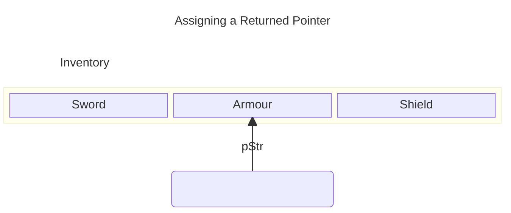
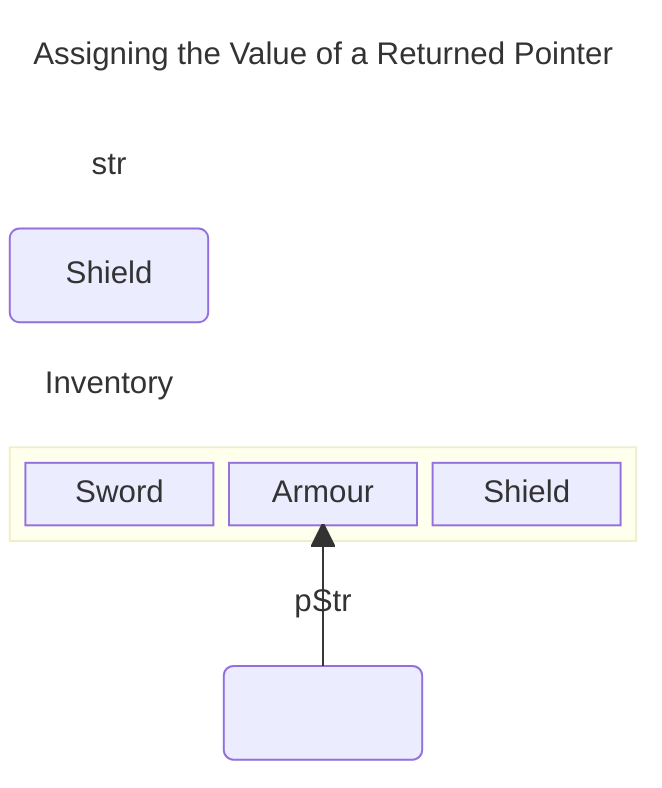
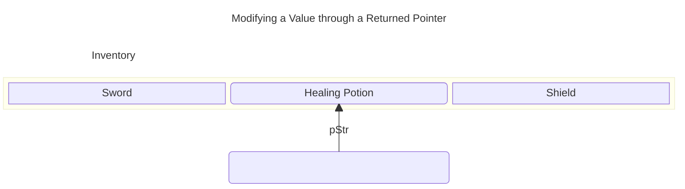

# Chapter 7: Pointers: Tic-Tac-Toe 2.0

## Examples

### [Pointing](./Examples/01_Pointing/pointing.cpp)

Introduces and demonstrates how to us pointers

### [Swap Pointers](./Examples/02_SwapPointerVersion/swapPointer.cpp)

Illustrates how to use constant pointers to alter argument variables

### [Inventory Pointer](./Examples/03_InventoryPointer/inventoryPointer.cpp)

Demonstrates returning a pointer-valued object from a function

### [Array Passer](./Examples/04_ArrayPasser/arrayPasser.cpp)

Highlights the relationship between C-style arrays and pointers

### [Major Project: Tic-Tac-Toe 2.0](./Examples/05_TicTacToe2/tictactoe.cpp)

Reimplements the [Tic-Tac-Toe](../Chapter6/Chapter6.md#major-project-tic-tac-toe) project from [Chapter 6](../Chapter6/Chapter6.md) using pointers instead of references.

## Exercises

### Discussion Questions

1. *What are the advantages and disadvantages of passing a pointer?*
    - **Pro**: Copying a memory address typically cheaper than pass by value
    - **Pro**: Allow you to modify or return multiple values in a function
    - **Pro** *and* **Con**: Allow you to modify variables from an outer scope
    - **Con**: Have to be careful to avoid dangling or uninitialised pointers
    - **Con**: Ability to alias variables, and modify them makes it harder to reason about a code or function
2. *What kind of situations call for a constant pointer?*
    - When you want to reference a single memory location, whose value you may or may not change
3. *What kinds of situations call for a pointer to a constant?*
    - When you want reference an existing constant, or provide *read-only* access to a set of objects
    - Useful when the object the pointer may point to might change
4. *What kinds of situations call for a constant pointer to a constant?*
    - When you want to provide *read-only* access to *one* specific object
5. *What kind of situations call for a non-constant pointer to a non-constant object*
    - When you want to modify the value of several objects, the pointer can be used to change the value and the pointer can be changed to refer to each of the objects in turn

### Code Exercises

#### [Exercise 7.1](./Exercises/Ex7_1/pointerToPointer.cpp)

*Write a program with a pointer to a pointer to a `string` object. Use the pointer to the pointer to call the `size()` member function of the `string` object*

To create a double pointer we write `string** ppStr` to declare a pointer to pointer to string called `ppStr`. We then store the address of a pointer to `string` `string* pStr`. To call the `size()` member function we must first *dereference* `ppStr` to get `pStr`. We can then use the `->` operator to call the `size()` member function on the original `string s`

#### [Exercise 7.2](./Exercises/Ex7_2/)

*Rewrite the final project from [Chapter 5, the Mad Lib Game](../Chapter5/Chapter5.md#major-project-mad-lib), so that no `string` objects are passed to the function that tells the story. Instead the function should accept pointers to `string` objects.*

This is straightforward, we note that the `string` objects we pass are never reassigned, i.e. they are *read-only* so we convert the `string` parameters to `string const* const` parameters, i.e. *constant pointers to constants*. We then replace any use of the parameter by `*name` to ensure we are dereferencing and accessing the value

#### [Exercise 7.3](./Exercises/Ex7_3/memory.cpp)

*Will the three memory addresses displayed by the following program all be the same? Explain what's going on in the code.*

```cpp
#include <iostream>

using namespace std;

int main() {
    int a = 10;
    int& b = a;
    int* c = &b;

    cout << &a << endl;
    cout << &b << endl;
    cout << &(*c) << endl;

    return 0;
}
```

At least for our compiled implementation the answer is *yes*. Consider what happens,

- first we declare an `int a` and put aside some memory for it.
- We then declare a reference `int& b` and set this to refer to `a`.
  - A reference is an *alias* for `a`, its effectively a new *semantic* label for the same block of memory.
- We then declare a pointer `int* c` and assign it the address of `b`, but `b` is just a label for `a` so we assign it to the address of `a`
- We then,
  - Print the address of `a`
  - Print the adress of `b`, which is an alias of `b`, so equivalent to printing the address of `a`
  - We then dereference `c` which is equivalent to `b`, equivalent to `a`
    - then take the address to get the address of `a`
- So these are all equivalent to `&a` and the output memory is the same

## Notes

- Pointers are powerful tools in C++
- Share overlapping behaviour with *iterators* and *references*
- More primitive and therefore more *powerful*

### Understanding Pointer Basics

- A *pointer* is a variable containing a memory address
- Allow us to manipulate and use computer memory directly
- Often used to access other variables

>[!IMPORTANT]
>Computer memory is a lot like a neighbourhood, but instead of houses in which people store their stuff, you have memory locations where you can store data. Just like a neighbourhood where houses sit side by side, labeled with addresses, chunks of computer memory sit side by side, labeled with addresses. In a neighbourhood, you can use a slip of paper with a street address on it to get to a particular house (and to the stuff stored inside it). In a computer, you can use a pointer with a memory address in it to get to a particular memory location (annd to the stuff stored inside it).

#### Example: [Pointing](#pointing)

#### Declaring Pointers

- pointers are declared with the `*` operator, e.g. the below example declares a pointer to an `int`

```cpp
int* pAPointer;
```

- `p` is often used to prefix a pointer-typed variable for clarity
- pointer must be declared to *point* to a specific *type*
- There are multiple forms of syntax for declaring a pointer, e.g.
  - `int* pAPointer;` - emphasises the *type* of `pAPointer` is a pointer
  - `int *pAPointer;` - emphasises the *type* of `*pAPointer`
  - `int * pAPointer;` are all equivalent

>[!CAUTION]
>When you declare a pointer, the asterisk only applies to the single variable name that immediately follows it. So the following statement declares `pScore` as a pointer to `int` and `score` as an `int`
>
>```cpp
>int *pScore, score;
>```
>
>However the clearest way to declare a pointer is to declare it in its own statement, as in the following lines.
>
>```cpp
>int* pScore;
>int score;
>```

#### Initialising Pointers

- You can initialise a pointer when you declare it like other variables, e.g. the following decalres `pScore` with a value of $0$, `int* pScore = 0`
- Assigning $0$ to a pointer has special meaning
  - Loosely means *point to nothing*
  - Also called a *null pointer*
  - Pointers should always be initalised with some value

>[!TIP]
>Many programmers assign `NULL` to a pointer instead of $0$ to make the pointer a null pointer. `NULL` is a constant defined in multiple library files including `iostream`

#### Assigning Addresses to Pointers

- Pointers store addresses, how do we get them the addresses?
  - One way is to pass the address of an existing variable to a pointer, e.g. `pScore = &score`
  - `&` in this case is the *address of* operator
    - Distinct from the *reference* operator
    - *returns* the address of the variable


#### Dereferencing Pointers

- Just as you dereference an iterator to access the underlying value you dereference a pointer the same way (using `*`)
- e.g. `*pScore` accesses the value in the address pointed to by `pScore`

>[!CAUTION]
>Don't dereference a null pointer because it could lead to disastrous results

- Pointers like references can be seen as aliases of the memory to which they point
  - If we modify the value stored in the referenced memory, we will see this when we dereference the pointer
  - and vice-versa, i.e. the pointer can change the value in the memory location

>[!CAUTION]
>Don't change the value of a pointer when you want to change the value of the object to which the pointer points. For example, if I want to add `500` to the `int` that `pScore` points to then the following line would be a big mistake,
>
>```cpp
>pScore += 500;
>```
>
>The preceding code adds `500` to the address stored in `pScore`, not to the value to which `pScore` originally pointed. As a result, `pScore` now points to some address that might contain anything. Dereferencing a pointer like this can lead to disastrous results

#### Reassigning Pointers

- *Unlike* references, pointers can point to different objects at different times
- Reassignment works like reassigning any other variable e.g. `pScore = &newScore` reassigns `pScore` to the address of `newScore`

>[!CAUTION]
>Don't change the value to which a pointer points when you want to change the pointer itself. For example, if I want to change `pScore` to point to `newScore`, then the following line would be a big mistake.
>
>```cpp
>*pScore = newScore;
>```
>
>This code simply changes the value to which `pScore` currently points; it doesn't change `pScore` itself. If `newScore` is equal to $5000$, then the previous code is equivalent to `*pScore = 5000;` and `pScore` still points to the same variable it pointed to before the assignment

#### Using Pointers to Objects

- You can use pointers to objects just like basic types, e.g. `string* pStr = &str` declares a pointer to the `string` `str`.
  - `pStr` can point to any `string` object
- Objects are accessed with the derefencing operator `*` like with built-in types
- Member functions and attributes accessed like with iterators (through the `->` operator or the `(*ptr).func()` construct)

>[!WARNING]
>Whenever you dereference a pointer to access a data member or member function, surround the dereferenced pointer with a pair of parentheses. This ensures that the dot operator will be applied to the object to which the pointer points (Or use the `->` operator).

### Understanding Pointers and Constants

- You can use the keyword `const` to restrict how specific pointers function
  - Act as safeguards by showing the programmers intent
  - Pointers are versatile, so you should restrict them inline with what you need

#### Using a Constant Pointer

- A *constant pointer* is a pointer that does not change the address it points to
  - i.e. always refers to the same object
  - Declared with a `const` *after* the `*`

```cpp
int score = 100
int* const pScore = &score // a constant pointer to score
```

- Like all constants they must be initialised with a value
- Once declared *reassignment* of the *pointer* is disallowed and will generate a compile error
- *However*, the value pointed to by a *constant pointer* is not itself marked constant and so can be changed
  - i.e. we *can reassign* the underlying *value*
- Constant pointers can be thought of as like a reference
  - Like a reference they can only refer to the one thing they were initialised to

>[!TIP]
>Although you can use a constant pointer instead of a reference in your programs you should stick to references when possible. References have a cleaner syntax than pointers and can make your code easier to read

#### Using a Pointer to a Constant

- You can also use the `const` keyword to declare the underlying value in the address stored by the pointer is `const`
  - i.e. That the pointer will not be used to change the value
  - The original variable with that value does not have to be `const` itself
- This is called a *pointer to a constant*, there are two ways to declare, either `int const* pNumber` or `const int* pNumber`.
  - Personally prefer the former for symmetry with a *constant pointer*, i.e. the `const` always binds *left*
  - The later emphasises that `*pNumber` is a `const int`
- Addresses are assigned to the *pointer* as before
- Since the *pointer* itself is not *constant* we can reassign the address that the pointer refers to
- Pointer can't be used to change the underlying value through *dereferencing* and attempting to do so will cause a compile error
- Pointers to constants are good then for performing *read-only* iteration over a container or set of objects

#### Using a Constant Pointer to a Constant

- *constant pointer to a constant* combines both behaviours
  - The pointer cannot be reassigned to a new object
  - The underlying value pointed to cannot be modified

>[!TIP]
>Like a pointer to a constant, a constant pointer to a constant can point to either a non-constant or constant value

- Acts similar to a *constant reference*, providing *read-only* access to a *single* data object

>[!WARNING]
>Although you can use a constant pointer to a constant instead of a constant reference in your programs, you should stick with constant references when possible. References have a cleaner syntax than pointers and can make your code easier to read

#### Summarising Constants and Pointers

- `type* const name` - pointer itself is constant
- `type const* name` - underlying value is constant
- `type const* const name` - pointer and underlying value both constant

### Passing Pointers

- Functions can accept pointers like they can accept references

#### Example [Swap Pointer](#swap-pointers)

#### Passing by Value

- Technically pointers are passed by value
- but the pointer itself is a memory address
  - i.e. we copy across a memory address
  - For large objects this is more efficient than a copy
- Since we modify the underlying values through dereferencing the address, pointer
arguments can reflect changes in the outer scope

#### Passing a Constant Pointer

- Simply declare the appropriate arguments in the function declaration, e.g.

```cpp
void goodSwap(int* const pX, int* const pY);
```

- The above declares a function that takes two *constant pointers* `pX` and `pY`.
- The function body, uses the constant pointers to swap the two values
  - Observe the pointers themselves always refer to the same memory
  - The values each memory stores is changed

```cpp
void goodSwap(int* const pX, int* const pY) {
    int temp = *pX;
    *pX = *pY;
    *pY = temp;
}
```

- If we want to call this function to swap the value of two variables `x` and `y` we can use the *address-of* operator e.g. `goodSwap(&x, &y);`
  - Note that the creation of a `const` pointer is handled by the compilation process

>[!TIP]
>You can also pass a constant pointer to a constant. This works much like passing a constant reference, which is done to efficiently pass an object that you don't need to change.

#### Returning Pointers

- Like references you can return pointers from a function
- Also efficent since just passing a memory address
- You must specify the return type as a pointer, like for a reference e.g. the below function returns a pointer to a `string`

```cpp
string* ptrToElement(vector<string>* const pVec, i);
```

- Either return a pointer object or use the *address-of* operator (`&`) to generate an address
  - e.g. `return &((*pVec)[i])`, dereferences `pVec`, takes the address of the `i`-th indexed element, and returns it,
  - i.e. a pointer to the `i`-th element

##### Example [Inventory Pointer](#inventory-pointer)

>[!CAUTION]
>Although returning a pointer cna be an efficient way to send information back to a calling function, you have to be careful not to return a pointer that points to an out-of-scope object. For example, the following function returns a pointer that, if used, could crash the program
>
>```cpp
>string* badPointer() {
>   string local = "This string will cease to exist once the function ends."; 
>   string* pLocal = &local;
>   return pLocal;
>}
>```
>
> That's because `badPointer()` returns a pointer to a string that no longer exists after the function ends. A pointer to a non-existent object is called a *dangling pointer*. Attempting to dereference a dangling pointer can lead to disastrous results. One way to avoid dangling pointers is to never return a pointer to a local variable

#### Assigning a Returned Pointer to a Pointer

- Since returned pointer-valued objects already are addresses, we don't need to use the *address-of* operator
- We simply assign the value, e.g.

```cpp
string* pStr = ptrToElement(&inventory, 1);
```



#### Assigning the Value Pointed to by a Returned Pointer

- Simply use the dereference operator, e.g. the below assigns `str` the value in the pointer returned by the function call

```cpp
string str = *(ptrToElement(&inventory, 2))
```



- The assignment will cause a copy, which incurs the copy cost

#### Altering an Object through a Returned Pointer

- Since the pointer is pointer-valued, the *derefence* operator lets us modify the associated object, e.g. `*pStr = "Healing Potion"` changes the contents of the `string` pointed to by `pStr` to `"Headling Potion"`

>[!TIP]
If you want to protect an object pointed to by a returned pointer, make sure to restrict the pointer. Return either a pointer to a constant or a constant pointer to a constant



### Understanding the Relationship Between Pointers and Arrays

- An array name can be seen as a constant pointer to the first element of the array
- Array elements stored in contiguous memory
  - Array name can thus be used as a pointer for random access to the elements
- Impacts how you can pass and return arrays

#### Example: [Array Passer](#array-passer)

#### Using an Array Name as a Constant Pointer

- You can dereference an array name to get the first element, i.e. `*highScores` is equivalent to `highScores[0]` for the array `highScores`
- This extends to random access, e.g. `*(highScores + 1)` is equivalent to `highScore[1]`
  - Note that we have to use parentheses, `*highScores + 1` is equivalent to `highScores[0] + 1`

#### Passing and Returning Arrays

- Can pass the array name as a constant pointer
- Can thus pass an array to a function, or return an array
- e.g. the below passes the `highScores` array to the function `increase`
  - Note that we have to pass the length `NUM_SCORES` too, since this is not intrinsically stored with the array

```cpp
increase(highScores, NUM_SCORES);
```

>[!WARNING]
>When you pass an array to a function, it's usually a good idea to also pass the number of elements in the array so the function can use this to avoid attempting to access an element that doesn't exist

- Array will be recognised as a pointer in the function, but we can treat it as an array using array syntax
- Since an array is passed as a pointer, any change in the array in the function is reflected in the outer scope.
  - If we want to protect the array, we can use the `type const* const` constuct to declare the array as a *constant pointer to a constant* and thus make it *read-only* e.g. as the below function does

```cpp
  void display(int const* const array, const int NUM_ELEMENTS);
```

>[!TIP]
>You can pass a C-style string to a function, just like any other array. In addition, you can pass a string literal to a function as a constant pointer to a constant

- Since an array is a pointer they can be returned using the array name

### Example  [Tic-Tac-Toe 2.0](#major-project-tic-tac-toe-20)

- Modified version of the [Chapter 6](../Chapter6/Chapter6.md) [project](../Chapter6/Chapter6.md#major-project-tic-tac-toe)
- From the player perspective the Tic-Tac-Toe 2.0 program plays the same
- Utilises pointers instead of references under the hood however
  - Observe that this makes the syntax a lot clunkier than the reference version where the syntax just works

## Summary

- Computer memory is organised in an ordered way, where each chuck of memory has its own address
- A pointer is a variable that contains a memory address
- In many ways, pointers act like iterators from the STL. For example, just as with iterators, you use pointers to indirectly access an object
- To declare a pointer, you list a type, followed by an asterisk, followed by a name
- Programmers often prefix pointer variable names with the letter `"p"` to remind them that the variable is indeed a pointer
- Just like an iterator, a pointer is declared to refer to a value of a specific type
- It's good programming practice to initialise a pointer when you declare it
- If you assign $0$ to a pointer, the pointer is called a null pointer
- To get the address of a variable, put the address of operator (`&`) before the variable name
- When a pointer contains the address of an object, it's said to point to the object
- Unlike references, you can reassign pointers. That is, a pointer can point to different objects at different times during the life of a program
- Just as with iterators, you dereference a pointer to access the objject it points to with `*`, the dereference operator
- Just as with iterators, you can use the `->` operator with pointers for a more readable way to access object data members and member functions
- A constant pointer can only point to the object it was initialised to point to. You declare a constant pointer by putting the keyword `const` right before the pointer name, as in `int* const p = &i;`
- You can't use a pointer to a constant to change the value to which it points. You declare a pointer to a constant by putting the keyword `const` before the type name, as in `const int* p`
- A constant pointer to a constant can only point to the value it was initialised to point to, and it can't be used to change that value .You declare constant pointer to a constant by putting the keyword `const` before the `*` as in `const int *` or `int const *`
- You can pass pointers for efficiency or to provide direct access to an object
- If you want to pass a pointer for efficiency, you should pass a pointer to a constant or a constant pointer to a constant so the object you're passing access to can't be changed through the pointer
- A dangling pointer is a pointer to an invalid memory address. Dangling pointers are often caused by deleting an object to which a pointer pointed. Dereferencing such a pointer can lead to disastrous results.
- You can return a pointer from a function, but be careful not to return a dangling pointer

## Questions and Answers

1. *How is a pointer different from the variable to whcih it points?*
    - A pointer stores a memory address. If a pointer points to a variable, it stores the address of that variable
2. *What good is it to store the address of a variable that already exists?*
    - One big advantage of storing the address of an existing variable is that you can pass a pointer to the variable for efficiency instead of passing the variable by value
3. *Does a pointer always have to point to an existing variable?*
    - No. You can create a pointer that points to an unamed chuck of computer memory as you need it. You'll learn more about allocating memory in that dynamic fashion in [Chapter 9: "Advanced Classes and Dynamic Memory: Game Lobby"](../Chapter9/Chapter9.md)
4. *Why should I pass variables using references instead of pointers whenever possible?*
    - Because of the sweet, syntactic sugar that references provide. Passing a reference or a pointer is an efficient way to provide access to objects, but pointers require extra syntax (like the dereference operator) to access the object itself
5. *Why should I initialise a pointer when I declare it or soon thereafter?*
    - Because dereferencing an uninitialised pointer can lead to disastrous results, including a program crash
6. *What's a dangling pointer?*
    - A pointer that points to an invalid memory location, where any data could exist
7. *What's so dangerous about a dangling pointer?*
    - Like using an uninitalised pointer, using a dangling pointer can lead to disastrous results, including a program crash
8. *Why should I initialise a pointer to $0$?*
    - By initialising a pointer to $0$, you create a null pointer, which is understood as a pointer to nothing
9. *So then it's safe to dereference a null pointer, right?*
    - No! Although it's good programming practice to assign $0$ to a pointer that doesn't point to an object, dereferencing a null pointer is dangerous as dereferencing a dangling pointer.
      - But it does provide a consistent value to check against for an invalid pointer
10. *What will happen if I dereference a null pointer?*
    - Just like dereferencing a dangling pointer or an uninitalised pointer, the results are unpredictable. Most likely, you'll crash your program
11. *What good are null pointers?*
    - They're often returned by functions as a sign of failure. For example, if a function is supposed to return a pointer to an object that represents the graphics screen, but that function couldn't initialise the screen, it might return a null pointer
12. *How does using the keyword `const` when declaring a pointer affect the pointer?*
    - It depends on how you use it. Generally, you use `const` when you are declaring a pointer to restrict what the pointer can do
13. *What kinds of restrictions can I impose on a pointer by declaring it with `const`*
    - You can restrict a pointer so it can only to the object it was initialised to point to, or you can restrict a pointer so it can't change the value of the object it points to, or both
14. *Why would I want to restrict what a pointer can do?*
    - For safety, For example, you might be working with an object that you know you don't want to change
15. *To what type of pointers can I assign a constant value?*
    - A pointer to a constant or a constant pointer to a constant
16. *How can I safely return a pointer from a function?*
    - One way is by returning a pointer to an object that you received from the calling function. This way, you're returning a pointer to an object that exists back in the calling code. (In [Chapter 9](../Chapter9/Chapter9.md) you'll discover another important way when you learn about dynamic memory)
