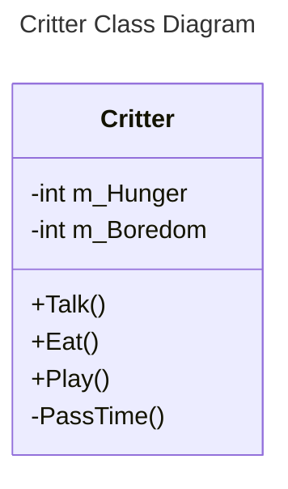
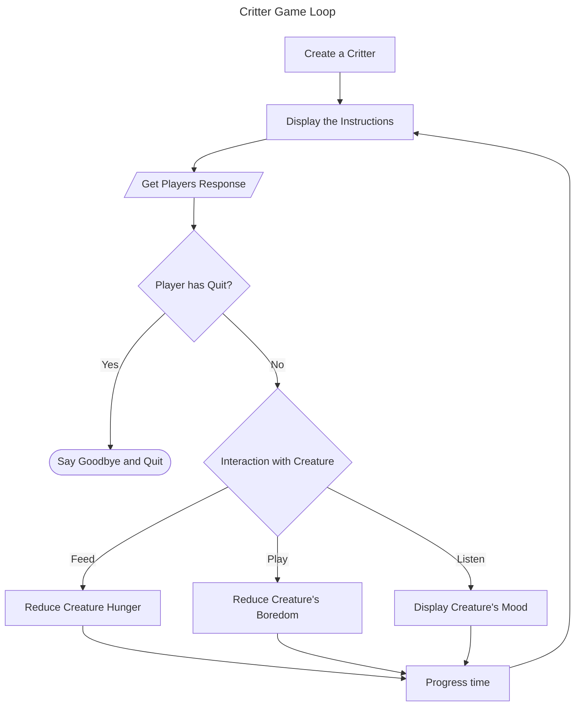

# Chapter 8: Classes: Critter Caretaker

## Examples

### [Simple Critter](./Examples/01_SimpleCritter/simpleCritter.cpp)

Demonstrates defining a new class and declaring it's methods

### [Constructor Critter](./Examples/02_ConstructorCritter/constructorCritter.cpp)

Demonstrates using Constructors to insantiate an object

### [Private Critter](./Examples/03_PrivateCritter/privateCritter.cpp)

Demonstrates setting member access levels

### [Static Critter](./Examples/04_StaticCritter/staticCritter.cpp)

Demonstrates variables and functions

### [Major Project: Critter Caretaker](./Examples/05_CritterCaretaker/critterCaretaker.cpp)

Brings together all we've seen with classes to create a game where we care for a virtual pet

## Exercises

### Discussion Questions

1. *What are the advantages and disadvantages of procedural programming?*
    - **Pro**: Code is highly structured
    - **Pro**: Control flow is typically obvious
    - **Pro**: Clear seperation between data and functions on data
    - **Con**: Rigid structure
    - **Con**: Inability to structure data directly with relevant functions
    - **Con**: Hard to create sophisticated runtime dynamic, polymorphic behaviour
2. *What are the advantages and disadvantages of object-oriented programming?*
    - **Pro**: Can package data directly with its relevant functions
    - **Pro**: Easier to create novel runtime behaviour through object message passing
    - **Pro**: Encapsulation increases modularity and data integrity
    - **Con**: Control flow is typically harder to decipher
    - **Con**: Data combined with functions can lead to large objects being passed around with resulting performance hit
3. *Are accessor member functions a sign of poor class design? Explain.*
    - They can be, generally objects should interact through message passing via function calls
      - These functions should control state changes
    - data should hold internal state
    - Accessor functions create coupling between objects
    - If not validated can lead to invalid object states,
      - e.g.  our critters had the constraint `m_Hunger >= 0`
    - However, sometimes they can be the cleanest way to implement a feature, and properly validated are generally not problematic
4. *How are constant member functions helpful to a game programmer?*
    - They clearly indicate that a programmer intends the function to act on the objects internal state *without* modifying it
5. *When is it a good idea to calculate an object's attribute on the fly, rather than storing it as a data member?*
    - When the cost of recalculating it on the fly, is cheaper than the cost of calculating and storing the object, e.g. here are two distinct scenarios
    - **The attribute changes frequently as a function of other attributes** (*like mood*)
      - The rate of update is higher than the rate at which it is requested by external clients
      - No point wasting time constantly recalculating and storing the value, much better just to eat the cost of calculating it at call time
    - **The attribute changes infrequently and is expensive to calculate**
      - Here we want to store the attribute, since we don't have to recalculate it often
      - This way the caller doesn't have to wait based on the request

### Code Exercises

#### [Exercise 8.1](./Exercises/Ex8_1/critterCaretaker2.cpp)

*Improve the Critter Caretaker program so that you can enter an unlisted menu choice that reveals the exact  values of the critter's hunger and boredom levels*

We introduce a new public function `Greet` that prints out the creatures hunger and boredom. Since this is a member function it can access a critter's private `m_Hunger` and `m_Boredom` variables. We then add an unlisted option $4$ to the `main` loop that calls this function.

```cpp
void Critter::Greet() {
    cout << "Critter's Hunger: " << m_Hunger << "\n";
    cout << "Critter's Boredom: " << m_Boredom << "\n\n";
}
```

#### [Exercise 8.2](./Exercises/Ex8_2/critterCaretaker3.cpp)

*Change the Critter Caretaker program so that the critter is more expressive about its neeeds by hinting at how hungry and bored it is*

We expand the `Talk` function give both the overall mood and insight into it's hunger and boredom. Since every time we feed or play with the creature the corresponding stat is reduced by $4$ we use this as the breakpoint. We also hide an easter egg value for if the stat is $0$

- The hunger phrases are `full (0), satisfied (1), hungry (4), starving (8)` (Break points in parentheses)
- The boredom phrases are `relaxed (0), playful (1), needy (4), bored (8)`
- The final implementation is then,

```cpp
void Critter::Talk() {
  cout << "I'm a critter and I feel ";
  int mood = GetMood();
  if (mood > 15) {
    cout << "mad.\n";
  } else if (mood > 10) {
    cout << "Frustrated.\n";
  } else if (mood > 5) {
    cout << "Okay.\n";
  } else {
    cout << "happy.\n";
  }
  cout << "The critter looks ";
  if (m_Hunger > 7) {
    cout << "starving.\n";
  }
  else if (m_Hunger > 3) {
    cout << "hungry.\n";
  } else if (m_Hunger > 0) {
    cout << "satisfied.\n";
  } else {
    cout << "full.\n";
  }

  cout << "The critter seems ";
  if (m_Boredom > 7) {
    cout << "bored.\n";
  } else if (m_Boredom > 3) {
    cout << "needy.\n";
  } else if (m_Boredom > 0) {
    cout << "playful.\n";
  } else {
    cout << "Relaxed.\n\n";
  }
  PassTime();
}
```

#### [Exercise 8.3](./Exercises/Ex8_3/brokenCritter.cpp)

*What design proble does the following program have?*

```cpp
#include <iostream>
using namespace std;

class Critter {
    public:
        int GetHunger() const {return m_Hunger;}
    private:
        int m_Hunger;
};

int main() {
    Critter crit;
    cout << crit.GetHunger() << endl;
    return 0;
}
```

- The above code never assigns a value to `m_Hunger` so when we call `crit.GetHunger()` we access an uninitalised variable
- A good compiler should hopefully pick this up as an error or warning

## Notes

- *Object-oriented Programming* (OOP) is a different way of thinking about programming.
- OOP relies on defining *objects* and their *relationships* to each other
  - Program proceeds through objects interacting
- OOP typically relies on the ability for a user to create and maintain their own types

### Defining New Types

- Objects consistent of member functions and attributes
- They can be defined by the programmer

#### Example: [Simple Critter](#simple-critter)

#### Defining a Class

- A *class* is a *type* which aggregates data members and functions
  - A *class* lets you *create* individual *objects*
  - objects have their own instances of each data member and access to all member functions
- Class definition is complicated and best shown through examples, e.g.

```cpp
class Critter { // class definition - defines the new type Critter
    public:
        int m_Hunger; // data member
        void Greet(); // member function
};
```

- By convention, class names start with an uppercase, class body then written like a function body (encapsulated in curly braces), but terminated with a semicolon `;`

##### Declaring Data Members

- In a class definition we can declare class data members
- Represent object qualities, e.g.

```cpp
int m_Hunger
```

- The above tells us that every `Critter` has a data member `m_Hunger`
- Convention is to prefix data members by `m_` so data members are differentiable from other variables

##### Declaring Member Functions

- We can also declare class member functions
- Same as declaring data members but is a function prototype
- e.g. the below states that each critter has a member function `Greet()`

```cpp
void Greet(); // member function prototype
```

>[!IMPORTANT]
>You might have noticed the keyword `public` in the class definition. You can ignore it for now. You'll learn more about it a bit later in this chapter, in the section, "Specifying Public and Private Access Levels"

#### Defining Member Functions

- Member functions can be defined outside of a class definition
- They need to be prefixed with the class name using the scope resolution operator (`::`)
- e.g. to define the aforementioned `Greet()` function, we write,

```cpp
void Critter::Greet() { // member function definition
    cout << "Hi. I'm a critter. My hunger level is " << m_Hunger << ".\n";
}
```

#### Instantiating Objects

- When you create an object you *instantiate* it from a class
  - Specific objects are therefore called *instances* of a class
- The following instantiates two `Critter` instances

```cpp
Critter crit1;
Critter crit2;
```

#### Accessing Data Members

- To access data members we use the `.` operator like we've seen with `string`
- e.g. `string crit1.m_Hunger = 9;` assigns the value $9$ to `crit1`'s `m_Hunger` data member
- You can get a value the same way, e.g. `cout << "crit2's hunger level is " << crit2.m_Hunger << ".\n\n";` prints the value of `crit2`'s `m_Hunger` data member

#### Calling Member Functions

- Called just like we've seen with functions like `size()` for the `string` type
- e.g. `crit2.Greet()` calls `Greet()` on `crit2`
  - Observe that the definition of `Greet` relies on the values of the `m_Hunger` data member for the `Critter` that was called

### Using Constructors

- When you instantiate objects, often you want to do some initialisation
  - e.g. assign values to data members
- A *constructor* is a special member function automatically invoked every time a new object in instantiated
- Means you can declare and initialise in one statement

#### Example [Constructor Critter](#constructor-critter)

#### Declaring and Defining a Constructor

- A constructor is declared with the following

```cpp
Critter(int hunger = 0); // constructor prototype
```

- A constructor has no return type
  - It's illegal to specify a return type for a constructor
- A constructor must have the same name as the class itself

>[!TIP]
>A *default constructor* requires no arguments. If you don't define a default constructor, the compiler defines a minimal one for you that simply calls the default constructors of any data members of the class. If you write your own constructor, then the compiler won't provide a default constructor for you. It's usually a good idea to have a default constructor, so you should make sure to supply your own when necessary. One way to accomplish this is to supply default arguments for all parameters in a constructor definition

- The constructor can be defined outside the code like any other function, the one below prints a message whenver it's called

```cpp
Critter::Critter(int hunger) {
    cout << "A new critter has been born!" << endl;
    m_Hunger = hunger;
}
```

>[!TIP]
>You can use *member initialisers* as a shorthand way to assign values to data members in a constructor. To write a member initialiser, start with a colon after the constructor's parameter list. Then type the name of the data member you want to initialise, followed by the expression you want to assign to the data member, surrounded by parentheses. If you have multiple initialisers, seperate them with commas. This is much simpler than it sounds (and it's really useful, too). Here's an example that assigns `hunger` to `m_Hunger` and `boredom` to `m_Boredom`. Member initialisers are especially useful when you have data members to initialise.
>
>```cpp
>Critter::Critter(int hunger = 0, int boredom = 0):
>   m_Hunger(hunger),
>   m_Boredom(boredom)
>{} //empty constructor body
>```

#### Calling a Constructor Automatically

- You don't explicitly call a constructor
  - Called automatically on object instantiation
- e.g. `Critter crit(7)` instantiates a `Critter`, `crit` and `7` is passed to the constuctor

### Setting Member Access Levels

- You should treat objects like functions
  - As encapsulated entities
- In general, should avoid directly altering or accessing an object's data members
  - Ensure's their data integrity
- You can enforce access restrictions when you define a class by setting member access levels

#### Example [Private Critter](#private-critter)

#### Specifying Public and Private Access  Levels

- Every class data member and member function has an access level
  - Determines what parts of the program can access it
- Currently we've used `public`
  - `public` data members or functions can be accessed at any part of the code that knows of a `Critter`
- To specify access we write an access specifier followed by a colon, e.g. `public:`
  - We then list all the member functions and data members that we want to have that access
  - We then specify the next access specifier as above (or finish the class)
- `private` is another access specifier
  - Any private specified data member or member function can only be accessed by the class itself (`Critter` in this case)
  - e.g. In our example we declare `m_Hunger` as private, this means in the main function the line `cout << crit.m_Hunger` is illegal and should generate a compile error
    - Uncomment the code in the example and check
- Member access is `private` by default

#### Defining Accessor Member Functions

- An *accessor member function* allows indirect access to a data member
- e.g. `GetHunger()` in our example returns the value of the `private` data member `m_Hunger`
  - For now ignore the `const` keyword

>[!TIP]
>Just as you can with regular functions, you can inline member functions. One way to inline a member function is to define it right inside of the class definition where you'd normally only declare the member function. If you include a member function definition in a class, then of course you don't need to define it outside the class.
>
>An exception to this rule is that when you define a member function in a class definition using the keyword `virtual`, the member function is not automatically inlined. You'll learn about virtual functions in [Chapter 10, "Inheritance and Polymorphism: Blackjack](../Chapter10/Chapter10.md)

- Why make a data member private only to then provide access via accessor functions?
  - You generally don't provide full access
  - e.g. `GetHunger` returns the value of `m_Hunger` but we can't arbitrarily set the value of `m_Hunger`
  - We instead use a function, `SetHunger`

```cpp
void Critter::SetHunger(int hunger) {
    if (hunger < 0) {
        cout << "You can't set a critter's hunger to a negative number.\n\n";
    }
    else {
        m_Hunger = hunger;
    }
}
```

- Observe that the setter function performs data validation. If `hunger < 0` then an error message is printed and `m_Hunger` is preserved

#### Defining Constant Member Functions

- A *constant member function* can't modify a data member of it's class or call a *non-constant* member function of its class
- Why restrict?
  - Again, conveys the programmers intention
  - Protects against later refactors or programming mistakes

>[!CAUTION]
>A constant member function can alter a static data member. You'll learn about static data members a bit later in this chapter, in the [Declaring and Initialising Static Data Members](#using-static-data-members-and-member-functions) section. Also, if you qualify a data member with the `mutable` keyword, then even a constant member function can modify it. For now though, don't worry  about either of these exceptions

- You can declare a constant member function by putting the keyword `const` at the *end* of the function header

### Using Static Data Members and Member Functions

- Each instance of an object stores its own data
- But what if we want to store some data about an entire class?
  - e.g. Total number of instances of a class
- Why might we want to do this?
  - A class could have some group behaviour, e.g. an enemy type that runs away if there's not enough of them, but attacks when they have critical mass
- Storing and updating the number in each class instance is expensive and hard to maintain
- Really want a way to store a single value for an entire class
  - Can do this with a *static data member*

#### Example [Static Critter](#static-critter)

#### Declaring and Initialising Static Data Members

- A *static data member* is a single data member that exists for the entire class
- Declared with a `static` keyword, e.g.

```cpp
static int s_Total; //static member variable declarations
```

- Prefixed with `s_` is a common convention to denote a static member variable
- The static variable can be initialised outside the class, e.g.

```cpp
int Critter::s_Total = 0;
```

- Observe that static data members need to be qualified by the class name and the scope resolution operator

>[!TIP]
>You can declare a static variable in non-class functions, too. The static variable maintains its value between function calls

#### Acessing Static Data Members

- You can access a public static data member anywhere in the your program
- Requires the scope resolution operator and the class name prefix as mentioned before e.g.

```cpp
cout << Critter::s_Total << "\n\n";
```

>[!TIP]
>You can also access a static data member thorugh any object of the class. Assuming that `crit1` is a `Critter` object, I could display the total number of critters with the following line:
>
>```cpp
>cout << crit1.s_Total << "\n\n";
>```

- The static variable can also be accessed by member functions in the class
  - In this case we are in the class's scope so don't need the scope resolution
- Static data members can be made `private`

#### Declaring and Defining Static Member Functions

- A *static member function* exists for the entire class.
  - e.g. The following declares a static member function in `Critter`

```cpp
int Critter::GetTotal() { //static member function definition
    return s_Total;
}
```

- Static member function definition works similar like the non-static member function definitions
- Static member function cannot access non-static data members
  - static methods exist for the entire class
  - not associated with a particular instance

#### Calling Static Member Functions

- Called by function name, qualified with the class name and scope resolution, e.g. the below example calls the static method `getTotal` on a `Critter` class

```cpp
cout << Critter::GetTotal() << "\n\n";
```

>[!TIP]
>You can also access a static member function through any object of the class. Assuming that `crit1` is a `Critter` object, I could display the total number of critters with the following line:
>
>```cpp
>cout << crit1.GetTotal() << "\n\n";
>```

- Because a static member functions exist for the entire class
- You can call a static member function without any class instances existing
- Private static member functions can only be accessed by other member functions of the class

### Example [Critter Caretaker](#major-project-critter-caretaker)

- Simple game where we care for a virtual pet
- Player can
  - Feed a critter
  - Play with the critter
  - Listen to how the critter feels

#### Planning the Game

- Core of the game is the critter
  - Start by planning the critter itself
  - Critter needs a hunger (to track how much we need to feed it)
  - Critter needs a boredom (to track how much we need to play with it)

- Critter therefore has data members
  - `m_Hunger`
  - `m_Boredom`

- Critter should also have a mood, directly based on its hunger and boredom
  - This can be calculated on the fly as a function
  - `GetMood()`
- That gives us the state management, but what about external interactions?
  - `Talk` - determine the mood
  - `Eat` - reduce hunger
  - `Play` - reduce boredom
- Finally need a function to simulate the time and manipulate state,
  - `PassTime()`
- We can embody this class in a diagram (This is based on a modelling toolset called [UML](https://en.wikipedia.org/wiki/Class_diagram), specifically this is a class diagram)



#### Planning the PseudoCode

```text
Create a critter
While the player doesn't want to quit the game
    Present a menu of choices to the player
    If the plyaer wants to listen to the critter
        Make the critter talk
    If the player wants to feed the critter
        Make the critter eat
    If the player wants to play with the critter
        Make the critter play
```

#### Game Loop



#### The Critter Class

- This is long, so we consider it in pieces

##### The Class Definition

```cpp
//Critter Caretaker
//Simulates caring for a virtual pet

#include <iostream>

using namespace std;

class Critter {
    public:
        Critter(int hunger = 0, int boredom = 0);
        void Talk();
        void Eat(int food = 4);
        void Play(int fun = 4);
    private:
        int m_Hunger;
        int m_Boredom;

        int GetMood() const;
        void PassTime(int time = 1);
};
```

- Notice we have really just translated out above thinking into the definitions

##### The Class Constructor

```cpp
Critter::Critter(int hunger, int boredom):
    m_Hunger(hunger),
    m_Boredom(boredom)
{};
```

- Standard default constructor

##### The `GetMood` Member Function

```cpp
inline int Critter::GetMood() const {
    return (m_Hunger + m_Boredom);
}
```

- We inline this since it is a small function
- Mood is a simple formula given by the sum of the hunger and boredom
  - Since this is encapsulated, in the future we could easily change this

##### The `PassTime` Member Function

- Simple private function that does the book keeping for incrementing time,
here represented by increasing hunger and boredom

```cpp
void Critter::PassTime(int time) {
    m_Hunger += time;
    m_Boredom += time;
}
```

- Can optionally take the time, else it defaults to $1$ (see the constructor)

##### The `Talk` Member Function

- Announces the critters mood, we obfuscate this based on the actual underlying mood score.

```cpp
void Critter::Talk() {
    cout << "I'm a critter and I feel ";

    int mood = GetMood();
    if (mood > 15) {
        cout << "mad.\n";
    }
    else if (mood > 10) {
        cout << "frustrated.\n";
    }
    else if (mood > 5) {
        cout << "okay.\n";
    }
    else {
        cout << "happy.\n";
    }
    PassTime();
}
```

- There a four mood levels, `mad`, `frustrated`, `okay`, `happy` depending on the sum of the `mood`

##### The `Eat` Member Function

```cpp
void Critter::Eat(int food) {
    cout << "Brruppp.\n";
    m_Hunger -= food;
    if (m_Hunger < 0) {
        m_Hunger = 0;
    }
    PassTime();
}
```

- Decreases the hunger in response to a provided food, and validates the hunger (ensures it's always non-negative)

##### The `Play` Member Function

```cpp
void Critter::Play(int fun) {
    cout << "Wheee!\n";
    m_Boredom -= fun;
    if (m_Boredom < 0) {
        m_Boredom = 0;
    }
    PassTime();
}
```

- The `boredom` analogue of `Eat`
- Observe that in all our interactions with the `Critter` we then call `PassTime()`, this is to keep the game progressing

#### The `main` function

- Main function effectively exists to instantiate a Critter
- Then give the player the game instructions
- Call the appropriate method on the critter in response to the input using a big `switch`
  - Not replicated here, because it doesn't show anything new

## Summary

- Object-Oriented Programming (OOP) is a way of thinking about programming in which you define different types of objects with relationships that interact with each other
- You can create new types
  - One such form of types is the `class`
- A class is a blueprint for an object
- In a class, you can declare data members and member functions
- When you define a member function outside of a class definition, you need to qualify it with the class name and scope resolution operator (`::`)
- You can inline a member function by defining it directly in the class definition
- You can access data members and member functions of objects through the member selection operator (`.`)
- Every class has a constructor - a special member function that's automatically called every time a new object is instantiated. Constructors are often used to initialise data members
- A default constructor requires no arguments. If you don't provide a constructor definition in your class, the compiler will create a default constructor for you
- Member initialisers provide shorthand to assign values to data members in a constructor
- You can set member access levels in a class by using the keywords `public`, `private` and `protected`. (You'll learn about `protected` in [Chapter 9, "Advanced Classes and Dynamic Memory"](../Chapter9/Chapter9.md))
- A public member can be accessed by any part of your code through an object
- A private member can only be accessed by a member function of that class
- An accessor member function allows indirect access to a data member
- A static data member exists for the entire class
- A static member function exists for the entire class
- Some game programmers prefix private data member namse with `m_` and static data members with `s_` so that they're instantly recognisable
- A non-constant member function can't modify non-static data members  or call non-constant member functions of its class

## Questions and Answers

1. *What is procedural programming?*
    - A paradigm where tasks are broken down into a series of smaller tasks and implemented in manageable chunks of code, such as functions. In procedural programming, functions and data are seperate
2. *What is an object?*
    - An entity that combines data and functions
3. *Why create objects?*
    - Because the world; especially game worlds, are full of objects. By creating your own types, you can represent objects and their relationships to other objects more directly and intuitively than you might be able to otherwise
4. *What is object-oriented programming?*
    - A paradigm where work is accomplished through objects. It allows programmers to define their own types of objects. The objects usually have relationships to each other and can interact
5. *Is C++ an object-oriented language or a procedural language?*
    - C++ is a multi-paradigm programming language. It allows a game programmer to write games in a procedural or object-oriented way. Or through a combination!
6. *Should I always try to write object-oriented game programs?*
    - Although object oriented programming is used in almost every commercial game on the market, you don't have to write games using this paradigm. C++ lets you use one of several programming paradigms. In general, though, large game projects will almost surely benefit from an object-oriented approach
7. *Why not make all class members public?*
    - Because it goes against the idea of encapsulation
8. *What is encapsulation?*
    - The quality of being self-contained. In the world of OOP,, encapsulation prevents client code from directly accessing the internals of an object. Instead, it encourages client code to use a defined interface to the object
9. *What are the benefits of encapsulation?*
    - In the world of OOP, encapsulation protects the integrity of an object. For example, you might have a spaceship object with a fuel data member. By preventing direct access to this data member, you can guarantee that it never becomes an illegal value (such as a negative number)
10. *Should I provide access to data members through accessor member functions?*
    - Some game programmers say you should never provide access to data members through accessor member functions because even though this kind of access is indirect, it goes against the idea of encapsulation. Instead, they say you should write classes with member functions that provide the client with all of the functionality it could need, eliminating the client's need to access a specific data member
11. *What a mutable data members?*
    - Data members that can be modified even by constant member functions. You create a mutable data member using the keyword `mutable`. You can also modify a mutable data member of a constant object
12. *Why is it useful to have a default constructor?*
    - Because their might be times when objects are automatically created without any argument values passed to a constructor, e.g. when you create an array of objects
13. *What is a structure?*
    - A structure is very similar to a class. The only real difference is that the default access level for a structure is public. You define a structure by using the keyword `struct`
14. *Why does C++ have both structures and classes?*
    - So that C++ retains backwards compatibility with C
15. *When should I use structures?*
    - Some game programmers use structures to group only data together, without functions (since that's how C structures work). But, it's probably best to avoid structures whenever possible and use classes instead
