# Chapter 9: Advanced Classes and Dynamic Memory: Game Lobby

## Examples

### [Critter Farm](./Examples/01_CritterFarm/critterFarm.cpp)

Demonstrates object containment, a form of *aggregation*

### [Friend Critter](./Examples/02_FriendCritter/friendCritter.cpp)

Introduces *friend functions* and shows how to implement *operator overloading*

### [Heap](./Examples/03_Heap/heap.cpp)

Demonstrates dynamically allocating memory

### [Heap Data Member](./Examples/04_HeapDataMember/heapDataMember.cpp)

Illustrates the technicalities of using an object with heap allocated memory

### [Major Project: Game Lobby](./Examples/05_GameLobby/gameLobby.cpp)

Creates a toy game lobby to demonstrate the practicalities of working with classes and advanced dynamic memory

## Exercises

### Discussion Questions

1. *What type of game entities could you create with aggregation?*
    - Anything that requires multiple components, e.g. player's units in a strategy game, items in an inventory etc.
2. *Do friend functions undermine encapsulation in OOP?*
    - Yes, the allow access of the internals of a class to an external function or class
    - One should try to limit what they do with friend functions
3. *What advantages does dynamic memory offer to game programs?*
    - The ability to tightly control the amount and location of memory thereby improving performance
    - Improved encapsulation by seperating object creation from lifetime
4. *Why are memory leaks difficult errors to track down?*
    - Because they arise from memory that is no longer referenced in the code, thus the code cannot inform you of them
    - Also because they arise in cases where object creation and destruction is seperated which makes the logic harder to follow
    - Don't have obvious effects like an immediate crash, only slowdown and potential crashes over a program's extended runtime
5. *Should objects that allocate memory on the heap always be required to free it?*
    - Technically the memory is always freed when the program finishes, so if the lifetime extends until program termination you can get away without freeing it
    - However, it is good practice to always free the memory (since you don't know when this ight change in a refactor)

### Exercises

#### [Exercise 9.1](./Exercises/Ex9_1/gameLobby2.cpp)

*Improve the `Lobby` class from the Game Lobby by writing a friend function of the `Player` class that allows a `Player` object to be sent to `cout`. Next, update the function that allows a `Lobby` object to be sent to `cout` so that it uses your new function for sending a `Player` object to `cout`*

We add the friend function prototype to the `Player` class

```cpp
friend ostream& operator<<(ostream& os, const Player& aPlayer);
```

Which we then implement as

```cpp
ostream &operator<<(ostream &os, const Player &aPlayer) {
  return os << aPlayer.GetName();
}
```

The overloaded argument ensures the correct operator overloading is applied. This also replicates the old [Game Lobby](#major-project-game-lobby) behaviour in that a `Player` is represented by it's name.

We then modify the operator overloading for the `Lobby` class to,

```cpp
ostream& operator<<(ostream& os, const Lobby& aLobby) {
    Player* pIter = aLobby.m_pHead;
    os << "\nHere's who's in the game lobby:\n";
    if (pIter == 0)  {
        os << "The lobby is empty.\n";
    }
    else {
        while(pIter != 0) {
            os << *pIter << endl;
            pIter = pIter->GetNext();
        }
    }
    return os;
}
```

Where we replace the `pIter->GetName()` call, with `*pIter`. This ensures we dereference `pIter` to get the underlying `Player` to match the signature for the operator overload

#### [Exercise 9.2](./Exercises/Ex9_2/gameLobby3.cpp)

*The `Lobby::AddPlayer()` member function from the Game Lobby program is inefficient because it iterates through all of the player nodes to add a new player to the end of the line. Add an `m_pTail` pointer data member to the `Lobby` class that always points to the last player node in the line and use it to more efficiently add a player*

We have to make three modifications, first we modify the `private` data section of the `Lobby` class to,

```cpp
  private:
      Player* m_pHead;
      Player* m_pTail;
```

i.e. We add a `m_pTail` `Player*` attribute

When then have to modify adding a `Player`, the new function is,

```cpp
void Lobby::AddPlayer() {
    //create a new player node
    cout << "Please enter the name of the new player: ";
    string name;
    cin >> name;
    Player* pNewPlayer = new Player(name);

    //if list is empty, make head of list this new player
    if (m_pHead == 0) {
        m_pHead = pNewPlayer;
        m_pTail = pNewPlayer;
    }
    //otherwise find end of the list, and add the player there
    else {
        m_pTail->SetNext(pNewPlayer);
        m_pTail = pNewPlayer;
    }
}
```

- First we still check if the list is empty, if it is we add the node as before, but we also make `m_pTail` point to this node, (here the start and the end nodes are the same)
- In the case that the list already contains an element, we make the current tail point to the new node via `m_pTail->SetNext(pNewPlayer)`
  - We then update `m_pTail` to refer to the new tail

Now we need to consider what happens when we delete a node

```cpp
void Lobby::RemovePlayer() {
    if (m_pHead == 0) {
        cout << "The game lobby is empty. No one to remove!\n";
    }
    else {
        Player* pTemp = m_pHead;
        m_pHead = m_pHead->GetNext();
        delete pTemp;
    } 
}
```

- This is basically the same as before, we delete the current head and move it to the next node.
  - Observe that if the lobby is empty `m_pTail` is left dangling on the last node to be removed
  - We could fix this by adding a check `if (m_pHead == 0) {m_pTail = 0;}`
    - i.e. if the Lobby is empty, we can then also set the tail to a null pointer
  - However, we don't need too! `m_pTail` is only accessed or modified by `AddPlayer` which already checks if the Lobby is empty and handles `m_pTail` appropriately
    - This is a minor efficiency saving!

#### [Exercise 9.3](./Exercises/Ex9_3/useAfterFree.cpp)

*What's wrong with the following code?*

```cpp
int main() {
    int* pScore = new int;
    *pScore = 500;
    pScore = new int(1000);
    delete pScore;
    pScore = 0;

    return 0;
}
```

The above code creates a memory leak, we first assign `pScore` to some heap memory for an `int`, then we change `pScore` to refer to a new block of memory without first deleteing the old. The old is now no longer referred to and is thus leaked. Obsserve that this creates not errors, the code should compile and appear to run without issue. This shows why memory leaks can be a hard thing to solve!!!

## Notes

- C++ gives programmers a high degree of control over memory
- This includes direct memory control
- Here we discuss *dynamic memory*, i.e. memory managed at runtime

### Using Aggregation

- Game objects are typically composed of other others
- In OOP this is described as *aggregation*
  - Combining objects into another

#### Example [Critter Farm](#critter-farm)

#### Using Object Data Members

- One form of aggregation is declaring a data member that holds another object
  - e.g. our `Critter` class contains `string` data member `string m_Name`
  - The constructor below, ensures the `string` is properly instantiated
    - The `name` is passed through to the `string` constructor

```cpp
Critter::Critter(const string& name): m_Name(name) {};
```

- Objects can then be accessed like any other data members

#### Using Container Data Members

- Can also use containers
- e.g. our `Farm` class contains a `vector<Critter> m_Critters` to store critters
- Constructor may be more complicated, as we see below
  - Have to be explicit about the desired behaviour

```cpp
Farm::Farm(int spaces) {
    m_Critters.reserve(spaces);
}
```

- Then can be used as any other data member, i.e. access with the `.` operator, then we can call the `vector`'s own functions
- e.g. If we want to add a `Critter` we can use,

```cpp
void Farm::Add(const Critter& aCritter) {
    m_Critters.push_back(aCritter);
}
```

>[!CAUTION]
>`push_back()` adds a copy of an object to a vector; this means that I can create an extra copy of each `Critter` object every time I call `Add`. This is no big deal in the Critter Farm program, but if I were adding many large objects, it could become a performance issue. You can reduce this overhead by say, a vector of pointers to objects. You'll see how to work with pointers to objects later in this chapter

### Using Friend Functions and Operator Overloading

- *Friend Functions* have complete access to any member of a class
- *Operator Overloading* allows you to define meanings for built-in operators as they relate to objects of yyour own class

#### Example [Friend Critter](#friend-critter)

#### Creating Friend Functions

- A friend function can access any member of a class of which its a friend
- A function is specified as a friend using the `friend` as a function prototype *inside* the class definition
  - e.g. The following prototype in the `Critter` class, makes `Peek` a friend of the `Critter` class

```cpp
friend void Peek(const Critter& aCritter);
```

- `Peek` can access any member of `Critter`, even though it's not a member function!

#### Overloading Operators

- Lets you give meaning to built in operators and new types
- e.g. could overload `*` to mean matrix multiplication for a `matrix` class
- To overload an operator, define a function `operatorX` where `X` is the operator to overload
- e.g. Here we overload the `<<` operator

```cpp
ostream& operator<<(ostream& os, const Critter& aCritter) {
    os << "Critter Object - ";
    os << "m_Name: " << aCritter.m_Name;
    return os;
}
```

- `<<` now overloaded so that a `Critter` object send via `<<` to `cout` prints details about `Critter`
  - Use the `friend` functionality to access `Critter`'s internals
- Makes it easy to print a `Critter`
- `cout` is of type `ostream` which also overloads `<<` so that you can send built-in types to `cout`

>[!TIP]
>With all the tools and debugging options available to game programmers, sometimes simply displaying the values of variables is the best way to understand what's happening in your programs. Overloading the `<<` operator can help you do that

### Dynamically Allocating Memory

- All previous programs have used *automatic* memory management
- Variables either declared in the global scope
  - Memory set aside for the entire duration of the program
  - Typically *static* memory
- Variables also declared in function scope
  - Memory set aside for the duration of the *function*
  - Called *stack* memory
- There is an additional form of memory that persists independent of the function calls
  - Must be allocated and deallocated by the programmer
  - Collectively referred to as the *heap*
- The *heap* is good for efficiency
  - Lets you control exactly how much memory you have at a point in time
  - Can create objects in one function that live on after the function returns

#### Example [Heap](#heap)

#### Using the `new` Operator

- `new` is an operator that allocates memory on the heap and returns the address
- Use is `new type` where type is the type you want to reserve space for
  - e.g. the below reserves the space for an `int` and stores the address in the pointer `pHeap`

```cpp
int* pHeap = new int;
```

- We can then treat the memory like any other address, e.g. to assign to the memory location we can write `*pHeap = 10`

>[!TIP]
>You can initialise memory on the heap at the same time you allocate it by placing a value, surrounded by parentheses, after the type. This is even easier than it sounds. For example, the following line allocates a chunk of memory on the heap for an `int` variable and assigns $10$ to it. The statement then assigns the address of that chunk of memory to `pHeap`, e.g.
>
>```cpp
>int* pHeap = new int(10);
>```

- Memory on the heap persists beyond the function call
  - It is not freed automatically
- e.g. The function `intOnHeap()` allocates an `int` on the heap and returns its address
  - `int* pHeap = intOnHeap();` then stores this in the outer scope variable `pHeap`
  - The implementation of `intOnHeap()` is expressed below

```cpp
int* intOnHeap() {
    int* pHeap = new int(20);
    return pTemp;
}
```

>[!TIP]
>Up until now, if you wanted to return a value created in a function, you had to return a copy of the value. But by using dynamic memory, you can create an object on the heap in a function and return a pointer to the new object

#### Using the `delete` Operator

- Since heap memory is not automatically freed, how do we release the memory?
- We use the `delete` operator
- `delete variable;` frees the memory at the address in `variable`
- The memory is returned to the heap (can be recycled)

>[!TIP]
>Because you need to free memory that you've allocated once you're finished with it, a good rule of thumb is that every `new` should have a corresponding `delete`. In fact, some programmers write the `delete` statement just after writing the `new` statement whenever possible, so they don't forget it

- while `delete` frees the memory, it does not touch the variable's value
  - Pointer will still point to the now freed memory
- These are *dangling* pointers as raised in [Chapter 7](../Chapter7/Chapter7.md)
  - Method for dealing with this is to set a freed pointer to $0$ or `NULL`
  - Alternative is to point them to a new valid address
  - *Obviously* do this for a reason *don't* just arbitrarily point at some part of your program!

>[!CAUTION]
>Using `delete` on a dangling pointer can cause your program to crash. Be sure to set a dangling pointer to $0$ or reassign it to point to a new, valid chunk of memory. *This is sometimes called a double* `free`

#### Avoiding Memory Leaks

- Dynamic memory allocation can lead to *memory leaks* where unfreed memory is no longer referenced by the program
- Thus can no longer be freed
- If a program leeks enough memory it may slow down or crash
- The next two functions show two ways to cause a memory leak,

```cpp
void leak1() {
    int* drip1 = new int(30);
}
```

- Here memory is assigned in a function, but never returned or freed
  - Memory leaks once the function ends and `drip1` no longer exists

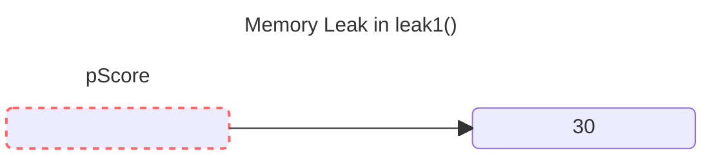

- In the second case below, we change the reference of a pointer, so that the block of memory it was referring to is no longer referenced by any pointer

```cpp
void leak2() {
    int* drip2 = new int(50);
    drip2 = new int(100);
    delete drip2;
}
```

- Observe that the memory pointed to by `drip2` frees the second block of memory at the end of the function, so a leak like in the first case is avoided

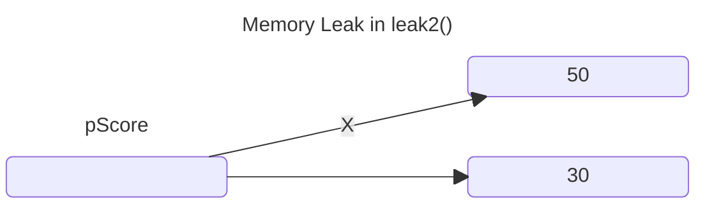

### Working with Data Members and the Heap

- Data members can also be pointers to heap memory
- Why would we do this?
  - Often same reason we otherwise use a pointer
  - e.g. storing a reference to a large 3D scene rather than a copy
- Default object behaviours can sometimes cause issue with heap-valued data members

#### Example: [Heap Data Member](#heap-data-member)

#### Declaring Data Members that Point to Values on the Heap

- First declare a data member that's a pointer, e.g. `string* m_pName;`
- In the class constructor can allocate memory on the heap, e.g. `m_pName = new string(name);`
  - Allocates and stores a `string` address in `m_pName`

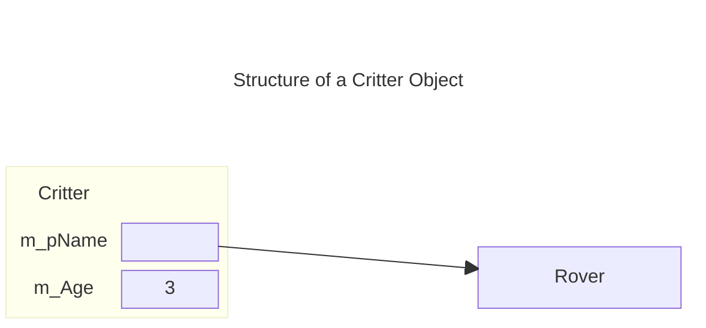

#### Declaring and Defining Destructors

- When an object contains heap-valued objects we need to think about how destory these objects
  - Object would need to delete any heap-valued objects
- The function that does this is called a *destructor*
  - Called just *before* an object is destroyed
- Default destructor created by the compiler
  - Won't free any heap-allocated memory
  - Often need to write own to free any heap-allocated memory
- Destructor has the name of the class preceded by `~` e.g. `~Critter` is the destructor for a `Critter`
  - Like the constructor has no return value
  - Also has no parameters

```cpp
Critter::~Critter() {
    cout << "Destructor called\n";
    delete m_pName;
}
```

- The above demonstrates a destructor implementation, we remove the memory pointed to by `m_pName`
- Destructors are *automatically* called when a stack-allocated object goes out of scope, e.g. in the `testDestructor` function here, the destructor is not explicitly called, but will execute regardless

```cpp
void testDestructor() {
    Critter toDestroy("Rover", 3);
    toDestroy.Greet();
}
```

>[!WARNING]
>When you have a class that allocates memory on the heap, you should write a destructor that cleans up and frees that memory

#### Declaring and Defining Copy Constructors

- Sometimes an object is automatically copied, this occurs when
  - Passed by value to a function
  - Returned from a function
  - Initialise to another object through an initialiser
  - Provided as a single argument to the object's constructor
- Copying is done by a special function called the *copy constructor*
  - Supplied by default if not written
  - Default performs a *memberwise copy*
- You should consider writing a copy constructor for heap-allocated memory
  - Why? By default the heap address is copied, not the value
  - Both copies would thus reference the *same* heap address
    - This is called a *shallow copy* as opposed to a *deep copy* where each copy has their own version of the heap-memory

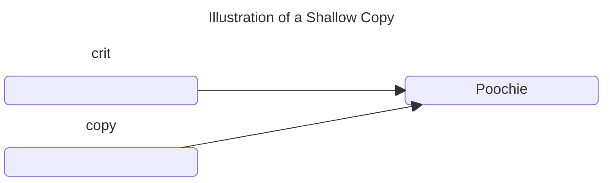

- What issues can arise from a shallow copy?
  - Suppose a copy is destroyed, while the other exists
  - If the destructor frees the memory, then the surviving copy now references invalid memory (i.e. is *dangling*)

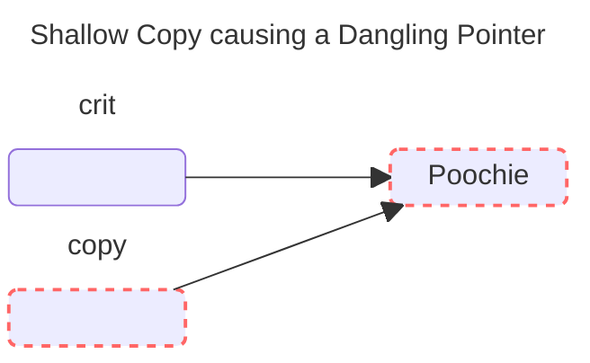

- To perform a deep copy, we have to duplicate the memory, e.g.

```cpp
Critter::Critter(const Critter& c) {
    cout << "Copy Constructor called\n";
    m_pName = new string(*(c.m_pName));
    m_Age = c.m_Age;
}
```

- Observe that we have to get the underlying string `*(c.m_pName)` to pass to the copy constructor for `string`

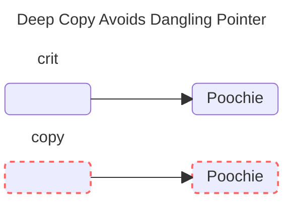

>[!WARNING]
>When you have a class with data members that point to memory on the heap, you should consider writing a copy constructor that allocates memory for a new object and creates a deep copy

#### Overloading the Assignment Operator

- If we use the assignment operator for objects of the same class, the classes assignment operator function is called
- A default assignment operator is supplied
  - Provides only memberwise assignment
  - Generates shallow copies for classes with heap-allocated members
  - So should roll your own by defining the `operator=(const Class& c)` function for a class `Class`
  - assignment member function should return a `reference`
- e.g. below is the example assignment for a `Critter`

```cpp
Critter& Critter::operator=(const Critter& c) {
    cout << "Overloaded Assignment Operator called\n";
    if (this != &c) {
        delete m_pName;
        m_pName = new string(*(c.m_pName));
        m_Age = c.m_Age;
    }
    return *this;
}
```

- Observe this deletes the existing value in `m_pName` and then creates a new heap-allocated value for `m_pName`
- `this` is a pointer that all non-static member functions already have
  - points to the object used to call the function
- We return the copy of the object using `*this`

>[!WARNING]
>When you have a class with a data member that points to memory on the heap, you should consider overloading the assignment operator for the class

### Example: [Game Lobby](#major-project-game-lobby)

- A basic system representing a `queue` where players join a line, and then leave in the order they joined

#### The `Player` Class

- Represents a player waiting in the game lobby
- Players then sit in a container, the game lobby
- But we put some of the structure for maintaining the container into the Player class

```cpp
//Game Lobby
//Simulates a game lobby where players wait

#include <iostream>
#include <string>

using namespace std;

class Player {
    public:
        Player(const string& name = "");
        string GetName() const;
        Player* GetNext() const;
        void SetNext(Player* next);

    private:
        string m_Name;
        Player* m_pNext; //pointer to next player in list
};

Player::Player(const string& name): m_Name(name), m_pNext(0) {}

string Player::GetName() const {
    return m_Name;
}

Player* Player::GetNext() const {
    return m_pNext;
}

void Player::SetNext(Player* next) {
    m_pNext;
}
```

- `m_Name` holds a player name
- `m_pNext` is a pointer to *another* `Player` object

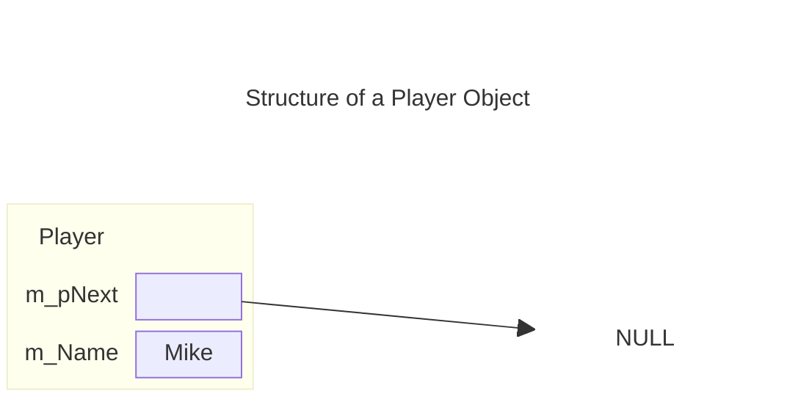

- The above shows a representation of the `Player` class

#### The `Lobby` Class

- Represents the Lobby or Queue itself

```cpp
class Lobby {
    friend ostream& operator<<(ostream& os, const Lobby& aLobby);

    public:
        Lobby();
        ~Lobby();
        void AddPlayer();
        void RemovePlayer();
        void Clear();

    private:
        Player* m_pHead;
};

Lobby::Lobby(): m_pHead(0) {}

Lobby::~Lobby() {
    clear();
}
```

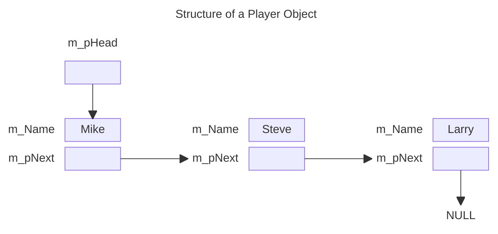

- Representation of the Lobby list with some player's in it
- `m_pHead` points to the start of the line
- `Player`'s are then linked together to form the line
  - This is often called a *linked list*
  - Individual elements sometimes referred to as *nodes*
- Each `Player` object in the list requires it's own allocation
  - This is handled by the `Lobby` class
- `Lobby` has a very basic constructor
- Destructor calls the `Clear` member function, which we'll see later
- `AddPlayer` instantiates a `Player` object
- `RemovePlayer` removes the first player object in the list
- The friend function `operator<<()` is used to send a `Lobby` object to `cout` using the `<<` operator

>[!CAUTION]
>The `Lobby` class has a data member, `m_pHead`, which points to `Player` objects on the heap. Because of this, I included a destructor that frees all of the memory occupied by the `Player` objects on the heap instantiated by a `Lobby` object to avoid any memory leaks when a `Lobby` object is destroyed. However, I didn't define a copy constructor or overload the assignment operator in the class. For the Game Lobby program, this isn't necessary. But if I wanted a more robust `Lobby` class, I woudl have defiend these member functions

#### The `Lobby::AddPlayer()` Member Function

```cpp
void Lobby::AddPlayer() {
    //create a new player node
    cout << "Please enter the name of the new player: ";
    string name;
    cin >> name;
    Player* pNewPlayer = new Player(name)

    //if list is empty, make head of list this new player
    if (m_pHead == 0) {
        m_pHead = pNewPlayer;
    }
    //otherwise find the end of the list and add the player there
    else {
        Player* pIter = m_pHead;
        while(pIter->GetNext() != 0) {
            pIter = pIter->GetNext();
        }
        pIter->SetNext(pNewPlayer);
    }
}
```

- Get's the player's name from the user then instantiates a new `Player` object on the heap
- We then add the `Player` to the ship
  - We need to check if the list is empty
  - This occurs when `p_Head = 0`
    - Easy in this case, just set `p_Head` to the new `Player`
  - If `Lobby` is not empty, we need to iterate to the end, using `GetNext()` until we reach the end
    - Denoted by `GetNext() == 0`
    - We then use `SetNext()` to link the new `Player` at the end

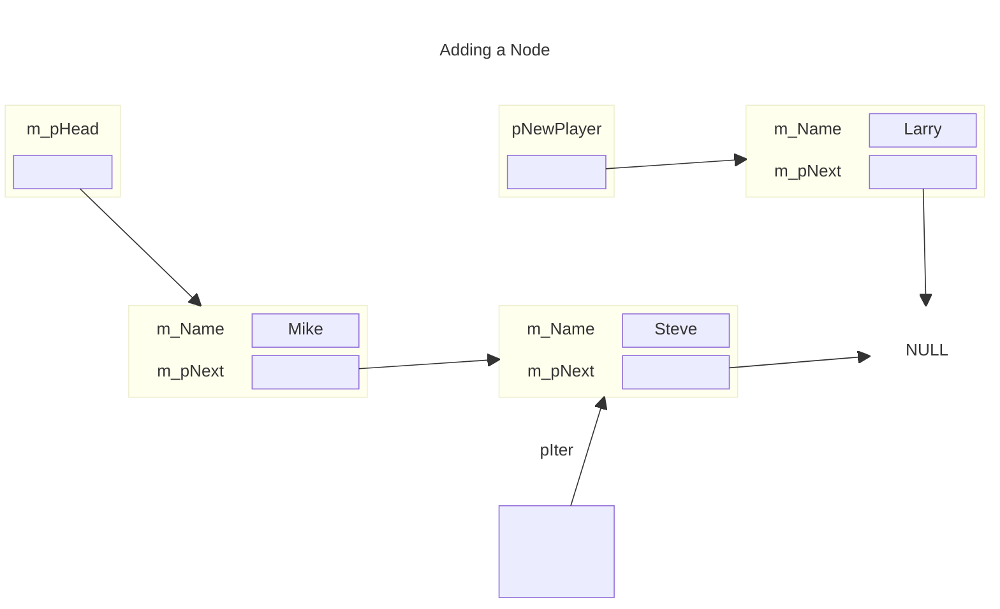

- The above show's the process of finding the last part of the list
- The below shows how the final list looks after inserting the new node

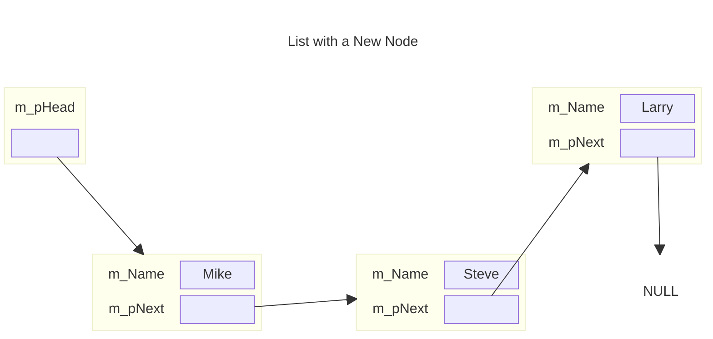

>[!CAUTION]
>`Lobby::AddPlayer()` marches through the entire `Player` objects every time it's called. For small lists this isn't a problem, but with large lists this inefficient process can become unwieldy. There are more efficient ways to do what this function does. In one of the chapter exerciss, your job will be to implement one of these more efficient methods

### The `Lobby::RemovePlayer()` Member Function

- Removes the player at the head of the line

```cpp
void Lobby::RemovePlayer() {
    if (m_pHead == 0) {
        cout << "The game lobby is empty. No one to remove!\n";
    }
    else {
        Player* pTemp = m_pHead;
        m_pHead = m_pHead->GetNext();
        delete pTemp;
    }
}
```

- We have to check `m_pHead` to see if the list is empty
  - If `m_pHead == 0` then it is
  - In that case we can't delete it
- Otherwise we have to grab the first node
- Make `m_pHead` refer to the next node making this the new first node
- Then delete the old first node
- This requires the use of `pTemp` pointer to maintain a reference to all of the nodes we're manipulating
  - Need to avoid a memory leak

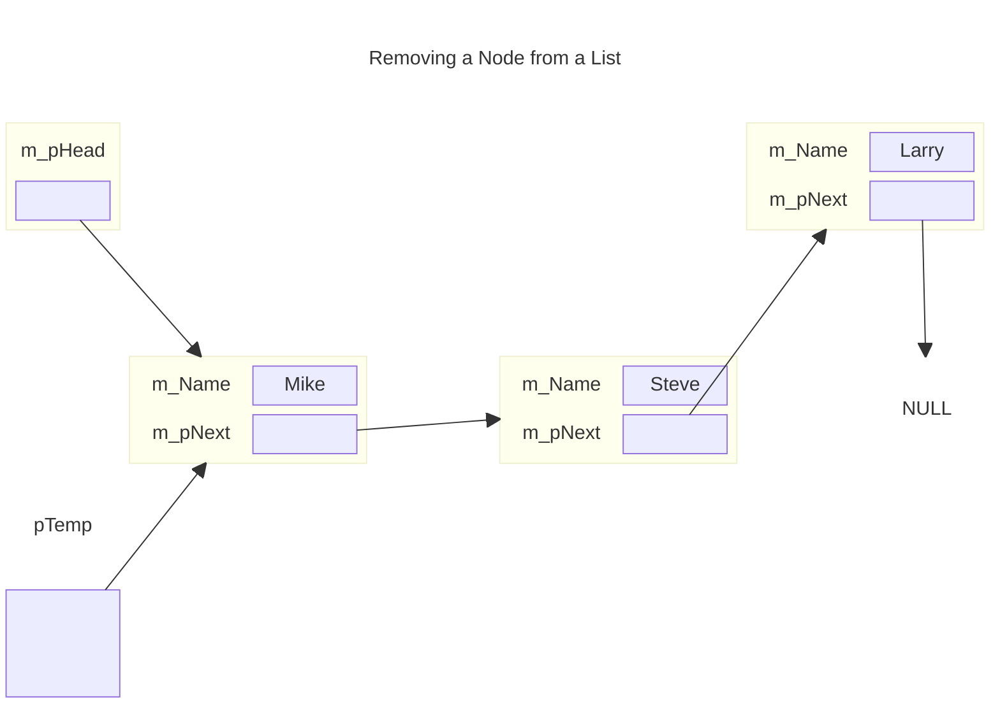

- Initial setup for removing a node

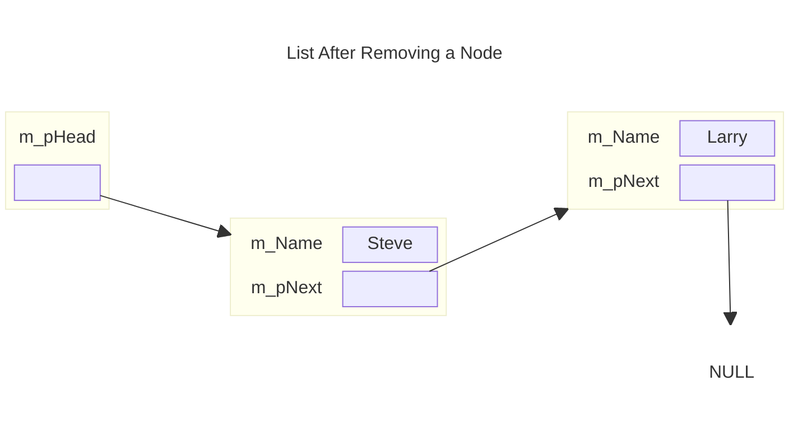

#### The `Lobby::Clear` Member Function

- Removes all players from the Lobby
- Just repeatedly calls `RemovePlayer` until the Lobby registers as empty
  - i.e. `m_pHead == 0`

#### The `operator<<` Friend Function

- The `operator<<(` member function overloads the `<<` operator so I can display a `Lobby` object by sending it to `cout`

```cpp
ostream& operator<<(ostream& os, const Lobby& aLobby) {
    Player* pIter = aLobby.m_pHead;
    os << "\nHere's who's in the game lobby:\n";
    if (pIter == 0) {
        os << "The lobby is empty.\n";
    }
    else {
        while(pIter != 0) {
            os << pIter->GetName() << endl;
        }
    }
    return os;
}
```

- Provides a standard interface for printing the state of a `Lobby` object

#### The `main` Function

- Like most of our recent main functions, this function creates the `Lobby` and then acts as a wrapper around an interface for the user to call methods on the `Lobby` object

## Summary

- Aggregation is the combing of objects so that one is part of another.
- Friend functions have complete access to any member of a class
- Operator overloading allows you to define new meanings for built-in operators as they relate to objects of your own classes
- The stack is an area of memory that is automatically managed for you and is used for local variables
- The heap (or free store) is an area of memory that you, the programmer, can use to allocate and free memory
- The `new` operatore allocates memory on the heap and returns its address
- The `delete` operator frees memory on the heap that was previously allocated
- A dangling pointer points to an invalid memory location. Dereferencing or deleting a dangling pointer can cause your program to crash
- A memory leak is an error in which memory that has been allocated becomes inaccessible and can no longer be freed. Given a large enough leak, a program might run out of memory and crash
- A destructor is a member function that's called just before an object is destroyed. If you don't write a destructor of your own, the compiler will supply a default destructor for you
- The copy constructor is a member function that's invoked when an automatic copy of an object is made. A default copy constructor is supplied for a class if you don't write one of your own
- The default copy constructor simply copies the value of each data member to data members with the same nnames in the copy, producing a member-wise copy
- Member-wise copying can produce a shallow copy of an object, in which the pointer data members of the copy point to the same chunks of memory as the pointers in the original object
- A deep copy is a copy of an object that has no chunks of memory in common with the original
- A default assignment operator member function, which provides ony member-wise duplication, is supplied for you if you don't write one of your own
- The `this` pointer is a pointer that all non-static member functions automatically have; it points to the object that was used to call the function

## Questions and Answers

1. *Why should you use aggregation?*
    - To create more complex objects from other objects
2. *What is composition?*
    - A form of aggregation in which the composite object is responsible for the creation and destruction of its object parts. Composition is often called a "uses a" relationship
3. *When should I use a friend function?*
    - When you need a function to have access to the non-public members of a class
4. *What is a friend member function?*
    - A member function of one class that can access all of the members of another class
5. *What is a friend class?*
    - A class that can access all of the members of another class
6. *Can't operator overloading become confusing?*
    - Yes. Giving too many meanings or unintuitive meanings to operators can lead to code that's difficult to understand
7. *What happens when I instantiate a new object on the heap?*
    - All of the data members will occupy memory on the heap and not on the stack
8. *Can I access an object through a constant pointer?*
    - Sure. But you can only access constant member functions through a constant pointer
9. *What's wrong with shallow copies?*
    - Because shallow copies share references to the same chunks of memory, a change to one object will be reflected in another object
10. *What is a linked list?*
    - A dynamic data structure that consists of a sequence of linked nodes
11. *How is a linked list different from a vector?*
    - Linked Lists permit insertion and removal of nodes at any point in the list but do not allow random access, like vectors. However, the insertion and deletion of nodes in the middle of the list can be more efficient than the insertion and deletion of elements in the middle of vectors
12. *Is there a container class from the STL that serves as a linked list?*
    - Yes, the `list` class
13. *Is the data structure used in the Game Lobby program a linked list?*
    - It shares similarities to a linked list, but really it uses a linked-lis-like implementation of a Queue
14. *What's a Queue?*
    - A data structure in which elements are removed in the same order in which they were entered. THis process is often called first in, first out (FIFO)
15. *Is there a kind of container from the STL that serves as a queue?*
    - Yes the `queue` container adaptor
